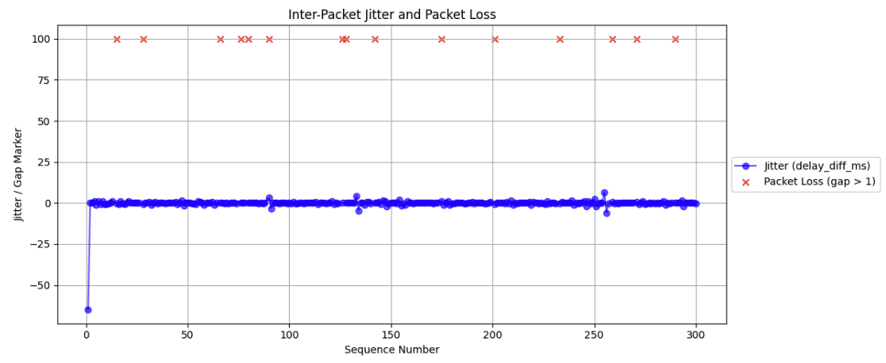
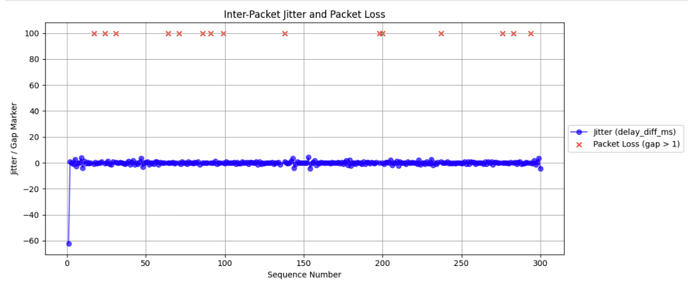

- LAN 5M
	- CPU    Processed Δ    Dropped Δ    Time Squeezed Δ
	  --------------------------------------------------
	  0             2952            0                  0
	  1             1075            0                  0
	  2                0            0                  0
	  3              155            0                  0
	  4                8            0                  0
	  5                0            0                  0
	  6                0            0                  0
	  7              732            0                  0
	- 
- LAN 10M
	- CPU    Processed Δ    Dropped Δ    Time Squeezed Δ
	  --------------------------------------------------
	  0             2775            0                  0
	  1               54            0                  0
	  2              183            0                  0
	  3              404            0                  0
	  4                2            0                  0
	  5                0            0                  0
	  6              682            0                  0
	  7                0            0                  0
	- 