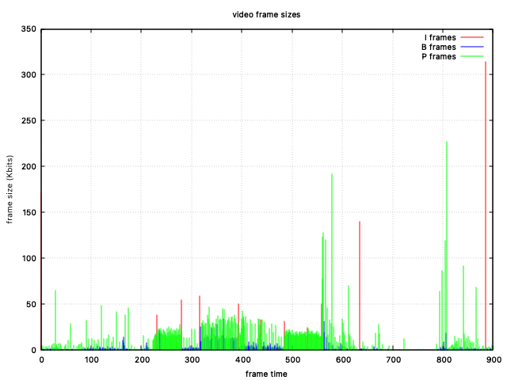

public:: true
tags:: Video Compression

- # Encode a video
  
  ```shell
  ffmpeg -i Documents/chrome.mp4 -c:v libx264 -tune animation  Documents/output.mkv
  ```
- # Plot Frame Type and Size
  
  ```shell
  plotframes -I output.mkv -t qt
  ```
  
- # Display Frame Information
  
  ```shell
  ffprobe -v trace -show_frames output.mkv
  ```
  output snippet
  
  ```shell
  [FRAME]
  media_type=video
  stream_index=0
  key_frame=1
  pts=3
  pts_time=0.003000
  pkt_dts=3
  pkt_dts_time=0.003000
  best_effort_timestamp=3
  best_effort_timestamp_time=0.003000
  duration=33
  duration_time=0.033000
  pkt_pos=4989
  pkt_size=21382
  width=480
  height=270
  crop_top=0
  crop_bottom=0
  crop_left=0
  crop_right=0
  pix_fmt=yuv420p
  sample_aspect_ratio=1:1
  pict_type=I
  interlaced_frame=0
  top_field_first=0
  repeat_pict=0
  color_range=tv
  color_space=unknown
  color_primaries=unknown
  color_transfer=unknown
  chroma_location=left
  [/FRAME]
  [FRAME]
  media_type=audio
  stream_index=1
  key_frame=1
  pts=3
  pts_time=0.003000
  pkt_dts=3
  pkt_dts_time=0.003000
  best_effort_timestamp=3
  best_effort_timestamp_time=0.003000
  duration=13
  duration_time=0.013000
  pkt_pos=27203
  pkt_size=1
  sample_fmt=fltp
  nb_samples=576
  channels=2
  channel_layout=stereo
  [/FRAME]
  ```
	- ## Frame type
		- When video key_frame = 1, pict_type = I
		  
		  ```shell
		  media_type=video
		  key_frame=1
		  pict_type=I
		  ```
	- ## Frame size
		- Mostly I frames is bigger than P and B frames
		  
		  ```shell
		  [FRAME]
		  pkt_size=4714
		  pict_type=I
		  [/FRAME]
		  
		  [FRAME]
		  pkt_size=123
		  pict_type=B
		  [/FRAME]
		  
		  [FRAME]
		  pkt_size=1610
		  pict_type=P
		  [/FRAME]
		  ```
	- ## Presentation and decode timestamps
		- only see decode timestamps
		  
		  ```shell
		  ```