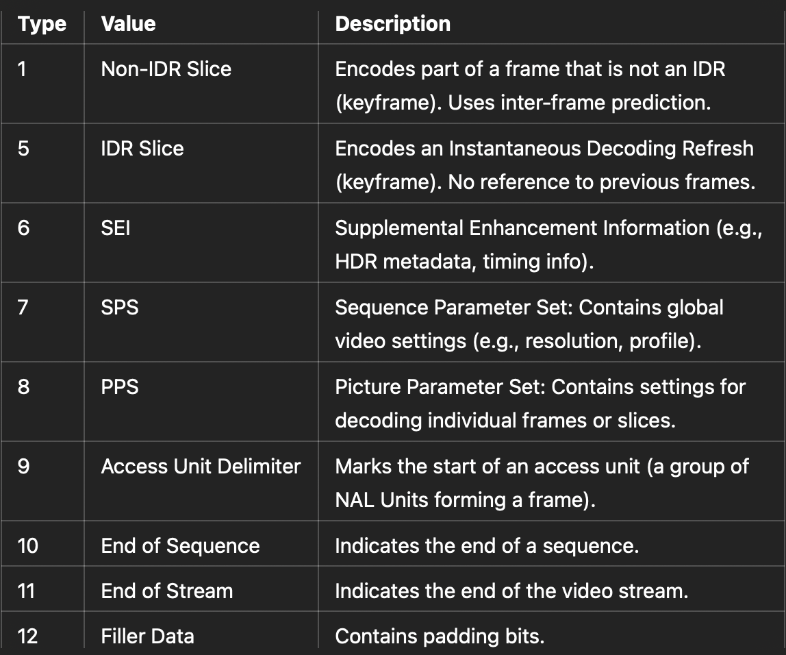

public:: true
tags:: Video Compression

- # Encode a video
  
  ```shell
  ffmpeg -i Documents/chrome.mp4 -c:v libx264 -tune animation  Documents/output.mkv
  ```
- # Plot Frame Type and Size
  
  ```shell
  plotframes -I output.mkv -t qt
  ```
  
- # Display Frame Information
  
  ```shell
  ffprobe -v trace -show_frames output.mkv
  ```
  output snippet
  ```shell
  [FRAME]
  media_type=video
  stream_index=0
  key_frame=1
  pts=3
  pts_time=0.003000
  pkt_dts=3
  pkt_dts_time=0.003000
  best_effort_timestamp=3
  best_effort_timestamp_time=0.003000
  duration=33
  duration_time=0.033000
  pkt_pos=4989
  pkt_size=21382
  width=480
  height=270
  crop_top=0
  crop_bottom=0
  crop_left=0
  crop_right=0
  pix_fmt=yuv420p
  sample_aspect_ratio=1:1
  pict_type=I
  interlaced_frame=0
  top_field_first=0
  repeat_pict=0
  color_range=tv
  color_space=unknown
  color_primaries=unknown
  color_transfer=unknown
  chroma_location=left
  [/FRAME]
  [FRAME]
  media_type=audio
  stream_index=1
  key_frame=1
  pts=3
  pts_time=0.003000
  pkt_dts=3
  pkt_dts_time=0.003000
  best_effort_timestamp=3
  best_effort_timestamp_time=0.003000
  duration=13
  duration_time=0.013000
  pkt_pos=27203
  pkt_size=1
  sample_fmt=fltp
  nb_samples=576
  channels=2
  channel_layout=stereo
  [/FRAME]
  ```
	- ## Frame type
		- When video key_frame = 1, pict_type = I
		  
		  ```shell
		  media_type=video
		  key_frame=1
		  pict_type=I
		  ```
	- ## Frame size
		- Mostly I frames is bigger than P and B frames
		  
		  ```shell
		  [FRAME]
		  pkt_size=4714
		  pict_type=I
		  [/FRAME]
		  
		  [FRAME]
		  pkt_size=123
		  pict_type=B
		  [/FRAME]
		  
		  [FRAME]
		  pkt_size=1610
		  pict_type=P
		  [/FRAME]
		  ```
	- ## Presentation and decode timestamps
		- `pts`: The presentation timestamp of the frame, often used in place of pkt_pts when analyzing frames.
		  `pkt_dts`: The decoding timestamp of the packet, indicating when the frame should be decoded.
		  `best_effort_timestamp`: FFmpeg’s best guess at the frame’s timestamp, derived from either pts, pkt_pts, or other available metadata.
		  `duration`: duration=33 and duration_time=0.033000 mean that this frame is displayed for 0.033 seconds (or 33 milliseconds) before the next frame is presented.
		  ```shell
		  [FRAME]
		  media_type=video
		  stream_index=0
		  key_frame=0
		  pts=26296
		  pts_time=26.296000
		  pkt_dts=26296
		  pkt_dts_time=26.296000
		  best_effort_timestamp=26296
		  best_effort_timestamp_time=26.296000
		  duration=33
		  duration_time=0.033000
		  [/FRAME]
		  ```
- # Inspect NAL Unit and Slice Information
  Use `ffmpeg` to trace NAL unit and slice-level details
  ```shell
  ffmpeg -i output.mkv -c copy -bsf:v trace_headers -f null -
  ```
	- `bsf:v trace_headers`:
	  Applies the trace_headers [bitstream](((675a7bdf-c641-4c0c-ba7d-421309ee1dc2))) filter to the video stream. This filter analyzes the H.264 bitstream and outputs information about headers in the stream, such as Sequence Parameter Sets (SPS), Picture Parameter Sets (PPS), and slice headers.
	- output snippet
		- **SPS**
		  
		  ```shell
		  Sequence Parameter Set
		  0           forbidden_zero_bit                                          0 = 0
		  1           nal_ref_idc                                                11 = 3
		  3           nal_unit_type                                           00111 = 7
		  8           profile_idc                                          01100100 = 100
		  24          level_idc                                            00010101 = 21
		  33          chroma_format_idc                                         010 = 1
		  36          bit_depth_luma_minus8                                       1 = 0
		  37          bit_depth_chroma_minus8                                     1 = 0
		  40          log2_max_frame_num_minus4                                   1 = 0
		  51          pic_width_in_mbs_minus1                             000011110 = 29
		  60          pic_height_in_map_units_minus1                      000010001 = 16
		  69          frame_mbs_only_flag                                         1 = 1
		  78          vui_parameters_present_flag                                 1 = 1
		  79          aspect_ratio_info_present_flag                              1 = 1
		  80          aspect_ratio_idc                                     00000001 = 1
		  92          num_units_in_tick            00000000000000000000001111101001 = 1001
		  124         time_scale                   00000000000000001110101001100000 = 60000
		  ```
			- `forbidden_zero_bit`: Must always be 0. Ensures stream integrity.
			- `nal_ref_idc:` Indicates the importance of this NAL unit for decoding (3 = highest priority).
			- `nal_unit_type`: Specifies the type of NAL unit (7 = SPS).
			- `profile_idc`: Encoding profile used (100 = High Profile).
			- `level_idc`: Defines the video level (complexity) (21 = Level 2.1).
			- `chroma_format_idc`: Chroma subsampling format (1 = 4:2:0).
			- `bit_depth_luma_minus8` and `bit_depth_chroma_minus8`: Bit depth for luma and chroma (8-bit in this case).
			- `log2_max_frame_num_minus4`: Specifies the maximum number of frames between keyframes.
			- `pic_width_in_mbs_minus1`: Encoded width in macroblocks minus 1 (30 × 16 = 480 pixels wide).
			- `pic_height_in_map_units_minus1`: Encoded height in macroblock units minus 1 (17 × 16 = 272 pixels high).
			- `frame_mbs_only_flag`: Indicates whether only progressive frames are used (1 = yes).
			- `vui_parameters_present_flag`: Indicates if additional VUI (Video Usability Information) is present.
			- `aspect_ratio_idc`: Aspect ratio (1 = square pixels).
			- `time_scale` and `num_units_in_tick`: Timing information for frame rate. Here, 60000 / 1001 = ~59.94 fps.
		- **PPS**
		  ```shell
		  Picture Parameter Set
		  3           nal_unit_type                                           01000 = 8
		  8           pic_parameter_set_id                                        1 = 0
		  9           seq_parameter_set_id                                        1 = 0
		  10          entropy_coding_mode_flag                                    1 = 1
		  13          num_ref_idx_l0_default_active_minus1                    00110 = 5
		  18          num_ref_idx_l1_default_active_minus1                        1 = 0
		  22          pic_init_qp_minus26                                     00111 = -3
		  33          deblocking_filter_control_present_flag                      1 = 1
		  ```
			- `nal_unit_type`: Specifies the type of NAL unit (8 = PPS).
			- `pic_parameter_set_id`: Identifier for this PPS.
			- `seq_parameter_set_id`: Links this PPS to its corresponding SPS.
			- `entropy_coding_mode_flag`: Specifies the entropy coding method (1 = CABAC, a more efficient method).
			- `num_ref_idx_l0_default_active_minus1`: Default number of reference frames for prediction.
			- `pic_init_qp_minus26`: Initial quantization parameter for the picture.
			- `deblocking_filter_control_present_flag`: Indicates if deblocking filter parameters are present.
		- **Slice header**
		  ```shell
		  Slice Header
		  3           nal_unit_type                                           00001 = 1
		  8           first_mb_in_slice                                           1 = 0
		  9           slice_type                                              00111 = 6
		  15          frame_num                                                0010 = 2
		  19          pic_order_cnt_lsb                                      000100 = 4
		  25          direct_spatial_mv_pred_flag                                 1 = 1
		  33          slice_qp_delta                                          00101 = -2
		  38          disable_deblocking_filter_idc                               1 = 0
		  ```
			- `nal_unit_type`: Specifies the type of NAL unit (1 = non-IDR slice, P-frame).
			- `slice_type`: Slice type (6 = P-slice).
			- `frame_num`: Frame number for reference.
			- `pic_order_cnt_lsb`: Least significant bits of picture order count, used for reordering frames.
			- `direct_spatial_mv_pred_flag`: Indicates whether spatial prediction is used for motion vectors.
			  id:: 675a84e3-eef2-4172-97d2-1a28240d8dd0
			- `slice_qp_delta`: Adjustment to the quantization parameter for this slice.
			- `disable_deblocking_filter_idc`: Indicates whether the deblocking filter is used.
		- **Packet Metadata**
		  ```shell
		  Packet: 34 bytes, pts 36, dts 36, duration 33.
		  ```
			- The final line describes the NAL packet itself:
				- `Packet`: 34 bytes: Size of the packet in bytes.
				- `pts`: Presentation timestamp of the frame (e.g., 36).
				- `dts`: Decoding timestamp of the frame (e.g., 36).
				- `duration`: Frame duration (e.g., 33, which corresponds to 33 ms if the timebase is 1/1000).
		- **nal_unit_type**
		  id:: 675a88b9-0350-452b-87d6-0cfc9581509a
		  {:height 678, :width 804}
- # Visualize Motion Vectors
  Display motion vectors overlaid on the video:
  ```shell
  ffplay -flags2 +export_mvs output.mkv -vf codecview=mv=pf+bf+bb
  ```
  Save a video with motion vectors overlaid:
  ```shell
  ffmpeg -flags2 +export_mvs -i output.mkv -vf codecview=mv=pf+bf+bb output.mp4
  ```
  
- # Analyze Macroblock Types
  
  ```shell
  ffmpeg -threads 1 -debug 'mb_type' -i file.h264 -f null -
  ```
	- `threads 1`: Limits FFmpeg to use a single thread for decoding. This ensures sequential processing, useful for debugging as it simplifies the output.
	- `debug 'mb_type'`: Activates debug mode and outputs macroblock type (mb_type) information. Macroblocks are the basic units of video compression in H.264. This shows how each macroblock is encoded (e.g., intra-prediction, inter-prediction, or skipped).
	- output snippet
		- **New Frame Metadata**
		  ```shell
		  [h264 @ 0x148e08440] New frame, type: B
		  ```
		  `New frame`: Marks the decoding of a new frame.
		  `type: B`: Indicates this is a B-frame (bidirectionally predicted frame), which uses both past and future frames for motion prediction.
		- **Macroblock Type Debug Table**
		  
		  ```shell
		  [h264 @ 0x148e08440]     0           64          128         192         256         320         384         448
		  [h264 @ 0x148e08440]   0 d  d  d  d  d  <  d  d  d  d  d  d  d  d  d  d  d  d  d  d  d  d  d  d  d  d  d  d  d  d
		  ```
		  Each line corresponds to a row of macroblocks in the video frame.
			- Column labels (0, 64, 128, etc.):
				- These indicate macroblock positions (or indices) across the frame.
			- Values (d, <, >, X, etc.):
			  Represent the type of encoding used for each macroblock:
				- d: `Direct mode` (used in B-frames, predicts using motion vectors from reference frames).
				- <, >: `Forward or backward motion prediction` (indicates inter-prediction using reference frames).
				- X: `Intra-coded blocks` (encoded without reference to other blocks or frames).
				- or +: Variants of intra or inter modes, showing further details.
		- **NAL Unit Metadata**
		  
		  ```shell
		  [h264 @ 0x148e08440] nal_unit_type: 1(Coded slice of a non-IDR picture), nal_ref_idc: 2
		  ```
			- `nal_unit_type`: 1:
				- Indicates the type of the current NAL Unit.
				- Type 1 corresponds to a coded slice of a non-IDR (non-keyframe) picture.
			- `nal_ref_idc`: 2:
			  Indicates the importance of the frame for reference:
				- 0: Non-reference frame.
				- 1-3: Increasing importance as a reference frame.
- # Analyze Quantization Parameters
  
  ```shell
  ```
-
-