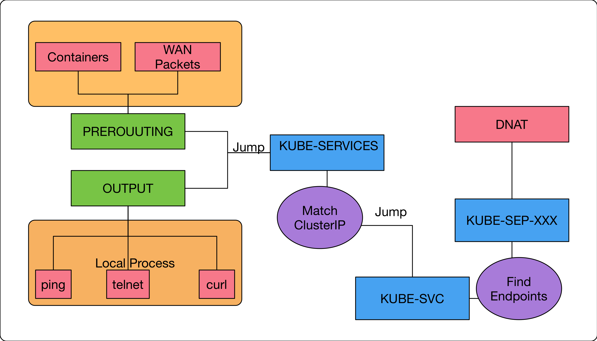

public:: true
tags:: Kubernetes, Kubernetes Service, iptables

- {{renderer :tocgen2}}
- ## 透過 FQDN 存取Endpoints
	- 只有`kube-dns`能夠理解`Service`對應的FQDN
	  ```
	  vortex-dev:05:36:40 [~/go/src/github.com/hwchiu/kubeDemo](master)vagrant
	  $kubectl get svc
	  NAME                TYPE        CLUSTER-IP     EXTERNAL-IP   PORT(S)        AGE
	  k8s-nginx-cluster   ClusterIP   10.98.51.150   <none>        80/TCP         1d
	  k8s-nginx-node      NodePort    10.99.157.45   <none>        80:32293/TCP   1d
	  ```
	  
	  `Cluster-IP`是一個虛擬IP，針對該IP發送的封包在滿足**特定條件**後會透過`DNAT`轉換到其中一個`Endpoints`
	  ```
	  vortex-dev:05:43:50 [~/go/src/github.com/hwchiu/kubeDemo](master)vagrant
	  $sudo iptables-save -t nat | grep nginx-cluster | grep DNAT
	  -A KUBE-SEP-7MBJVYFMXTKOJUKD -p tcp -m comment --comment "default/k8s-nginx-cluster:" -m tcp -j DNAT --to-destination 10.244.0.88:80
	  -A KUBE-SEP-ARZAHNE3T3EMMTGB -p tcp -m comment --comment "default/k8s-nginx-cluster:" -m tcp -j DNAT --to-destination 10.244.0.90:80
	  -A KUBE-SEP-O3CWA7STMVCKFPRY -p tcp -m comment --comment "default/k8s-nginx-cluster:" -m tcp -j DNAT --to-destination 10.244.0.89:80
	  
	  vortex-dev:05:43:54 [~/go/src/github.com/hwchiu/kubeDemo](master)vagrant
	  $kubectl get endpoints k8s-nginx-cluster
	  NAME                ENDPOINTS                                      AGE
	  k8s-nginx-cluster   10.244.0.88:80,10.244.0.89:80,10.244.0.90:80   1d
	  ```
- ## 只有`Cluster`內的應用程式/節點才可以存取
	- 上面提到的特定條件就是**只有``Cluster``內的應用程式/節點可以存取**，使用`iptables build-in chain`的 `OUTPUT/PREROUTING`來達成
	  OUTPUT: 本地節點送出的封包會先到這
	  PREROUTING: 本地網卡收到封包後會到這，包含`Container`出來的封包
	  ```
	  $sudo iptables-save -c | grep KUBE-SERVICES
	  :KUBE-SERVICES - [0:0]
	  [2376:171145] -A PREROUTING -m comment --comment "kubernetes service portals" -j KUBE-SERVICES
	  [3706:223392] -A OUTPUT -m comment --comment "kubernetes service portals" -j KUBE-SERVICES
	  ...
	  ```
	- 透過 `iptables`查看規則，上面顯示 `ClusterIP` 的 IP 是`10.98.51.150`
	  ```
	  vortex-dev:04:24:49 [~/go/src/github.com/hwchiu/kubeDemo](master)vagrant
	  $sudo iptables-save | grep k8s-nginx-cluster
	  ....
	  -A KUBE-SERVICES -d 10.98.51.150/32 -p tcp -m comment --comment "default/k8s-nginx-cluster: cluster IP" -m tcp --dport 80 -j KUBE-SVC-3FL7SSXCKTCXAYCR
	  ....
	  ```
	  -A KUBE-SERVICES: 這是一個 Custom Chain, 所有跟 Kubernetes Service 有關的第一到防線規則都在這邊
	  -d 10.98.51.150/32: 目標位置是 ClusterIP 的話
	  -p tcp: 目標是 TCP 協定
	  -m comment: 就是註解
	  -m tcp --dport 80: 使用外掛模組來解析TCP裡面的資訊，希望 TCP port 是80
	  -j KUBE-SVC-3FL7SSXCKTCXAYCR: 上述所有條件都符合，就會跳入另外一個custom chain來執行後續任務
- ## 從多個 `Endpoints` 中選擇
	- 檢視剛剛的 custom chain 內容
	  ```
	  -A KUBE-SVC-3FL7SSXCKTCXAYCR -m comment --comment "default/k8s-nginx-cluster:" -m statistic --mode random --probability 0.33332999982 -j KUBE-SEP-POVAFWTN5ECIRK7J
	  -A KUBE-SVC-3FL7SSXCKTCXAYCR -m comment --comment "default/k8s-nginx-cluster:" -m statistic --mode random --probability 0.50000000000 -j KUBE-SEP-AQWRPA7WRPWQAWLR
	  -A KUBE-SVC-3FL7SSXCKTCXAYCR -m comment --comment "default/k8s-nginx-cluster:" -j KUBE-SEP-XPSDT7KEI65EZ2WI
	  ```
	  看到`-m statistic`, `random`, `probability`發現是根據機率選擇接下來的 custom chain，當找到要使用的 **Endpoints** 的時候，就會跳到對應的 **KUBE-SEP-XXXX** 去進行 **DNAT** 的轉換
- ## Summary
  