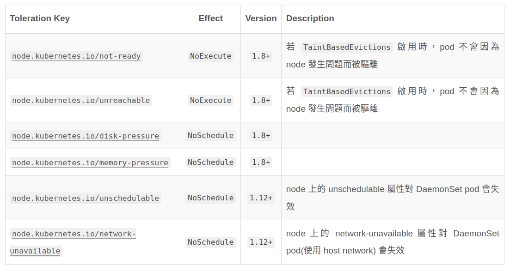

public:: true
tags:: Kubernetes, Kubernetes Node, Kubernetes Pod

- # What is DaemonSet?
	- DaemonSet 是確保在 Kubernetes 中的每一個 node 上都會有一個指定的 pod 來運行特定的工作，當有新的 node 加入到 Kubernetes cluster 後，系統會自動在那個 node 上長出相同的 DaemonSet pod，當有 node 從 Kubernetes cluster 移除後，該 node 上的 DaemonSet pod 就會自動被清除掉。
	- ## When to use?
		- 日誌收集和監控：當你需要在每個節點上運行一個日誌或監控代理，例如 Prometheus 監控集群，在每個節點上都運行一個node-exporter來收集監控節點的訊息，或是 fluented, logstash。在每個節點上運行以收集容器的日誌。
		- 網路代理：對於需要節點級網路代理的應用程序，如CNI，你可以使用DaemonSet確保每個節點都運行這個代理。例如 flannel, calico。
		- 分佈式存儲：當你需要在每個節點上運行分佈式存儲代理，以實現數據持久性和可用性。例如 glusterd, ceph 要部署在每個節點上以提供持久性儲存。
		- 應用程式資料庫：對於某些應用程式，每個節點可能需要本地存儲或快取資料庫的副本。
		- Node-Level操作：當你需要執行僅涉及單個節點的操作時，如特定節點的升級或清理。
	- ## 範例
	  ```yaml
	  apiVersion: apps/v1
	  kind: DaemonSet
	  metadata:
	    name: fluentd-elasticsearch
	    namespace: kube-system
	    labels:
	      k8s-app: fluentd-logging
	  spec:
	    # .spec.selector 一旦定義後就無法再變更了
	    # 必須與 .spec.template.metadata.labels 的定義相同
	    # 這裡可以使用 matchLabels 或是 matchExpressions(用來處理較為複雜的 label 組合)
	    selector:
	      matchLabels:
	        name: fluentd-elasticsearch
	    # 此為必要欄位，與 pod template 相同
	    # 用來定義 DaemonSet 的內容應該要長什麼樣子
	    template:
	      metadata:
	        labels:
	          name: fluentd-elasticsearch
	      # 由於是 DaemonSet 的關係，因此 .spec.template.spec.restartPolicy 永遠是 "Always"
	      # 預設值為 "Always"
	      spec:
	        tolerations:
	        - key: node-role.kubernetes.io/master
	          effect: NoSchedule
	        containers:
	        - name: fluentd-elasticsearch
	          image: k8s.gcr.io/fluentd-elasticsearch:1.20
	          resources:
	            limits:
	              memory: 200Mi
	            requests:
	              cpu: 100m
	              memory: 200Mi
	          volumeMounts:
	          - name: varlog
	            mountPath: /var/log
	          - name: varlibdockercontainers
	            mountPath: /var/lib/docker/containers
	            readOnly: true
	        terminationGracePeriodSeconds: 30
	        volumes:
	        - name: varlog
	          hostPath:
	            path: /var/log
	        - name: varlibdockercontainers
	          hostPath:
	            path: /var/lib/docker/containers
	  ```
	  **注意**
	  1. `.spec.selector` 一旦定義後就不建議再修改，若是修改可能會造成某些 pod 變成孤兒(因為 DaemonSet controller 無法管理到正確的 pod)
	  2. `.spec.selector` 的定義必須與 .spec.template.metadata.labels 相同，否則會被 API server 拒絕套用
	  3. 不可以再建立(或是透過其他 controller 建立，例如： [[Deployment]] )帶有與 DaemonSet 相同 label 組合的 pod，否則會被 DaemonSet 認為是自己所產生的
- # How Daemon Pods are scheduled?
	- ## DaemonSet controller (v1.12 之前)
		- 一般來說決定 pod 要在哪個 node 上運行是 k8s scheduler 的工作，但其實 DaemonSet controller 跟 k8s schedule 之間的運作有時就是會有矛盾之處，因為：
			- 若是使用者為特定的 node 設定 unschedulable，這通常就會跟 DaemonSet controller 的規則衝突
			- DaemonSet controller 可以在 k8s scheduler 還沒啟動前就佈署 pod，有時對於 k8s cluster bootstrap 是很有用途的
		- 由 DaemonSet controller 調度產生的問題
			- Pod行為的不一致性：一般的Pod在剛創立時status為`Pending`，但DaemonSet所創立的Pod並無`Pending`這狀態，這也讓使用者感到困惑。
			- Pod的搶佔優先序：啟用搶佔後，DaemonSet Controller將在不考慮Pod的優先序情況下制定搶佔決策。
	- ## default scheduler (v1.12 之後)
		- 在 v1.12 之後，DaemonSet pod 預設是回到由 k8s scheduler 統一來處理分派的工作
		  使用方法：移除在 DaemonSet 中的 `spec.nodeName` 的部份，透過nodeAffinity來做調度。
		  ```yaml
		  nodeAffinity:
		    requiredDuringSchedulingIgnoredDuringExecution:
		      nodeSelectorTerms:
		      - matchFields:
		        - key: metadata.name
		          operator: In
		          values:
		          - target-host-name
		  ```
		  若是原有的 DaemonSet pod 已經有 node affinity 的設定，上面新增的設定則會會覆蓋掉原本舊有的部份。
- # Taints and Tolerations with DaemonSet
	- scheduling 由 DaemonSet controller 回到了 k8s scheduler 身上，[Taint & Toleration](((66b42b6b-71d0-47af-b499-7c719b63b5ed))) 這兩個機制就會對 DaemonSet 顯得相對重要了，因為 Noschedule 的設定會影響 DaemonSet pod 的分派。
	  
	  原本由 DaemonSet controller 負責 scheduling 的情況下，若是 node 被設定為 unschedulable，也是同樣會被忽略的，但回到 k8s scheduler 之後，就必須額外增加 Toleration 的設定來達到相同的效果，以下是會被自動加入到 DaemonSet pod 中的 toleration 清單
	  
- # Communicating with Daemon Pods
	- 與DaemonSet 中的Pod 進行通信的幾種可能模式如下：
		- **Push**：配置DaemonSet中的Pod，將更新發送到另一個服務，例如統計數據庫。這些服務沒有客戶端。
		- **NodeIP和已知端口**：DaemonSet中的Pod可以使用`hostPort`，從而可以通過節點IP訪問到Pod。外部的 client 可以透過 IP + port 的型式直接存取 pod。
		- **DNS**：可以跟 [[StatefulSet]] 一樣，建立一個 `Headless Service` 搭配 pod selector，讓特定的 domain name 在 k8s cluster 內部可以直接被解析為 pod IP。
		- **Service**：創建具有相同Pod選擇算符的服務，並使用該服務隨機訪問到某個節點上的守護進程（沒有辦法訪問到特定節點）。
- # Update DaemonSet
	- Node labels update：
	  當節點標籤有更新時，DaemonSet會向上匹配符合標籤的pod，並移除不符合標籤的pod。
	- Update DaemonSet Pod：
	  當你直接修改DaemonSet的Pod時，並不影響 DaemonSet Pod template，因此新產生的DaemonSet Pod還是會依照舊template產生。
	- Delete DaemonSet 並保留 DaemonSet pod：
	  使用`kubectl`並指定`--cascade=false`，則原有正在運行的Pod並不會被刪除。
	  接下來如果創建另一個相同 label selector 不同 template 的新DaemonSet，原有現存的 pod 不會被修改，但也不會產生新的 pod，此時就必須要手動將原有的 pod 刪除，讓新的 pod 可以自動被產生。
	- RollingUpdate：
	  在 spec 加入 `RollingUpdate`，會自動刪除舊的 DaemonSet pods 且建立新的 pod。