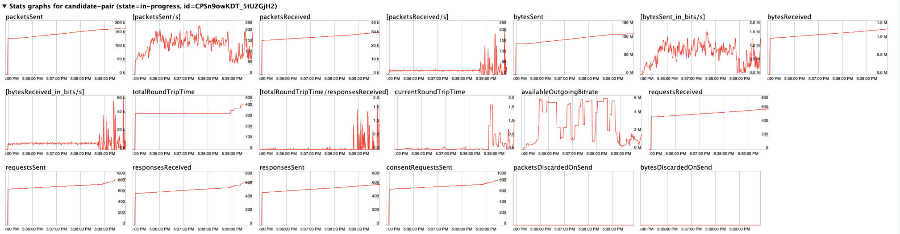

public:: true

- # Normal
	- ## DTLS handshake
	  
	- ## STUN and TURN
	  
	- ## RTP media
		- ### How to find filter `ip.addr==172.21.13.157 && udp.port==62481 && ip.addr==172.21.10.181 && udp.port==43716`
			- #### **From chrome tool**
				- ICE Candidate pair in `chrome://webrtc-internals`
			- #### **From WireShark**
				- **Capture Network Traffic**
					- Start capturing packets while the streaming application is running.
					- Use a filter (optional) to focus on UDP traffic during capture
				- **Open the Conversations Window**
					- Stop the capture once you have sufficient traffic.
					- Navigate to: **Statistics** > **Conversations**.
				- **Focus on UDP Conversations**
					- In the **Conversations** window, switch to the **UDP** tab.
					- This tab shows a list of all UDP conversations (source/destination IP and port pairs) along with statistics like packet count, byte count, and duration.
					  
				- **Identify Streaming Traffic**
					- Look for streams with a **high packet count** and a **steady byte rate**—typical for streaming traffic.
					- If you know the IP address of the streaming server, look for conversations involving that IP.
					  **Key Indicators of Streaming Traffic:**
						- High **packet count**: Indicates a sustained stream of data.
						- Consistent **data size**: Streaming often uses similar-sized packets.
			- ### Decoded as RTP
				- Select the packet then right click `Decoded As...`
				  Set Current to `RTP`
				  
			- ### Check info
			  seq 會是遞增
			  PT 的 codec 會在 SDP 中找到 (e.g., 106)
			- {:height 368, :width 771}
	- ## P2P Connections
	  
	-
- # Blocking Direct Connections
	- macOS use `pfctl` to block traffic
		- ```
		  sudo vim /etc/pf.conf
		  ```
		- At the end of the file add the following to block UDP on port 12345
		  ```
		  block quick proto udp from any to any port = 12345
		  ```
		- Then enable the firewall with
		  ```
		  sudo pfctl -f /etc/pf.conf && sudo pfctl -E
		  ```
	- ### Web sender
		- Block port after connected
			- 出現 Reconnecting 後斷線
		- Block target IP after connected
		  ```
		  block quick proto udp from any to 172.21.10.181
		  ```
			- 使用 TURN
			  
			  
		- Block before connect
			- 使用 TURN
	- ### MacOS sender
		- Block port after connected
			- 出現 Reconnecting 後斷線
		- Block target IP after connected
			- 出現 Reconnecting 後斷線
		- Block before connect
			- 使用 TURN
- # Test with Network Emulator
	- webrtc 數值解釋 https://www.w3.org/TR/webrtc-stats
	- **Bandwidth Throttling**
		- {:height 249, :width 804}
		- 
		- 從 outbound-rtp -> targetBitrate 觀察和 Bandwidth 設定的限制是否相符
		- WebRTC 會自動調整 bitrate
			- 一開始 Bandwidth 調低後 -> 輸出超過 queue 能消化的量 -> PacketLost 會變高
			- WebRTC 自動調低 targetBitrate 後 -> 送出的量變少(bytesSent_in_bits/s) jitter 變低 & packetLost 變低 & RTT 變低
	- **High Latency**
		- 
		- 
	- **Jitter Simulation**
	- **Packet Loss**
		- 
		- 
		- 觀察 remote-inbound -> fractionLost
	- **Network Interruptions**
		- 
		- {:height 355, :width 804}
-