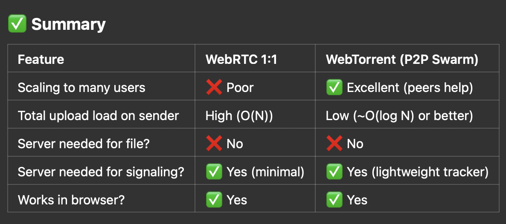

public:: true

- ## Bytello
	- IFP <-> Device 互傳檔案
	  檔案限制 1GB
	  可以接受或拒絕發送請求
	  沒有加密
	  
	  device -> IFP 
	在 IFP 同意後向 IFP 發起 TCP 連線（和原本連線的 port 不同
	使用 HTTP 發送檔案 POST /api/localshare/v1/upload HTTP/1.1 
	多個 tcp segments
	  
	  IFP -> device
	  	在 device 同意後向 IFP 發起 TCP 連線（和原本連線的 port 不同
	  	可同時傳給多個 device
	  
	  發送端送出多個 Seq 後(Seq = last Seq + len, ACK = 1）
	  接收端回應 Seq = 1, ACK = last Seq + len
	  
	  Android 版不能上傳檔案
	  無法 Device <-> Device
- ## Note
	- ### 實作需注意
		- 切片
		  還原切片、拼接
		  中斷後續傳
		- 討論
			- 是否需要雲端儲存
	存取時限
			  裝置間互傳是否直接建立連線
			  是否需加密
			  一次傳的檔案數量上限
			  檔案大小上限
- ## 方案
	- webRTC
	- WebTorrent
	- 
- ## 參考產品
  collapsed:: true
	- LocalSend
		- 開源
		  使用 TCP, UDP
		  加密
		  搜尋設備使用 UDP 廣播 or HTTP 向本地所有 IP 發送請求註冊
		  傳輸使用 HTTP，接收端為 server
		  接收方無法使用時可以由發送端提供未加密 HTTP 網址下載
	- Landrop
		- 舊版開源
		  搜尋設備使用 UDP 廣播
		  每個裝置啟一個 server 使用 TCP 連線
	- AirDroid
	- drop.lol
		- 開源
		  文件說使用 webRTC
		  加密
	- ShareDrop
		- 開源
		  文件說使用 webRTC
	- WebTorrent
		- base on webRTC
		  上傳者只要傳部份給所有人
		  大家 share chunk
		  可以並行傳輸增加速度和量級
		  減少上傳者的 loading
		- 需要其中一個
			- Trackers (via WebSocket) to find other peers (用來建立 WebRTC 連線)
			- Distributed Hash Tables (DHT) in native environments (完全去中心化，不需 Signaling server)
		- 不需要所有 peer 都連線
		- 隨時可加入
		- flutter 實作方法
			- 切檔案
			- 建立Chunk Map (Bitfield)
			  `[true, false, true, false, false, true, ...]`
			- Exchange Bitfields Between Peers
			- Send/Respond to Chunk Requests
			- 選擇 Peer 的策略
				- round-robin / least-busy
		-
- ## 評估項目
	- internet / intranet 支援
	- 使用者間要透過 IFP 中轉或直連
	- housekeeping
- ## Sender 間建立連線
  collapsed:: true
  避免 receiver 成為瓶頸，同時保持整個系統的高效率和彈性。
	- 在 sender 間建立直接的 WebRTC 連接（如果沒辦法建立就會有多條路徑的問題）
	- Mesh 網絡：每個 sender 維持與其他幾個 sender 的連接，形成分散式網絡
	- receiver 可以作為 signaling server，幫助 sender 間建立連接，但實際資料傳輸不經過 receiver
	- ### 建立連線需要的資源和時間
		- WebRTC 連線建立時間
		- 信令交換延遲
		- 初始連線建立後的檔案分割與傳輸協調
	- ### 替代解決方案
	  如果檔案通常很大（幾百 MB 或更大），則連線建立的時間相對於總傳輸時間來說就不那麼重要了，按需建立連線是合理的。
	  但對於頻繁分享小檔案的場景，可能需要考慮更積極的連線預建策略。
		- 預先建立連線：
		  當有新的 sender 加入系統時，就預先與其他 sender 建立連線
			- 優點：需要傳檔時可以立即開始，無需等待連線建立
			- 缺點：消耗資源維護可能不會用到的連線
		- 維持一個基本的最小連線網路拓撲（目前 sender 都和 receiver 建立了連線就是一種星狀拓撲）
			- 只在需要額外頻寬時才動態增加更多連線
			- **優點：**
				- 資源利用效率高，只在需要時使用資源
				- 實現簡單直接，邏輯清晰
				- 無需複雜的預測算法
			- **缺點：**
				- 用戶體驗不佳，傳輸開始前需等待連線建立
				- 在高峰期可能造成突發的連線建立負載
				- WebRTC握手過程可能導致明顯延遲
		- 連線池
			- 預先建立少量常用連線，並保持活躍
			- 使用 LRU (Least Recently Used) 策略管理連線池大小
			- 當需要新連線時，優先使用池中已有連線
			- **優點：**
				- 減少連線建立延遲，文件傳輸可以更快開始
				- 平滑系統負載，避免高峰時段突然建立大量連線
				- 可以預先處理較難建立的連線（如NAT穿透複雜的節點）
			- **缺點：**
				- 預測準確性挑戰大，可能維護了不必要的連線
				- 持續消耗系統資源維護閒置連線
				- 初始實現較複雜，需要設計連線優先級和淘汰機制
		- 漸進式檔案傳輸
			- 先用已有的連線（如與 receiver 的連線）開始檔案傳輸
			- 同時在背景建立 sender 間的連線
			- 一旦 sender 間連線建立，自動轉移部分傳輸負載到新連線
			- **優點：**
				- 自動平衡系統負載
				- 防止receiver成為瓶頸
				- 系統可以在壓力下自我調整
			- **缺點：**
				- 需要精確的負載監測機制
				- 負載閾值設定困難
				- 可能導致連線建立策略不穩定
	- ### 整合建議
		- **漸進式實施**：
			- 首先實現基本星形拓撲
			- 加入簡單的連線池管理
				- 不是單純在同個內網的 sender 間要連線會比較久，可以優先保留這些連線
				- 動態調整連線池大小
			- 逐步引入負載感知功能
				- 需要定時監控
				- 根據使用場景修改負載 threshold
			- 持續優化預測算法
- ## File cleanup
	- ### Android Cache Directory
		- Internal cache
			- 在文件管理器無法瀏覽，除了 App 本身或 root、adb
			- 空間相對有限
		- External cache
			- 用戶可通過文件管理器訪問（取決於設備）
			- 空間通常比內部緩存大
	- ### 需要 App 啟動
		- WorkManager
		- FileProvider  clear cache directory
	- ### 系統級 task (需要權限)
		- JobScheduler
		- 監聽系統事件
		- 後台服務受限、系統可能會延遲或取消
	- 方案
		- App 執行時及定期清理
		- 監聽系統廣播
		- 文件放在 cache directory，系統會在存儲空間不足時自動清理