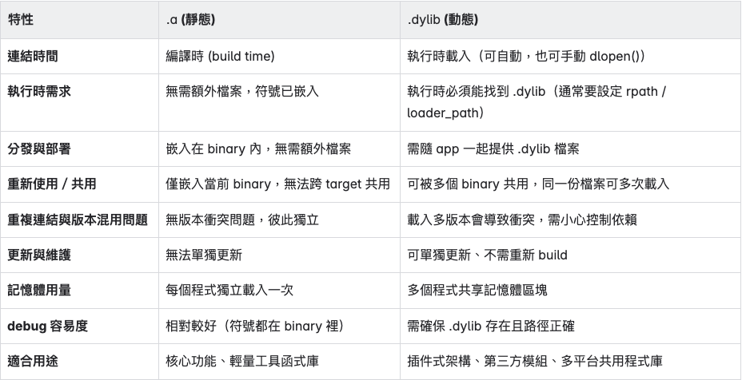

- 本文件說明 Flutter macOS 原生專案在執行與打包過程中，與 .a / .dylib 的關係、Library 路徑解析、CocoaPods 對 .dylib 的處理方式，並結合實際專案（multicast plugin）進行範例說明。
- # macOS Flutter App 的結構
	- Flutter 在 macOS 上編譯後會產出一個原生 macOS 應用程式（.app），其實質上是一個目錄結構，包含主程式執行檔、資源、frameworks、以及其他元資料。本章將解構這個 .app 包內的結構，並說明 Flutter plugin（包含 native C++、GStreamer 等）如何整合進來。
	- ## App Bundle Layout
		- 以 flutter_multicast_plugin_example.app 為例，其目錄結構大致如下：
		- ```shell
		  flutter_multicast_plugin_example.app/
		  ├── Contents/
		  │   ├── MacOS/
		  │   │   └── flutter_multicast_plugin_example <- 主執行檔（Flutter engine runtime）
		  │   │   └── flutter_multicast_plugin_example.debug.dylib  <- Flutter plugin 的原生邏輯 (僅 Debug 模式)
		  ...
		  │   ├── Resources/                     <- Dart 資源檔案、Assets、以及 plugin 資源
		  │   │   ├── gstreamer-frameworks/      <- GStreamer 所需的 .dylib、plugins
		  │   │   │   ├── lib/                   <- Relocated 核心 .dylib
		  │   │   │   └── gstreamer-1.0/         <- plugin .dylib
		  ```
	- ## Debug vs Release 模式的差異
	- Debug 模式
		- CocoaPods 會將 plugin 的原生邏輯編譯為 .debug.dylib（例如：flutter_multicast_plugin_example.debug.dylib）
		- Flutter runtime 執行期間會 dlopen() 這個 dylib 並呼叫 plugin 初始化 (Flutter plugin 的 native initialization 註冊 native code 到 Flutter)
		- 好處是可以熱重載原生 plugin 並附加 debugger
	- Release 模式
		- .debug.dylib 不會被產出
		- plugin 的原生邏輯會被靜態連結到主執行檔中（透過 CocoaPods build system）
		- 更簡單的 deploy，較佳效能與載入時間
	- ## Plugin 的嵌入方式
	- Flutter plugin（包含原生 C++ 及 GStreamer 整合）會透過 CocoaPods 整合進 Xcode 專案中，進一步影響：
		- 原生 C++ 來源有兩種方式進入專案：
			- 撰寫在 s.source_files 中的原始碼會在 Debug 模式被編譯為 plugin 的 .dylib；在 Release 模式則靜態連結進主執行檔。
			- 預先透過 CMake 編譯好的 .a（靜態庫）則透過 s.vendored_libraries 被加入 linker 輸出。
		- plugin 若使用 GStreamer 的 .dylib（如解碼器或核心庫），這些會透過 CocoaPods 的資源配置（如 s.resources）被打包進 .app/Contents/Resources/
	- 關於 s.vendored_libraries 、s.source_files等欄位的具體功能與影響，會在〈CocoaPods 設定與打包控制〉章節中詳細說明。
- # .a 和 .dylib 的差異和選用策略
	- ## 什麼是 .a 和 .dylib
		- 靜態庫 .a (archive): 在編譯期間被直接打包進可執行檔中，產生的 binary 不再依賴外部檔案。
		- 動態庫.dylib (dynamic library): 在執行期間由系統動態載入，可被多個執行檔或模組共享。
	- ## 差異比較表
		- 
	- ## 在 Flutter Multicast Plugin 中的實際選擇考量
		- 原生 C++ 程式（如 Crypto++、uvgRTP、自訂邏輯）以 .a 形式建構：
			- 避免額外載入 .dylib，簡化部署與打包流程
			- 可由 CocoaPods 自動 link 至 plugin 的 .debug.dylib（Debug 模式）或主執行檔（Release 模式）
		- GStreamer 支援在 runtime 動態載入 .dylib plugin 並註冊 element。除了內建的自動掃描目錄機制，也可以透過 gst_plugin_load_file() 手動載入指定 plugin。雖然部分 GStreamer plugin 也提供 .a 靜態版本，但使用上有下列限制：
			- 不會自動註冊 element
			- 需撰寫額外的註冊程式碼（呼叫 gst_plugin_register_static() 及對應的 init 函式）
		- 在大型原生 C++ 專案中，還有其他考量（如符號可見性、跨 target 共用等）會影響選擇 .a 或 .dylib，但在 Flutter plugin 開發中較少遇到，此處略去。
		- 使用 .dylib 時，需注意 macOS 的路徑解析與打包規則，詳見下一章〈Dynamic Library 路徑解析機制〉。
- # Dynamic Library 路徑解析機制（@loader_path / @rpath / @executable_path）
	- ## macOS 使用 .dylib 的實務注意事項
	- 動態庫的 安裝位置 必須正確，常用方式為使用 @loader_path 或 @rpath 解決相對路徑問題。
	- 若 .dylib 並非來自系統路徑或未安裝為 framework，應透過 CocoaPods 的 s.resources 或其他手段 打包進 .app/Contents/Resources/。
	- 可使用以下工具查看或修改 .dylib 的依賴路徑：
		- 查看：otool -L <dylib>
		- 修改：install_name_tool -change 或 -id
	- ## 為什麼需要理解動態庫路徑機制？
	- 為了讓打包出來的 macOS .app 可以在「任何使用者電腦上」執行，而不依賴本機絕對路徑（像 /usr/local/lib），我們必須讓 app 內的 .dylib 使用「相對路徑」載入。
	- 若 .dylib 相依其他 .dylib，也要處理依賴鏈
	- ## 三個主要的特殊路徑變數
	- ### @loader_path
		- 意思：正在載入某個 dylib 時，該 dylib 檔案本身所在的目錄
		- 常用情境：某個 plugin .dylib 依賴其他 .dylib 時，用來表示「從自己這個檔案的位置出發」去找依賴項
		- 範例：
		  假設 app 結構如下：
		  ```shell
		  MyApp.app/
		  ├── Contents/
		  │   ├── MacOS/
		  │   │   └── MyApp
		  │   └── Resources/
		  │       └── gstreamer-frameworks/
		  │           ├── gstreamer-1.0/
		  │           │   └── libgstlibav.dylib            <-- 正在被載入的 plugin
		  │           └── lib/
		  │               └── libavcodec.61.dylib          <-- 依賴的核心 dylib
		  ```
		  此時，plugin libgstlibav.dylib 依賴 libavcodec.61.dylib，就可以寫成：`@loader_path/../lib/libavcodec.61.dylib`
		- libgstlibav.dylib 在 Resources/gstreamer-frameworks/gstreamer-1.0/
		  它的依賴 libavcodec.61.dylib 在 ../lib/（也就是 Resources/gstreamer-frameworks/lib/）
	- ### @executable_path
		- 意思：代表「主程式」的執行檔位置，通常是 .app/Contents/MacOS/
		- 常用於：當主程式直接 link 某個 .dylib 時（例如 plugin 的 .debug.dylib），這些 .dylib 內的依賴路徑可以使用 @executable_path。
		- 範例：
		  假設 app 結構如下：
		  ```shell
		  YourApp.app/
		  └── Contents/
		      ├── MacOS/
		      │   ├── YourApp                ← 主執行檔
		      │   └── flutter_plugin.dylib   ← 被主程式直接 link
		      └── Resources/
		          └── libfoo.dylib
		  ```
		  此時 flutter_plugin.dylib 可以寫：`@executable_path/../Resources/libfoo.dylib`
	- ### @rpath
		- 意思：“runpath search path”，可以想成是一種路徑的變數。它本身不代表某個固定位置，而是在程式執行時，macOS 會從事先設定好的一串路徑中，一個一個去嘗試找出真正的檔案。
		- 常用於：「一個 binary 可以在不同環境下被動態找到依賴項」，常搭配 Xcode/CocoaPods 設定 LD_RUNPATH_SEARCH_PATHS
		- 在 Flutter + CocoaPods 的開發情境中，@rpath 較少被使用，因為：
			- CocoaPods 預設不會設置 @rpath，且使用方式較複雜
			- Flutter 工程對於 native linker 設定的控制有限
		- 為了簡化部署與除錯流程，建議改用 @loader_path，這樣 dylib 的依賴可以固定寫為相對於自身的位置，更直觀且容易維護。
		- 如果某個 dylib 寫了 @rpath/libfoo.dylib，那 macOS 會在執行時依序嘗試：
			- A/libfoo.dylib
			- B/libfoo.dylib
			- C/libfoo.dylib
			- 直到找到為止，而這些 A、B、C 就是在 linker 或 Xcode 中設定的 rpath 路徑。
		- 查看這個 binary 定義了哪些 rpath 對應路徑（即 runtime 查找會去哪裡找 @rpath）：`otool -l plugin.dylib | grep -A 5 LC_RPATH`
- # Flutter Multicast Plugin 的 GStreamer 打包與依賴處理設計
	- 本章說明 multicast plugin 在 macOS 下整合 GStreamer 的整體架構與設計原理，包括靜態與動態資源的管理、Debug/Release 模式下的載入差異、CocoaPods 的設定角色、以及手動管理 .dylib 的必要性。
	- ## Plugin 的整體架構與組件關係圖（包含主執行檔、.debug.dylib、.dylib plugin）
		- ```shell
		  flutter_multicast_plugin_example.app/
		  ├── Contents/
		  │   ├── MacOS/
		  │   │   └── flutter_multicast_plugin_example          ← 主執行檔
		  │   │   └── flutter_multicast_plugin_example.debug.dylib ← Debug 模式時的 plugin dylib
		  │   ├── Resources/
		  │   │   └── gstreamer-frameworks/
		  │   │       ├── lib/                                  ← GStreamer core .dylib
		  │   │       └── gstreamer-1.0/                         ← GStreamer plugin .dylib
		  ```
		- flutter_multicast_plugin_example: Flutter engine 封裝出的主程式執行檔。
		- flutter_multicast_plugin_example.debug.dylib: Debug 模式下由 CocoaPods 產生的 plugin 動態庫。
		- gstreamer-frameworks/lib: 包含所有 GStreamer plugin 及核心模組運作所需的共用 .dylib 依賴（例如 libgstreamer-1.0.dylib, libglib-2.0.dylib, libavcodec.dylib 等）。
		  這些 .dylib 會被：
		  •	Flutter plugin 的 native 程式碼載入
		  •	GStreamer plugin 本身 在執行時載入（例如 libgstcoreelements.dylib 載入 libglib-2.0.dylib）
		- gstreamer-frameworks/gstreamer-1.0: GStreamer plugin .dylib，例如 libgstcoreelements.dylib、libgstlibav.dylib。
	- ## .debug.dylib 與 dlopen() 
	  在 Debug 模式 下，Flutter engine 並不會把 plugin 的 native code 直接連進主程式中，而是：
		- CocoaPods 為每個 plugin 建立一個 .debug.dylib
		- Flutter runtime 透過 dlopen() 載入這個 .debug.dylib，並執行其初始化函式
		- 這使得 plugin 可以在 Debug 模式下動態載入與卸載，有助於 hot reload/debug。
		- .debug.dylib 裡的內容來自你在 podspec 中指定的以下內容：
			- 包含的來源：
				- s.source_files
					- 所有你指定的 .mm, .cc, .cpp, .c, .h 等原始碼
					- 這些檔案會在 build 時被編譯並 靜態 link 進 .debug.dylib 中。
				- s.vendored_libraries
					- 你指定的 .a 檔（靜態庫）
					- 這些 .a 檔的內容會被 靜態 link 進 .debug.dylib
			- 不包含的：
				- .dylib 檔案（就算寫在 s.vendored_libraries）並不會被打包進 .debug.dylib → 它們會在執行時由主程式或 plugin 透過 dlopen() 或系統 linker 載入。
				- s.resources 指定的資料（例如 .dylib plugin 放到 Resources）→ 這些資料會被複製進 .app/Contents/Resources/，但不屬於 .debug.dylib 的一部分。
	- ## GStreamer .dylib 的來源與路徑處理
		- GStreamer 提供的 SDK（GStreamer.framework）中包含了大量 .dylib 檔案，分為兩類：
			- Core library（例如 libgstreamer-1.0.dylib, libavcodec.dylib）
			- Plugin library（例如 libgstcoreelements.dylib, libgstlibav.dylib）
		- 這些 .dylib 不會自動被 CocoaPods 或 Flutter 處理，因此我們採用以下機制：
		- #### 資源複製與 relocate
			- 執行 scripts/build_gstreamer_bundle.sh，會將本機的 GStreamer.framework 內容：
				- 複製到 macos/gstreamer-frameworks/lib/ 與 gstreamer-frameworks/gstreamer-1.0/
				- 修改其 install_name 與依賴，設為：
				  `@loader_path/../Resources/gstreamer-frameworks/lib/libxyz.dylib`
				  這確保 .dylib 之間的相依能從 plugin 本身的位置出發找到其他依賴。
		- #### podspec 的設定
			- ```shell
			  s.resources = ['gstreamer-frameworks']
			  s.vendored_libraries = ['libs/*.a', 'gstreamer-dylibs/*.dylib']
			  ```
			- s.resources 會把 gstreamer-frameworks 資料夾複製到 .app/Contents/Resources/ 中。
			- s.vendored_libraries 中的 .dylib 只是作為編譯連結參考，最終執行依然依賴 Resources/ 中的副本。
	- ### .dylib 依賴的修正與路徑
- 為了讓所有 GStreamer 元件能在 macOS Flutter App 中正確載入與連結
- 確保執行時所有 .dylib 都能相對載入，不依賴絕對路徑或系統安裝、CocoaPods 在編譯時能完成連結，不需動態掃描或額外配置 RPATH
- 針對不同 .dylib 類型設計了以下路徑策略：
- gstreamer-frameworks/lib/：核心 .dylib（如 libgstreamer-1.0.dylib、libavcodec.dylib 等）
  這些 core .dylib 彼此之間會互相依賴。
- 因為這些檔案會一起被放在同一目錄中，因此它們的依賴路徑統一修正為:
  @loader_path/libxyz.dylib
  即「從自身位置找同一目錄下的依賴」。
- gstreamer-frameworks/gstreamer-1.0/：GStreamer plugin .dylib
  Plugin .dylib 會依賴 core .dylib，但它們與 core 分屬不同目錄。
- 所以這些 plugin 的依賴路徑會被修正為：
  @loader_path/../lib/libxyz.dylib
- 即「從 plugin 目錄回到 lib 目錄尋找核心依賴」。
- gstreamer-dylibs/*.dylib：為了連結用途的副本
  Flutter plugin 的 native 程式會依賴 GStreamer core .dylib。
- 為了讓 Xcode / CocoaPods 在編譯時能正確 link 到這些 .dylib，因此將 .dylib 的副本放進 s.vendored_libraries 中的 gstreamer-dylibs/ 目錄。
- 這些副本內容與 Resources/gstreamer-frameworks/lib/ 中的檔案相同，但使用 install_name_tool -id 將其 install name 改為：
  @loader_path/../Resources/gstreamer-frameworks/lib/libxyz.dylib
  .debug.dylib 或 app 主程式在 link 後，會記錄這個相對路徑，於執行時正確從 .app/Contents/Resources/gstreamer-frameworks/lib/ 載入實際的 .dylib。
- 此外，這些副本中的內部依賴（即 libA.dylib 依賴 libB.dylib）也需要修改為一致的 Resources 路徑。
- 因此，透過 install_name_tool -change，將所有以 lib*.dylib 開頭且非系統路徑的依賴，統一改為：@loader_path/../Resources/gstreamer-frameworks/lib/libXYZ.dylib
  如此一來，不論是主程式、plugin、或其他 dylib，在執行期間都會從 .app/Contents/Resources/gstreamer-frameworks/lib/ 正確載入所有核心依賴。
- 本 plugin 使用 gst_plugin_load_file() 手動載入 GStreamer plugin，避免依賴預設 scanner 行為。詳細策略請見維護指南。
- 為什麼這樣設計（可維護性、擴充性、與打包限制）
  這套架構的目標：
- 需求
- 對應設計
- Flutter plugin 可 Debug / Release 下穩定運作
- 使用 .a 靜態庫（Crypto++ / uvgRTP / 自訂邏輯）配合 CocoaPods，讓 Debug 模式自動產出 .debug.dylib，Release 模式則直接連結
- GStreamer plugin 可以明確管理與增減
- 手動 relocate .dylib、顯式 gst_plugin_load_file() 載入
- GStreamer core 與 plugin 的依賴明確且不受路徑問題干擾
- 統一使用 @loader_path 調整所有 .dylib 的 install_name 和相依，確保 Resources 內 .dylib 能正確互相連結
- CocoaPods 可協助打包
- 使用 s.resources、s.vendored_libraries 處理整合
- 支援未來擴充其他 .dylib plugin
- plugin 資料夾採可預測結構（如 gstreamer-frameworks/gstreamer-1.0），配合 relocation script，可快速更新或替換 GStreamer plugin
- 編譯時與執行時相依保持一致性
- gstreamer-dylibs/ 為與 runtime 相同內容但經過特殊 relocation 的副本，用來滿足 Xcode link 需求，確保 Debug/Release 都找得到正確路徑
- CocoaPods 設定與打包控制
  podspec 各欄位用途
  s.source_files：指定會編譯進 .debug.dylib（Debug 模式）或主執行檔（Release 模式）的原生程式碼。例如：Classes/**/*.{h,m,mm}
- s.vendored_libraries：讓 Xcode 編譯時可 link 到指定的 .a 或 .dylib，不會自動複製到 .app 內部。需搭配 .dylib 的 @loader_path 設定正確
- s.resources：指定哪些檔案/資料夾會被打包進 .app/Contents/Resources/，例如 GStreamer plugin、core .dylib
- s.frameworks：放 CocoaPods 原生支援的系統 framework
- s.pod_target_xcconfig：可用來覆蓋 build flag，例如設定 GCC_PREPROCESSOR_DEFINITIONS 或調整 FRAMEWORK_SEARCH_PATHS
- HEADER_SEARCH_PATHS：編譯原生程式碼時要去哪找 header file
- OTHER_CFLAGS：加入自定義 macro
- OTHER_LDFLAGS：在 編譯 linker 階段（ld） 加入額外參數，用來：
- 指定要連結的 framework 或 library
- 指定 rpath
- 指定額外的搜尋路徑
- LD_RUNPATH_SEARCH_PATHS：執行時的 rpath 搜尋清單，用來解決 .dylib 的相依關係
- s.user_target_xcconfig：會影響最終 app target 的 build 設定，通常不建議在 plugin pod 裡設
- 注意事項
  .a 與 .dylib 不可混用於 runtime
- .a 是靜態庫，無法在執行時被 dlopen()。
- 若某些元件僅提供 .a（靜態庫），則無法在執行時透過 dlopen() 或其他方式動態載入。這會限制它們被動態 plugin 系統（如某些影像解碼框架）使用。
- .dylib 不會自動打包進 .app
- 即使出現在 s.vendored_libraries，最終執行時 .app 內並不會有它。
- 必須明確放進 s.resources，才能讓 .app 執行時能載入。
- .dylib 的依賴需手動 relocate
- 修改 install_name (-id) 與依賴路徑 (-change)
- @loader_path 是根據「當前載入的 .dylib 檔案」所在位置展開的，因此每個 .dylib 的依賴路徑需根據其實際放置位置動態決定
- 可用 otool -L 與 install_name_tool 驗證