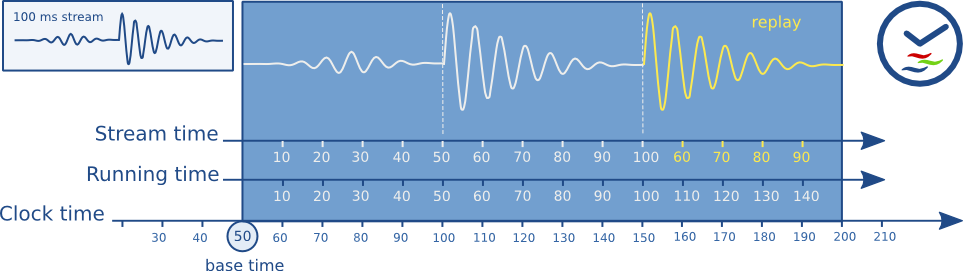

public:: true
tags:: GStreamer

- GStreamer 透過 `GstClock` object , buffer timestamp, `SEGMENT` event 去同步 pipeline 的 streams
- # Clock running-time
	- 因為電腦會有多個時間來源，所以 GStreamer 有很多 `GstClock`
	- **absolute-time** 可以透過 `gst_clock_get_time ()`取得
	- **running-time** 是由 `absolute-time - base-time` 算出
	- **base-time** 是當 GStreamer 的 pipeline 切換到 PLAYING 狀態時，選擇一個 GstClock（通常是系統時鐘或 audio/video sink 所提供的時鐘）。
		- 在 PAUSED 狀態下，running-time 是靜止的（即便時鐘還在走）。
		- 每次重新進入 PLAYING 時，pipeline 會更新 base-time，使 running-time 是連續的。
		- 這樣可以確保時間同步正確，並避免例如 seek 或暫停後時間錯亂的情況。
- # Buffer running-time
	- 在 GStreamer 裡，每個 buffer 都有一個 timestamp，但這是 stream-time，不是 running-time。
	  要計算出 running-time，需要使用 `SEGMENT` 事件中攜帶的資訊。
	  可以透過 GStreamer 的 API `gst_segment_to_running_time()` 取得
	- ## 為什麼要知道 buffer 的 running-time？
		- 用來同步播放
		  pipeline 裡所有元件（尤其是 sink）都會根據 clock 的當前時間減掉 base-time 得到「現在的 running-time」
			- 如果 buffer 的 running-time 小於這個值，表示它「應該已經播過了」。
			- 如果大於，表示「還沒到播放時間，要等一下」。
		- 實際播放時間 = buffer.running_time + pipeline.latency
		  Sink 元件會用這個計算來決定 buffer 要不要丟掉、延遲或立即播放。
	- ## 非即時 (non-live) source 的行為
		- 從檔案讀取影片的情境，第一個 buffer 通常 timestamp 是 0。
		- 若使用者做了 flushing seek（例如跳到 30 秒位置），新的 SEGMENT 會重新定義時間區段，buffer running-time 會從 0 開始。
	- ## 即時 (live) source 的行為
		- 把 capture 時刻對應的 pipeline running-time 設為 buffer 的 timestamp。
		  這樣 playback 才能與現實世界對齊（例如直播畫面必須延遲固定幾百 ms，但不能隨便亂跳時間）。
- # Buffer stream-time
	- stream-time 是這個 buffer 在 整體 media 流程中的位置。
	  通常從 0 開始，一直累積到 整個 media 的 duration。
	  可以透過 `gst_segment_to_stream_time()` 取得
	- ## 用途
		- 如果你對 pipeline 做 GST_QUERY_POSITION，得到的時間是 stream-time。顯示目前播到哪
		- 如果發一個 seek_event(10 * GST_SECOND)，這裡的 10s 就是 stream-time。
		  GStreamer 會根據這個 stream-time 找出實際該從哪個 buffer 開始播放。
		- stream-time 可以被用來對某些屬性做動畫同步，例如："音量在第 5 秒到 10 秒之間慢慢變大"
	- ## stream-time ≠ 播放時間點
	  不管 stream-time 是多少，真正決定 buffer 什麼時候被播放的，是 running-time。
- # Time overview
	- 
		- 上圖表示在 base time = 50ms 時播放 一個 100ms 的 stream，並重播 50ms ~ 100ms 的部份
		- running time 一直都是`clock time - base time`
		- stream time 代表 stream 的位置
- # Clock Provider
	- pipeline 中的某些 element 內建自己的 clock（例如 audio sink / audio source）。
	  這些 element 可以「提供」這個 clock 給整條 pipeline。
	  提供出來的 clock 必須：
		- 單調遞增（monotonically increasing）
		- 在 PLAYING 狀態下準確推進
		- 可以在 PAUSED 時暫停不動（避免時間跳動）
	- ## 為什麼需要 Clock Provider
		- clock provider 是用來對應 實際設備的播放速率（設備時鐘），比用系統時間還要準確。
	- ## clock slaving 是什麼
		- 如果 pipeline 已經選定某個 clock 作為 pipeline clock，而一個 element 有自己內建的 clock，那這個 element 就需要「對齊」或「跟隨（slave to）」 pipeline 的 clock。
		- 這需要某種演算法去估算：「當 pipeline clock 到 t 時，我的 internal clock 應該是什麼狀態？」
		- 如果 pipeline 就直接選擇了該 element 的 internal clock，那它就 不需要同步自己，直接用就行（這樣更快，也更準）
	- ## pipeline 怎麼選 clock provider
		- pipeline 會從 sink 到 source 倒著查詢每個 element。
		- 找出最後一個可以提供 clock 的 element → 它會成為 clock provider。
		- 偏好：
			- 播放型 pipeline：偏好使用 audio sink 的 clock（因為播放是以 audio 為基準）
			- 擷取型 pipeline（例如錄音）：偏好 source 的 clock（以 capture 為基準）
	-
	-
	-
	-
	-
	-
	-
	-