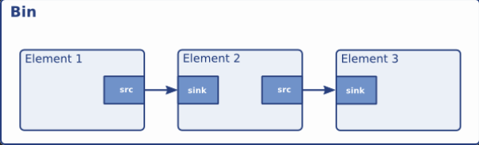
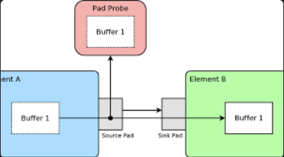
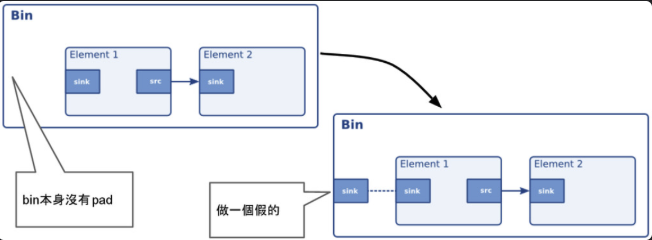

public:: true

- # Introduction
	- GStreamer是一個基於管道的多媒體框架，用於創建流媒體應用程序。它具有以下基本概念：
		- **元素(Elements)**: GStreamer的基本組件被稱為元素。元素可以執行特定的多媒體操作，例如音頻解碼、視頻編碼、效果處理等。它們可以單獨工作或與其他元素連接以構建處理流媒體數據的管道[1].
		- **管道(Pipeline)**: GStreamer使用管道來連接和處理多個元素，以完成複雜的工作流程。一個管道可以包含多個元素，並定義了數據的流向和處理步驟。開發者可以通過手動組裝元素來構建管道[1].
		- **接口(Pad)**: 元素之間的連接通過接口（pad）實現。pad是元素的輸入或輸出端口，負責接收和發送數據。每個元素可以有一個或多個輸入驅動和輸出驅動，用於與其他元素進行數據交換[4].
		- **狀態(State)**: GStreamer的元素可以處於不同的狀態，例如停止狀態、播放狀態、暫停狀態等。狀態控制元素的執行和數據流動[6].
		- **時鐘(Clock)**: GStreamer使用時鐘來控制媒體數據的同步和時間進度。時鐘提供精確的時序信息，確保音頻和視頻等媒體數據按預定的速率播放[1].
	- 通過組合不同的元素、設定管道和狀態，開發者可以使用GStreamer來實現各種多媒體應用程序，包括音頻回放、音頻和視頻播放、錄音、流媒體和音頻編輯等功能
- # 組件的基本定義和功能
	- 容器中包含組件，以pads相連(Bins containing Elements, linked by Pads)
	  
	- **pipeline**
		- GStreamer 的主要數據結構，用於建構元素的容器
		- 管理元素的流程和同步，提供播放、暫停、停止等控制功能
	- **bin**
		- 特殊的 element，可以包含其他的 element 和 bin (子容器)
		- 管理其內部的元素，提供元素間的連接和數據流動
	- **element**
		- GStreamer 的基本組件，處理媒體數據的物件
		- 執行特定的媒體處理任務，如解碼、編碼、播放、捕獲等
	- **pad**
		- 連接 element 的接口，允許數據在 element 之間流動
		- 提供元素間的數據傳輸可以動態創建和釋放
			- 靜態Pad是在元素創建時就存在的，可以通過gst_element_get_static_pad()方法獲取
			- 動態Pad是在運行時動態創建和刪除的。
		- 有 `source` (輸出) 和 `sink` (輸入) 兩種類型
		- [Capabilities](((680ae796-1125-444d-a1f5-a8ba62cd6468)))
			- Pad Capabilities定義了Pad所支持的數據類型和格式
			- 通過定義Capabilities，Pad可以指定其所能處理的數據種類，如圖像格式、視頻分辨率、音頻采樣率等
		- 一個源Pad可以連接到一個或多個接收器Pad，但一個接收器Pad只能連接到一個源Pad
		- 探針 Pad Probes 允許GStreamer應用程序監視和控制元素之間的數據流
		  
		- Ghost pad
			- 由於bin沒有pad，所以實際上仍得借助element的pad，這個過程就是建立ghost pad
			  
-
- # video pipeline
	- udpsrc uri=udp://224.5.5.5:4002 multicast-iface=wlan0 caps="application/x-rtp, media=video, payload=96, clock-rate=90000, encoding-name=H264" ! rtpbin ! queue ! rtph264depay ! video/x-h264, stream-format=byte-stream , alignment=au ! appsink name=appsink sync=false
	- ## udpsrc
	  用來接收 UDP 的 data
		- multicast-iface=wlan0: 指定 Wi-Fi interface
		- caps="application/x-rtp, ...": 告訴 GStreamer UDP data 是 RTP format、包含 H264 video
	- ## rtpbin
	  管理 RTP session state, depacketization, jitter buffer, and SSRC handling
		- rtpbin dynamically generates “recv_rtp_sink_X_Y” and “recv_rtp_src_X_Y” pads
		- It handles packet reordering, loss recovery, and clock sync for RTP sessions.
		- Note: It doesn’t automatically connect — you usually need to manually link udpsrc to the rtpbin recv_rtp_sink_0 pad. In simple pipelines like this, rtpbin can infer and autoconnect, but that’s risky in production.
	- ## queue
	- ## rtph264depay
	- ## caps
	  id:: 680ae796-1125-444d-a1f5-a8ba62cd6468
		- ### Set Caps on udpsrc
			- ```
			  udpsrc caps="application/x-rtp, media=video, encoding-name=H264, payload=96, clock-rate=90000" ! ...
			  ```
			  	•	The output pad of udpsrc will produce buffers with these caps.
			  	•	These caps are not a filter, they are an assertion: “This is the type of data I will emit.”
		- ### Filter with Caps on a Link
			- You add a caps filter as an element between stages:
			  
			  ```
			  ... ! rtph264depay ! video/x-h264, stream-format=byte-stream, alignment=au ! appsink ...
			  ```
			  	•	The output of rtph264depay must match these caps.
			  	•	If it doesn’t, negotiation fails (or it tries to convert via other elements if autoplugging is enabled).
			  	•	This is how you force a certain format going into appsink.
			- 和在程式裡加一樣
			  
			  ```cpp
			  GstCaps* sink_caps = gst_caps_new_simple("video/x-h264",
			      "stream-format", G_TYPE_STRING, "byte-stream",
			      "alignment", G_TYPE_STRING, "au",
			      NULL);
			  g_object_set(appsink, "caps", sink_caps, NULL);
			  gst_caps_unref(sink_caps);
			  ```