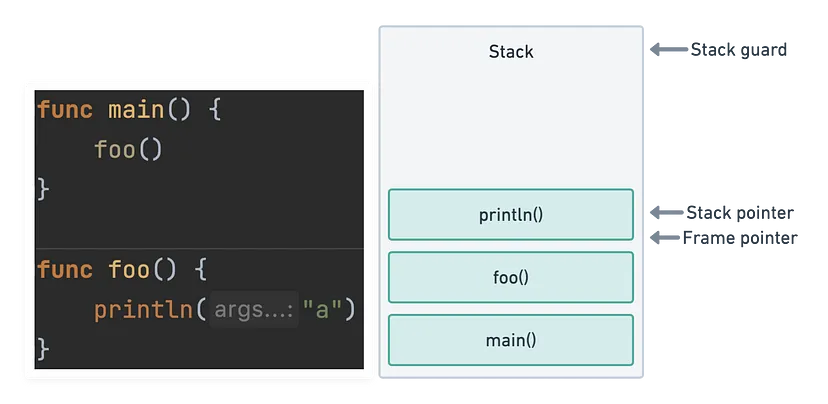
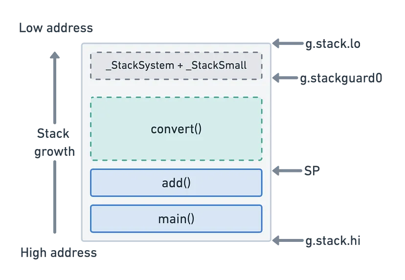

public:: true
tags:: golang, allocate

- ## Introduction
	- 在 Go runtime 進行的記憶體管理會影響效能，編譯器透過 `escape analysis` 決定要把變數放在 stack 或 heap，以下狀況會把變數放到 heap
		- function return pointer
		- 變數的大小在編譯時未知
	- 可以使用 `-benchmem`看 `alloc/op` 知道目前程式的記憶體分配狀況
	- GC 的時候會 STW
- ## Stack and Heap
	- ### Stack
		-  
		  在許多流行的程式設計環境中，stack 通常指向 thread 的 call stack。
		  call stack 是一種 LIFO stack 資料結構，用於儲存參數、局部變數以及 thread 執行 function 時追蹤的其他資料。每個 function 呼叫都會向 stack push 一個 frame，每個 return 都會從 stack 中 pop。
		  當最近的 stack frame pop 時，我們必須能夠安全地釋放它的記憶體。因此，我們不能在 stack 上儲存以後需要在其他地方引用的任何內容。
		  由於 thread 由 OS 管理，因此 thread stack 可用的記憶體量通常是固定的，例如在許多 Linux 環境中預設值為 8MB。這意味著我們還需要注意 stack 上最終有多少數據，特別是在 deeply-nested recursive functions 的情況下。
		  如果上圖中的 stack pointer 超過 stack guard，程式將因 stack overflow 錯誤而 crash。
	- ### Heap
		- 我們可以使用 heap 來儲存程式中所需的資料。此處分配的記憶體不能在 function return 時簡單地釋放，需要仔細管理以避免 leak 和 fragmentation。heap 通常會比任何 thread stack 大許多倍，大部分最佳化工作將花在研究 heap 的使用上。
		- Go 運行時將 OS 管理的 thread 完全從我們手中抽象化出來，取而代之的是我們使用一個新的抽象：`goroutines`。 
		  `Goroutine` 在概念上與 thread 非常相似，但它們存在於 user space 中。這意味著運行時不是 OS 設定了 stack 行為的規則。
		  Goroutine stack 沒有由 OS 設定硬限制，而是以少量記憶體（目前為 2KB）開始。在執行每個函數呼叫之前，會在函數序言中執行檢查，以驗證不會發生 stack overflow。
		  在下圖中，convert() 函數可以在目前堆疊大小的限制內執行（SP 不會超出 stackguard0）。
		  
		- 如果不是這種情況，運行時會在執行 Convert() 之前將目前 heap 複製到新的更大的連續記憶體空間。這意味著 Go 中的 heap 是動態調整大小的，並且只要有足夠的可用記憶體來填充它們，通常就可以不斷增長。
		  Go heap 在概念上再次類似於上述執行緒模型。所有 `goroutine` 共享一個公共 heap，任何無法儲存在 stack 中的內容都將最終存放在那裡。當正在進行 benchmark 測試的 function 中發生 heap allocation 時，我們將看到 `allocs/ops` 增加一。GC 的工作是稍後釋放不再引用的 heap 變數。
- ## When a variable is allocated to the heap
	- Go 編譯器將在 function 的 stack frame 中分配 function 的 local variable。但是，如果編譯器無法證明 function 在 return 後該變數未被引用，則編譯器必須在 GC heap 分配該變數以避免 dangling pointer error。此外，如果 local variable 非常大，將其儲存在 heap 上可能比 stack 好。
	  如果一個變數的位址已被獲取，那麼該變數就是在 heap 上分配的候選變數。基本的 `escape analysis` 可以識別某些情況，像是這些變數在 function return 之後不會存在，就可以駐留在 stack 上。
	- 可以透過編譯器的輸出看到轉義分析的結果，透過 `go build` 加上 `gcflags` 來實現
	- 透過 `-m`(`print optimization decisions`) 看以下程式的 `escape analysis` 結果
		- ### Return value
		  ```go
		  func main1() {
		     _ = stackIt()
		  }
		  //go:noinline
		  func stackIt() int {
		     y := 2
		     return y * 2
		  }
		  ```
		  
		  ```shell
		  go build -gcflags '-m -l'
		  ```
		  加上 `noinline` pragma 避免編譯時 `inlining`(如果編譯器移除 function calls 就看不到 stack 的行為
		  `-l` omit inlining decision
		  可以看到 `escape analysis` 沒有要把變數放到 heap 中，代表 `y` 還在 stack 上
		  
		  使用 benchmark 再確認一次
		  ```shell
		  $ go test -bench . -benchmem
		  BenchmarkStackIt-8  680439016  1.52 ns/op  0 B/op  0 allocs/op
		  ```
		  `allocs/op` 是 0 代表透過 copy variable 可以讓變數留在 stack
		- ### Return pointer
		  
		  ```go
		  func main2() {
		     _ = stackIt2()
		  }
		  //go:noinline
		  func stackIt2() *int {
		     y := 2
		     res := y * 2
		     return &res
		  }
		  ```
		  
		  ```shell
		  go build -gcflags '-m -l'
		  # github.com/Jimeux/go-samples/allocations
		  ./main.go:10:2: moved to heap: res
		  ```
		  編譯器表示把 pointer `res` 放到 heap
		  
		  看看 benchmark
		  ```shell
		  $ go test -bench . -benchmem
		  BenchmarkStackIt2-8  70922517  16.0 ns/op  8 B/op  1 allocs/op
		  ```
		- ### 使用 pointer 但沒有 return pointer
		  
		  ```go
		  func main3() {
		     y := 2
		     _ = stackIt3(&y) // pass y down the stack as a pointer
		  }
		  
		  //go:noinline
		  func stackIt3(y *int) int {
		     res := *y * 2
		     return res
		  }
		  ```
		  
		  ```shell
		  $ go build -gcflags '-m -l'
		  # github.com/Jimeux/go-samples/allocations
		  ./main.go:10:14: y does not escape
		  ```
		  `stackIt3` 把 `res` 傳到 `main`，`y`在
		  
		  benchmark
		  ```shell
		  $ go test -bench . -benchmem
		  BenchmarkStackIt3-8  705347884  1.62 ns/op  0 B/op  0 allocs/op
		  ```
		-
-