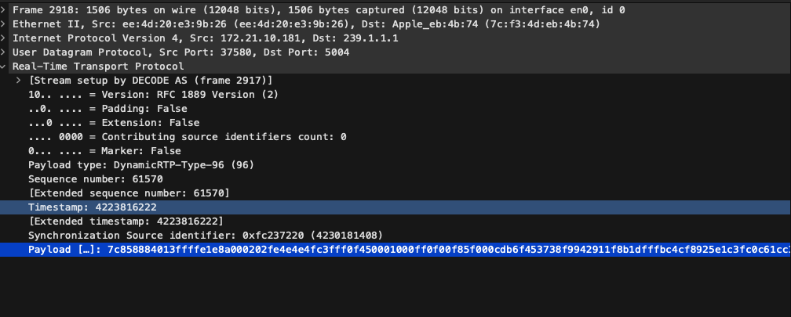

public:: true
tags:: Video Compression

- 用 16 的倍數在存影相，每個 frame 是 16 * 16
- ME：search match 這 block 在其他畫面的哪裡
- MC：diff
	- 每個 block 用不同方式預測、算差值
	- 要記錄用了什麼方式、差值
- # Parse NALU（Network Abstraction Layer Unit）Header
	- H264 的 NALU
	  
	  ```
	  +------+--------------------+
	  | 0x00 | NALU Header (1B)  |
	  +------+--------------------+
	          ^
	          └─ 要解析的就是這個 byte
	  ```
	- NALU Header
	  
	  ```
	  +---------------+
	  |F| NRI |  Type |
	  +---------------+
	   1  2bits  5bits
	  ```
	  	•	F (1 bit): forbidden_zero_bit（通常為 0）
	  	•	NRI (2 bits): nal_ref_idc（重要程度，通常可忽略）
	  	•	Type (5 bits): [nal_unit_type](((675a88b9-0350-452b-87d6-0cfc9581509a)))
	- ParseNaluType
	  
	  ```cpp
	  uint8_t parse_nalu_type(uint8_t byte) {
	      return byte & 0x1F;  // 取出最低的 5 bits (0001 1111)
	  }
	  ```
- # 播放器 初始化 decoder
	- ## SPS（Sequence Parameter Set）
		- 包含編碼影像的全域資訊，例如：
			- Profile（如 Baseline/Main/High）
			- Resolution（影像寬高）
			- Frame rate 等
		- 類似於「整個影片檔案的格式資訊」
	- ## PPS（Picture Parameter Set）
		- 包含單一圖片或片段的解碼資訊，例如：
			- 是否使用 CABAC entropy coding
			- Macroblock 排列方式
	- 通常順序：
		- 播放器解析到 SPS
		- 然後是 PPS
		- 才能正確解碼後面的 Slice（frame）
	- 沒有 SPS/PPS，播放器無法解析之後的壓縮影像內容（即使是 I-frame）
- # Wireshark 抓封包
	- 
		- ## Payload 的第一個 byte
			- 根據 RFC 6184，如果第一個 byte 是：
			  •	0x7C → 01111100
			  •	F = 0
			  •	NRI = 3 (bits 5~6 → 11)
			  •	Type = 28 (bits 0~4 → 11100 = 28)
			- 這代表 這是一個 Fragmentation Unit (FU-A)，也就是「被分片的 NALU」，這表示原始的 H.264 NALU 太大，RTP 封包無法單獨放下，所以會用 FU-A 分成數個 RTP 傳送。
		- ## 第二個 byte 看出是哪種 NALU 被分片
			- 0x85 → 10000101
			  •	Start bit = 1（bit 7）
			  •	End bit = 0（bit 6）
			  •	Reserved bit = 0（bit 5）
			  •	NALU type = 5（bit 0~4）
			- 這是該 NALU 的第一個 fragment（Start bit = 1）
			- 這是 IDR slice（NAL type 5）
- # STAP-A（Single-Time Aggregation Packet Type A）
	- 在 單一個 RTP 封包中打包多個小型 NALU（通常是 SPS、PPS 等），讓播放器在接收第一個封包時就獲得完整的解碼所需資訊。
	-