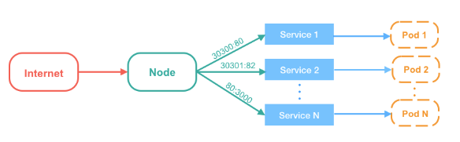
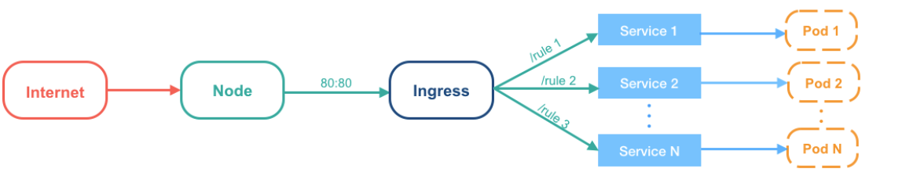

public:: true
tags:: Kubernetes

- ## 什麼是 Ingress
	- 用來將服務暴露到 cluster 外面，並且可以自定義服務的訪問策略
	- 當多個 Service 同時運行時，Node 都需要有相對應的 port number 去對應相每個 Service
	  不論新增、或是刪除 Service，都必須額外調整防火牆的設定，port 的管理也相對複雜
	  
	  使用 Ingress，只需開放一個對外的 port number，Ingress 可以在設定檔中設置不同的路徑，決定要將使用者的請求傳送到哪個 Service
	  
- ## 與 [[LoadBalancer]] 的差別
	- Ingress 可以解析 L7 的 HTTPS，也能在 ingress 設定 SSL 及 route。
	- 需要 Ingress Controller 來做負載平衡和反向代理。