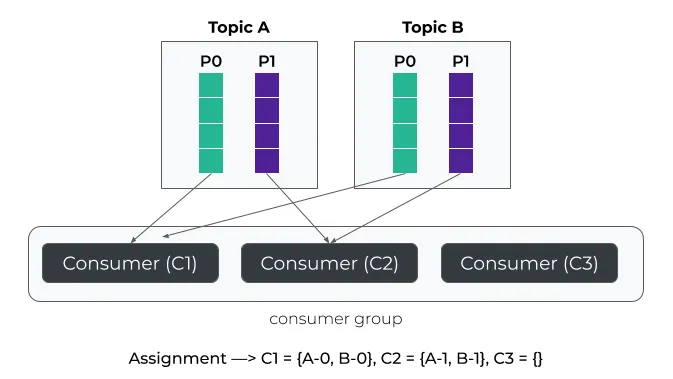
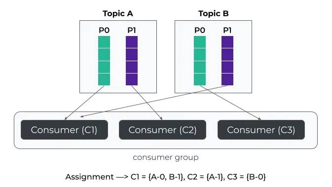
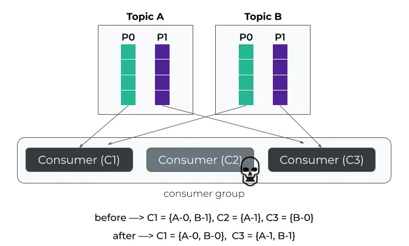
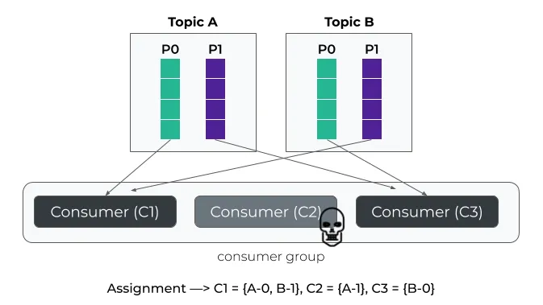
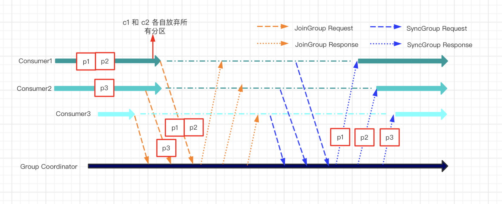

public:: true
tags:: Kafka, Kafka Partition

- [[Kafka]] 的重平衡（rebalance），一直以來都是人詬病。因為重平衡過程會觸發 `stop-the-world`（STW），此時對應 `topic`的資源都會處於不可用的狀態。小規模的集群還好，如果是大規模的集群，例如幾百個節點的 `Consumer` 或 `Kafka connect` 等，那麼重平衡就是一場災難
- ## Range
  id:: 66f0267f-0f03-48bf-91e4-5702b44311df
	- 以 member_id 的順序分配 `Partition`
	  
- ## RoundRobin
  id:: 66f02700-7a4d-495f-a0b9-3d5da538f47c
	- 比 [Range](((66f0267f-0f03-48bf-91e4-5702b44311df))) 更能完全分配，最大化的使用 `Consumer`
	  
	  當 `Comsumer` 有變動時，需要重新分配的 `Partition` 會影響蠻大的
	  
- ## StickyAssignor
	- 和 [RoundRobin](((66f02700-7a4d-495f-a0b9-3d5da538f47c))) 的分配方式相似，但減少 rebalance 的變動
	  主要功能是確保客戶端，例如 `Consumer` 消費者在重平衡後能夠維持原本的分配方案，可惜的是這個分配策略依舊是在`eager` 協議的框架之下，重平衡仍然需要每個 `Consumer` 都先放棄當前持有的資源（分區）
	  
- ## Incremental Cooperative Rebalancing
  `Cooperative` 協定將一次全域重平衡，改成每次小規模重平衡，直到最終收斂平衡的過程
	- Eager 協定
	  
	- Cooperative 協定
	  
	  c1 和c2發送joingroup的request給group coordinator，但不需要revoke其所擁有的partition，而是將其擁有的分區編碼後一併發送給group coordinator，即{c1->p1, p2}，{c2- >p3}