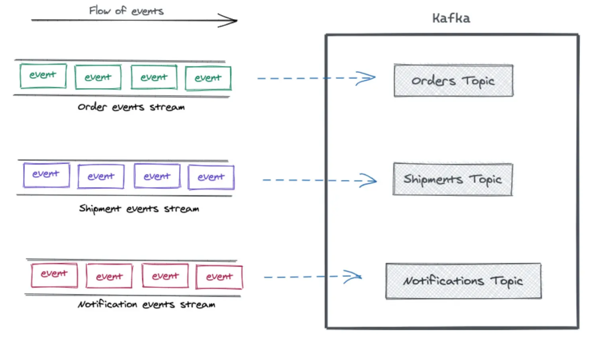

public:: true
tags:: Kafka

- Partition（分區）是 Kafka 的核心角色，對於 Kafka 的存儲結構、消息的生產消費方式都至關重要。
  掌握好 Partition 就可以更快的理解 Kafka。本文會講解 Partition 的概念、結構，以及行爲方式。
- ## Events, Streams, Topics
  在深入 Partition 之前，我們先看幾個更高層次的概念，以及它們與 Partition 的聯繫。
  `Event`（事件）代表過去發生的一個事實。簡單理解就是一條消息、一條記錄。
  `Event` 是不可變的，但是很活躍，經常從一個地方流向另一個地方。
  `Stream` 事件流表示運動中的相關事件。
  當一個事件流進入 [[Kafka]] 之後，它就成爲了一個 `Topic` 主題。
  
  所以，`Topic` 就是具體的事件流，也可以理解爲一個 `Topic` 就是一個靜止的 `Stream`。
  `Topic` 把相關的 `Event` 組織在一起，並且保存。一個 `Topic` 就像數據庫中的一張表。
-