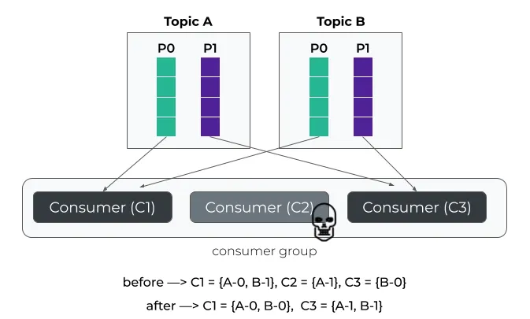
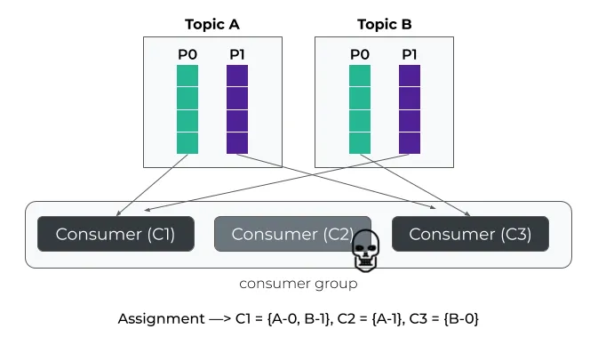

public:: true
tags:: Kafka, Kafka Partition

- [[Kafka]] 的重平衡（`rebalance`），一直以來都是人詬病。因為重平衡過程會觸發 `stop-the-world`（STW），此時對應 `topic`的資源都會處於不可用的狀態。小規模的集群還好，如果是大規模的集群，例如幾百個節點的 `Consumer` 或 `Kafka connect` 等，那麼重平衡就是一場災難
- ## Partition Assignment Strategy
	- ### Range
	  id:: 66f0267f-0f03-48bf-91e4-5702b44311df
		- 以 member_id 的順序分配 `Partition`
		  
	- ### RoundRobin
	  id:: 66f02700-7a4d-495f-a0b9-3d5da538f47c
		- 比 [Range](((66f0267f-0f03-48bf-91e4-5702b44311df))) 更能完全分配，最大化的使用 `Consumer`
		  
		  當 `Comsumer` 有變動時，需要重新分配的 `Partition` 會影響蠻大的
		  
	- ### StickyAssignor
		- 和 [RoundRobin](((66f02700-7a4d-495f-a0b9-3d5da538f47c))) 的分配方式相似，但減少 rebalance 的變動
		  主要功能是確保客戶端，例如 `Consumer` 消費者在重平衡後能夠維持原本的分配方案，可惜的是這個分配策略依舊是在`eager` 協議的框架之下，重平衡仍然需要每個 `Consumer` 都先放棄當前持有的資源（分區）
		  
- ## Incremental Cooperative Rebalancing
  `Cooperative` 協定將一次全域重平衡，改成每次小規模重平衡，直到最終收斂平衡的過程
	- Eager 協定
	  
	- Cooperative 協定
	  
		- c1 和c2發送 joingroup 的request給 `group coordinator` ，但不需要 revoke 其所擁有的 `partition`，而是將其擁有的分區編碼後一併發送給 `group coordinator`，即 **{c1->p1, p2}**，**{c2- >p3}**
		- `group coordinator` 從元資料取得目前的分割資料（這個稱為 `assigned-partitions`），再從c1 c2 的 joingroup request 中取得所指派的分割區（這個稱為 `owned-partitions`），透過 `assigned-partitions` 和 `owned-partitions` 知曉目前分配情況，決定取消 c1 一個分區 p2 的消費權，然後發送 sync group request（**{c1->p1}**，**{c2->p3}**）給c1 c2，讓它們繼續消費p1 p2
		- c1 c2 接收到分配方案後，重新開始消費，一次 `rebalance` 完成，當然這時候 **p2處於無人消費狀態**
		- 再次觸發 `rebalance`，重複上述流程，不過這次的目的是把p2分配給c3（透過 `assigned-partitions` 和 `owned-partitions` 取得分區分配狀態）
- ## Static Membership
	- 目前重平衡發生的條件有三：
		- 成員數量發生變化，即有新成員加入或現有成員離組（包括主動離組和崩潰被動離組）
		- 訂閱主題數量發生變化
		- 訂閱主題分區數量發生變化
	- 其中成員加入或成員離組是最常見的觸發 `rebalance` 的情況。新成員加入這個場景必然發生 `rebalance`，沒辦法優化（針對初始化多個消費者的情況有其他優化，即延遲進行重平衡），但消費者崩潰離組卻可以優化。因為一個消費者崩潰離組通常不會影響到其他 {partition - consumer} 的分配情況。
	- `Static Membership`功能和一個 `Consumer` 端的設定參數 `group.instance.id`。一旦配置了該參數，成員將自動成為靜態成員，否則的話和以前一樣仍然被視為是動態成員。
	- 靜態成員的好處在於，其靜態成員ID值是不變的，因此先前分配給該成員的所有分區也是不變的。**即假設一個成員掛掉，在沒有超時前靜態成員重啟回來是不會觸發 `Rebalance` 的**（超時時間為 `session.timeout.ms`，預設為10 sec）。在靜態成員掛掉這段時間，`broker` 會一直為該消費者保存狀態（offset），直到逾時或靜態成員重新連接。
	- 如果使用了 `static membership` 功能後，觸發 `rebalance` 的條件如下：
		- 新成員加入組：這個條件依然不變。當有新成員加入時肯定會觸發 `Rebalance` 重新分配分區
		- Leader 成員重新加入群組：例如主題分配方案發生變更
		- 現有成員離組時間超過了 `session.timeout.ms` 逾時時間：即使它是靜態成員，`Coordinator` 也不會無限期地等待它。一旦超過了 session 逾時時間依然會觸發 `Rebalance`
		- `Coordinator` 接收 `LeaveGroup` 要求：會員主動通知 `Coordinator` 永久離組。