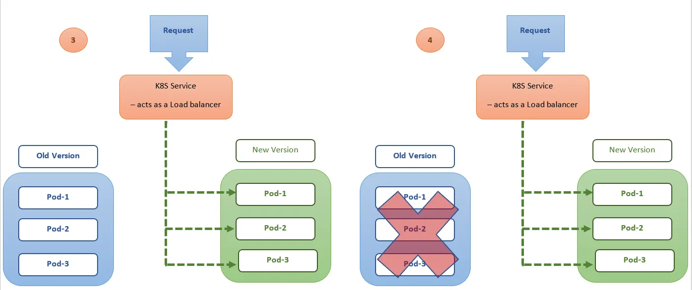
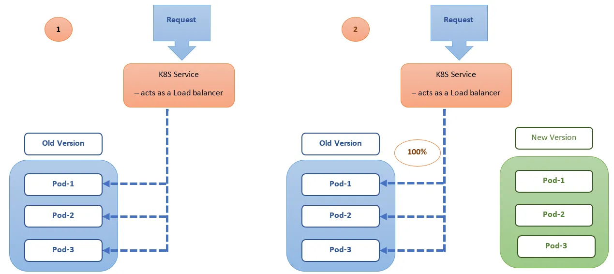

public:: true
tag:: Kubernetes

- ## Rolling Deployment
	- rolling upgrade 在更新 pod 時，會先確定部份新的 pod 可以正常運作後才把舊的 pod 停止，讓服務不中斷。
	  以下兩個參數用來調整策略，不能同時為 0
		- maxSurge: 升級中最多會有 replicas + maxSurge 個 pod 在運作
		- maxUnavailable: 最多有幾個 pod 在無法服務的狀態
	- readiness probe 用來檢查應用程式是否可以接收流量，在 rolling upgrade 的過程會等到新的 pod 通過 readiness probe 檢查才停止舊的 pod。
	- 
	  
- ## Recreate Deployment
	- recreate 會先把舊的 pods 都停掉後才建立新的，因此不會有新舊服務同時在線上的問題。
	- 
- ## Blue/Green Deployment
	- 藍綠部署是最常見的一種 `Zero Downtime` 部署的方式，是相對簡單穩定且不會有多版本同時存在線上的問題，需要注意的是會有一段系統承受兩倍的資源負載的時間，如果資源不吃緊的話的確是值得使用該策略以換取穩定性與時間成本。
	- 
	  
- ## Canary Deployment
	- 金絲雀部署與藍綠部署最大的不同是，它不是非黑即白的部署方式，而是介在於黑與白之間，能夠平滑過渡到下一個版本的方法。它能夠緩辦的將修改推送給小部分的使用者，確定沒問題後才正式迭代到下一個版本，以降低值接引入新功能的風險。
	- 使用
	- 
	  
-