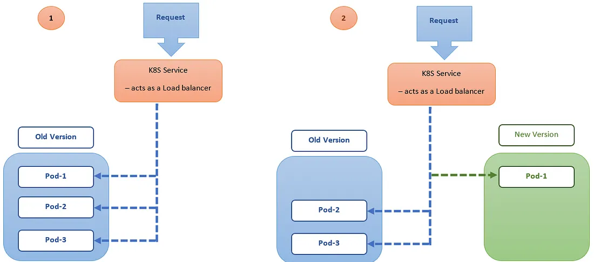

public:: true
tag:: Kubernetes

- ## Rolling Deployment
	- rolling upgrade 在更新 pod 時，會先確定部份新的 pod 可以正常運作後才把舊的 pod 停止，讓服務不中斷。
	  以下兩個參數用來調整策略，不能同時為 0
		- maxSurge: 升級中最多會有 replicas + maxSurge 個 pod 在運作
		- maxUnavailable: 最多有幾個 pod 在無法服務的狀態
	- readiness probe 用來檢查應用程式是否可以接收流量，在 rolling upgrade 的過程會等到新的 pod 通過 readiness probe 檢查才停止舊的 pod。
	- 
	  
- ## Recreate Deployment
	- recreate 會先把舊的 pods 都停掉後才建立新的，因此不會有新舊服務同時在線上的問題。
	- 
- ## Blue/Green Deployment
	-