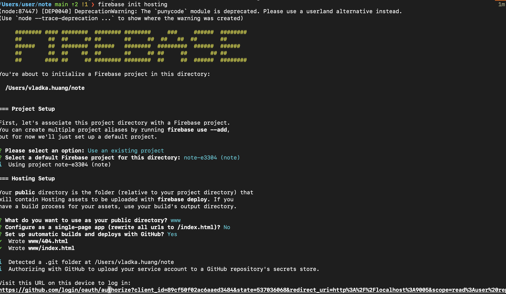
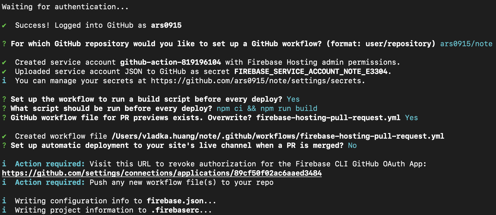

## 使用 firebase publish 的原因
	- 原本使用 https://github.com/logseq/publish-spa 發現無法顯示圖片
- ## 設定步驟
	- Create new Github repo
	  logseq.order-list-type:: number
	- Logseq create new graph 指定本地位置到 git clone 的路徑
	  logseq.order-list-type:: number
	- Logseq setting
	  logseq.order-list-type:: number
	  ```
	  :editor/preferred-pasting-file? true
	  :publishing/all-pages-public? true
	  ```
	- Logseq enable auto commit (Optional)
	  logseq.order-list-type:: number
	- Firebase 設定，透過 CLI 建立 hosting
	  logseq.order-list-type:: number
		- `sudo npm install -g firebase-tools`
		  logseq.order-list-type:: number
		- `firebase login`
		  logseq.order-list-type:: number
		- `firebase init hosting`
		  logseq.order-list-type:: number
		  
		  
		- modify `.firebaserc` by command 
		  logseq.order-list-type:: number
		  ```
		  // firebase target:apply hosting <target> <resources...>
		  firebase target:apply hosting note-e3304 note-e3304
		  ```
		- edit `firebase.json`, 設定 target,
		  logseq.order-list-type:: number
		- logseq.order-list-type:: number
		  ```
		  {
		    "hosting": {
		      "target": "note-e3304",
		      "public": "www",
		      "ignore": [
		        "firebase.json",
		        "**/.*",
		        "**/node_modules/**"
		      ],
		      "rewrites": [
		        {
		          "source": "**",
		          "destination": "www/index.html"
		        }
		      ]
		    }
		  }
		  ```
	- 建立 `.github/workflows/publish.yml` replace firebaseServiceAccount and projectId from `.github/workflows/firebase-hosting-pull-request.yml`
	  logseq.order-list-type:: number
	  ```
	  # This is a basic workflow to help you get started with Actions
	  name: Logseq Deploy
	  
	  # Controls when the workflow will run
	  on:
	    push:
	      branches: [main]
	  
	    # Allows you to run this workflow manually from the Actions tab
	    workflow_dispatch:
	    # A workflow run is made up of one or more jobs that can run sequentially or in parallel
	  
	  permissions:
	      contents: write
	  
	  jobs:
	    # This workflow contains a single job called "build"
	    build:
	      # The type of runner that the job will run on
	      runs-on: ubuntu-latest
	  
	      # Steps represent a sequence of tasks that will be executed as part of the job
	      steps:
	        # Checks-out your repository under $GITHUB_WORKSPACE, so your job can access it
	        - uses: actions/checkout@v2
	        
	        # Publish action by other contributor
	        - name: Logseq Publish
	          uses: pengx17/logseq-publish@main
	          with:
	            version: latest
	  
	        - name: add a nojekyll file
	          run: touch $GITHUB_WORKSPACE/www/.nojekyll
	  
	        - name: Deploy to GitHub pages
	          uses: JamesIves/github-pages-deploy-action@v4
	          with:
	            branch: gh-pages # The branch the action should deploy to.
	            folder: www # The folder the action should deploy.
	            clean: true
	  
	        - name: deploy to firebase hosting live channel
	          uses: FirebaseExtended/action-hosting-deploy@v0
	          with:
	            repoToken: "${{ secrets.GITHUB_TOKEN }}"
	            firebaseServiceAccount: "${{ secrets.FIREBASE_SERVICE_ACCOUNT_NOTE_E3304 }}"
	            projectId: note-e3304
	            channelId: live
	  ```
	- remove `.github/workflows/firebase-hosting-pull-request.yml`
	  logseq.order-list-type:: number
	- logseq.order-list-type:: number