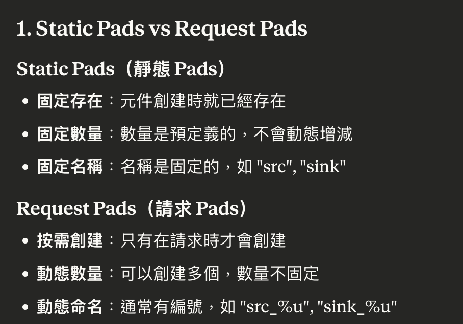

public:: true
tags:: Multicast, GStreamer

- pipeline
  ```
  udpsrc -> rtpbin -> rtpmp2tdepay -> tsparse -> tsdemux 
  tsdemux
  |_> (audio) queue -> aacparse -> avdec_aac -> audioconvert -> audioresample -> openslessink
  |_> (video) queue -> decodebin -> videoconvert -> capsfilter -> queue -> glimagesink
  ```
- decodebin -> videoconvert -> capsfilter -> glimagesink 黑畫面
	- 看 native windows 尺寸是 1*1 => 先在 Surface 設定尺寸後再傳入
- render 完第一個畫面後就卡住
	- decodebin 也沒有再產出，應該是 glimagesink 的背壓造成
	- 前面加上 queue => decodebin -> videoconvert -> capsfilter -> queue -> glimagesink
- glimagesink 參數
	- sync = FALSE：
		- glimagesink 不根據 PTS 與 pipeline 的 clock 播放，只要有 buffer 就立刻顯示。
		  id:: 68c22b60-7cf6-4adb-84ce-69ddeafc2023
		  •	畫面會比較流暢，但幀不一定準時（甚至跑很快）。
		  •	音訊和視訊失去同步，尤其當 openslessink（音訊）是 sync = TRUE 時，就會導致：
		  •	音訊播放速度不正常（常是太快）
		  •	音訊 buffer 播放完但沒有新的到來 → 播放中止（無聲音）
	- sync = TRUE（預設）：
		- glimagesink 會根據 buffer 的 PTS（presentation timestamp） 和 pipeline 的 全域 clock（通常由音訊 sink 控制） 來同步播放。
		  •	必須等到時間到了才會顯示 → 符合 A/V sync 要求
		  •	若 render（例如 GPU 或 Surface）太慢，或是上游 PTS 很跳躍，就會：
		  •	畫面掉幀（因為 PTS 過期）
		  •	視訊嚴重卡頓，但音訊正常
- decodebin 接 probe 看輸出發現一秒一幀
	- 在 tsdemux 發現每 33ms 就有一幀、也有 PTS
	- 使用 tsdemux -> queue -> h264parse -> capsfilter -> filesink 產出 h264 檔案可以播放
	- 加了 probe 發現 tsdemux 和 h264parse PTS 都是幾乎 33ms 差距
	- 改用 avdec_h264: queue ! h264parse ! avdec_h264 ! videoconvert ! render_queue ! glimagesink 只有一幀就卡住了
	- 查看 element 輸出 PTS
	  ```cpp
	  gst_pad_add_probe(
	        gst_element_get_static_pad(self->video_sink_, "sink"), // element, sink/src
	        GST_PAD_PROBE_TYPE_BUFFER,
	        [](GstPad* pad, GstPadProbeInfo* info, gpointer) -> GstPadProbeReturn {
	          GstBuffer* buffer = GST_PAD_PROBE_INFO_BUFFER(info);
	          GstClockTime pts = GST_BUFFER_PTS(buffer);
	          g_print("[%s] : PTS = %" GST_TIME_FORMAT "\n", GST_ELEMENT_NAME(GST_PAD_PARENT(pad)), GST_TIME_ARGS(pts));
	          static GstClockTime last_time = GST_CLOCK_TIME_NONE;
	          GstClockTime now = gst_util_get_timestamp();
	          if (last_time != GST_CLOCK_TIME_NONE) {
	            GstClockTime diff = now - last_time;
	            double sec = GST_TIME_AS_SECONDS(diff);
	            if (sec > 0.01) {  // 避免太短一堆 0.000
	              g_print("[%s]  interval: %" GST_TIME_FORMAT "\n", GST_ELEMENT_NAME(GST_PAD_PARENT(pad)), GST_TIME_ARGS(diff));
	            }
	          }
	          last_time = now;
	          return GST_PAD_PROBE_OK;
	        },
	        nullptr, nullptr);
	  ```
- decodebin PTS 33ms
	- 查看 decodebin 選用什麼解碼器
	  ```cpp
	  // 在建立 decodebin 時連接 signal
	  g_signal_connect(decodebin, "element-added", G_CALLBACK(on_element_added), NULL);
	  
	  static void on_element_added(GstBin* bin, GstElement* element, gpointer user_data) {
	      const gchar* element_name = gst_element_get_name(element);
	      const gchar* factory_name = gst_plugin_feature_get_name(
	          GST_PLUGIN_FEATURE(gst_element_get_factory(element)));
	      
	      ALOGI("decodebin added element: %s (factory: %s)", element_name, factory_name);
	      
	      // 特別留意解碼器
	      if (strstr(factory_name, "dec") || strstr(factory_name, "decoder")) {
	          ALOGI("*** DECODER SELECTED: %s ***", factory_name);
	      }
	  }
	  ```
	  decodebin added element: h264parse0 (factory: h264parse)
	  decodebin added element: capsfilter0 (factory: capsfilter)
	  decodebin added element: avdec_h264-0 (factory: avdec_h264)
	- 輸出到檔案看看
	  ```
	  self->video_sink_ = gst_element_factory_make("filesink", "video_sink");
	      if (self->video_sink_) {
	        g_object_set(self->video_sink_,
	                     "location", "/sdcard/test_output.yuv",
	                     NULL);
	  ```
- queue 的 "leaky" 屬性
	- 當 queue 滿了時，要「丟棄」哪邊的 buffer：0 = 不丟（預設）1 = upstream（丟舊的 input）2 = downstream（丟新的 output）
	- upstream: **適合低延遲場景**：視訊監控、即時通訊
	- downstream: 不建議用在 video，會增加延遲
- openslessink 參數
	- buffer-time
		- ✅ 定義：
		  •	sink 內部的總 buffer 大小（以時間表示）。
		  •	GStreamer 播放音訊前，最多會累積這麼多資料進入 sink。
		- 📌 影響：
		  •	越大 → 播放越穩定（耐 jitter），但延遲變高。
		  •	越小 → 播放延遲變低，但更容易出現「聲音斷裂」、「resync」。
	- latency-time
		- ✅ 定義：
		  •	從 buffer 開始接收資料到實際播放的延遲時間。
		  •	是這個 sink 對 pipeline 提出的最小 latency 要求。
		- 📌 影響：
		  •	GStreamer 播放器會根據它與其他元素（如 demuxer）計算 latency。
		  •	如果低於 source 實際提供資料的時間，就會造成掉幀、跳音。
	- 實測結果 當 pipeline clock provider 是 audio sink 時
		- buffer-time: 200ms, latency-time: 20ms => 聲音正常，video很卡
		  buffer-time: 300ms, latency-time: 200ms => video 很順暢，audio 會一直 resync 沒聲音
- ## Audio sink 大緩衝區造成不準確的幾個原因
  大緩衝區 = 位置不確定性大 = 對任何誤差都很敏感 = 容易 resync
	- ### Hardware Position 報告的不確定性
		- 小 Latency (20ms) 
		  ```
		  Hardware Buffer: [████████] 20ms
		                   ↑
		              精確的播放位置報告
		              誤差範圍: ±1-2ms
		  ```
		- 大 Latency (300ms) 
		  ```
		  Hardware Buffer: [████████████████████████████████] 300ms
		                   ↑        ↑         ↑        ↑
		             可能位置1   可能位置2   可能位置3   寫入點
		             
		  Hardware 回報的 position 可能指向緩衝區中的任何位置
		  誤差範圍: ±50-150ms
		  ```
	- ### Buffer Offset 計算的累積誤差
		- **小緩衝區 (20ms = 882 samples)**：
		  ```
		  時間線：
		  T0: write 882, played 0    → offset = 882
		  T10ms: write 882, played 441  → offset = 1323  
		  T20ms: write 882, played 882  → offset = 882
		  T30ms: write 882, played 1323 → offset = 882
		  
		  Buffer offset 在 440-880 範圍內波動
		  ```
		- **大緩衝區 (300ms = 13230 samples)**：
		  ```
		  時間線：  
		  T0: write 13230, played 0     → offset = 13230
		  T50ms: write 13230, played 2205  → offset = 24255
		  T100ms: write 13230, played 4410 → offset = 35475
		  ...
		  
		  Buffer offset 在 6000-13000+ 範圍內波動
		  ```
	- ### Clock Skew 的影響
	  ```
	  // 小緩衝區：時鐘基準更新頻繁，誤差來不及累積
	  void update_clock_20ms() {
	      hardware_time = get_hardware_time();
	      samples_played = get_samples_played();
	      
	      // 每 20ms 重新校正一次
	      current_time = base_time + (samples_played / sample_rate) * GST_SECOND;
	  }
	  
	  // 大緩衝區：時鐘基準更新較少，期間累積微小漂移
	  void update_clock_300ms() {
	      // 同樣的計算，但 300ms 期間：
	      // - 硬體時鐘可能漂移
	      // - samples_played 的誤差被放大
	      // - 最終的 current_time 就不準了
	  }
	  ```
- ## 排查過程
	- 寫檔案
	  ```cpp
	  void RtpMpegTsPlayerGst::ConnectVideoPad(GstPad* pad) {
	    GstElement* queue = gst_element_factory_make("queue", "h264_dump_queue");
	    GstElement* h264parse = gst_element_factory_make("h264parse", "h264parse");
	    GstElement* capsfilter = gst_element_factory_make("capsfilter", "capsfilter");
	    GstElement* filesink = gst_element_factory_make("filesink", "h264sink");
	  
	    if (!queue || !h264parse || !capsfilter || !filesink) {
	      ALOGE("Failed to create h264 dump elements");
	      return;
	    }
	  
	    g_object_set(filesink, "location", "/sdcard/dump.h264", NULL);
	  
	    // 🔧 確保插入 SPS/PPS + 強制 parse
	    g_object_set(h264parse,
	                 "config-interval", 1,
	                 "disable-passthrough", TRUE,
	                 NULL);
	  
	    // 🔧 設定輸出為合法 AVC (MP4/H.264) stream
	    GstCaps* caps = gst_caps_new_simple("video/x-h264",
	                                        "stream-format", G_TYPE_STRING, "byte-stream",
	                                        "alignment", G_TYPE_STRING, "au",
	                                        NULL);
	    g_object_set(capsfilter, "caps", caps, NULL);
	    g_object_set(capsfilter, "caps", caps, NULL);
	    gst_caps_unref(caps);
	  
	    gst_bin_add_many(GST_BIN(pipeline_), queue, h264parse, capsfilter, filesink, NULL);
	  
	    if (!gst_element_link_many(queue, h264parse, capsfilter, filesink, NULL)) {
	      ALOGE("Failed to link h264 dump elements");
	      return;
	    }
	  
	    GstPad* queue_sink = gst_element_get_static_pad(queue, "sink");
	    if (gst_pad_link(pad, queue_sink) != GST_PAD_LINK_OK) {
	      ALOGE("Failed to link video pad to h264 dump queue");
	    }
	    gst_object_unref(queue_sink);
	  
	    gst_element_sync_state_with_parent(queue);
	    gst_element_sync_state_with_parent(h264parse);
	    gst_element_sync_state_with_parent(capsfilter);
	    gst_element_sync_state_with_parent(filesink);
	  }
	  ```
	- 列出可用 decoder
	  ```cpp
	  void ListAvailableDecoders() {
	    GList* decoders = gst_element_factory_list_get_elements(
	        GST_ELEMENT_FACTORY_TYPE_DECODER, GST_RANK_NONE);
	  
	    ALOGI("Available decoders:");
	    for (GList* l = decoders; l; l = l->next) {
	      GstElementFactory* factory = GST_ELEMENT_FACTORY(l->data);
	      const gchar* name = gst_plugin_feature_get_name(GST_PLUGIN_FEATURE(factory));
	      const gchar* description = gst_element_factory_get_description(factory);
	      ALOGI("  %s - %s", name, description);
	    }
	  
	    gst_plugin_feature_list_free(decoders);
	  }
	  ```
	- 查看 decodebin 用什麼 element
	  ```cpp
	  static void on_element_added(GstBin* bin, GstElement* element, gpointer user_data) {
	    const gchar* element_name = gst_element_get_name(element);
	    const gchar* factory_name = gst_plugin_feature_get_name(
	        GST_PLUGIN_FEATURE(gst_element_get_factory(element)));
	  
	    ALOGI("decodebin added element: %s (factory: %s)", element_name, factory_name);
	  
	    // 特別留意解碼器
	    if (strstr(factory_name, "dec") || strstr(factory_name, "decoder")) {
	      ALOGI("*** DECODER SELECTED: %s ***", factory_name);
	    }
	  }
	  ```
- PacketLost 事件
	- 攔截 GstRTPPacketLost ((68cd1b55-a892-4cae-b5f2-67b271d6dbe8))
	- 
	-
- Static Pads vs Request Pads
	- 
	- ```
	  // === Static Pads ===
	  GstPad* static_pad = gst_element_get_static_pad(element, "src");
	  // 使用完後只需要 unref，不需要 release
	  if (static_pad) {
	      gst_object_unref(static_pad);  // 只需要這個
	  }
	  
	  // === Request Pads ===
	  GstPad* request_pad = gst_element_get_request_pad(element, "src_%u");
	  // 使用完後需要先 release 再 unref
	  if (request_pad) {
	      gst_element_release_request_pad(element, request_pad);  // 先釋放
	      gst_object_unref(request_pad);                          // 再 unref
	  }
	  ```
	- **在播放期間調用 `gst_element_release_request_pad` 會自動 unlink 該 pad 的所有連接**
	-
	-
	-