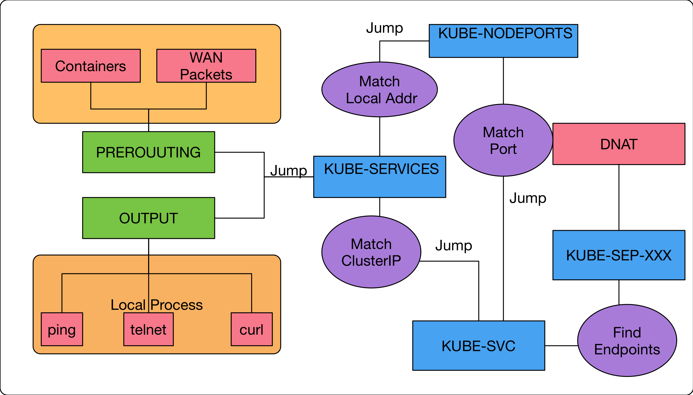

public:: true
tags:: Kubernetes, Kubernetes Service, iptables

- `NodePort` 本身包含了 [[ClusterIP]] 的能力，也可以讓`Cluster`外部透過指定的Port存取`Cluster`內的應用程式。
- ## 實現方式
  根據 [[ClusterIP]]的流程中得知，要支援`NodePort`只需要修改前面的條件
  1. 封包若來自叢集上的應用程式/節點，則跳到 `KUBE-SVC`
  2. 如果封包的目標IP地址是 ClusterIP 所提供的虛擬IP地址, 則跳到 KUBE-SVC-XXXX
- 先部屬一個 `k8s-nginx-node`service 在 `default`namespace 中，查看它的 iptables 規則
  ```
  vortex-dev:03:17:35 [~]vagrant
  $sudo iptables-save  | grep default/k8s-nginx-node
  -A KUBE-NODEPORTS -p tcp -m comment --comment "default/k8s-nginx-node:" -m tcp --dport 30136 -j KUBE-MARK-MASQ
  -A KUBE-NODEPORTS -p tcp -m comment --comment "default/k8s-nginx-node:" -m tcp --dport 30136 -j KUBE-SVC-RD5DSC6PXE26GCYZ
  -A KUBE-SEP-VRKO3GZ2XUCPVWY5 -s 10.244.0.115/32 -m comment --comment "default/k8s-nginx-node:" -j KUBE-MARK-MASQ
  -A KUBE-SEP-VRKO3GZ2XUCPVWY5 -p tcp -m comment --comment "default/k8s-nginx-node:" -m tcp -j DNAT --to-destination 10.244.0.115:80
  -A KUBE-SEP-YNJKNN6SS5424R7C -s 10.244.0.113/32 -m comment --comment "default/k8s-nginx-node:" -j KUBE-MARK-MASQ
  -A KUBE-SEP-YNJKNN6SS5424R7C -p tcp -m comment --comment "default/k8s-nginx-node:" -m tcp -j DNAT --to-destination 10.244.0.113:80
  -A KUBE-SEP-ZGMDZ7UNNV74OV5B -s 10.244.0.114/32 -m comment --comment "default/k8s-nginx-node:" -j KUBE-MARK-MASQ
  -A KUBE-SEP-ZGMDZ7UNNV74OV5B -p tcp -m comment --comment "default/k8s-nginx-node:" -m tcp -j DNAT --to-destination 10.244.0.114:80
  -A KUBE-SERVICES ! -s 10.244.0.0/16 -d 10.98.128.179/32 -p tcp -m comment --comment "default/k8s-nginx-node: cluster IP" -m tcp --dport 80 -j KUBE-MARK-MASQ
  -A KUBE-SERVICES -d 10.98.128.179/32 -p tcp -m comment --comment "default/k8s-nginx-node: cluster IP" -m tcp --dport 80 -j KUBE-SVC-RD5DSC6PXE26GCYZ
  -A KUBE-SVC-RD5DSC6PXE26GCYZ -m comment --comment "default/k8s-nginx-node:" -m statistic --mode random --probability 0.33332999982 -j KUBE-SEP-YNJKNN6SS5424R7C
  -A KUBE-SVC-RD5DSC6PXE26GCYZ -m comment --comment "default/k8s-nginx-node:" -m statistic --mode random --probability 0.50000000000 -j KUBE-SEP-ZGMDZ7UNNV74OV5B
  -A KUBE-SVC-RD5DSC6PXE26GCYZ -m comment --comment "default/k8s-nginx-node:" -j KUBE-SEP-VRKO3GZ2XUCPVWY5
  ```
  根據 custom chain 來看有四個部份
  1. KUBE-NODEPORTS
  2. KUBE-SEP-XXXX
  3. KUBE-SERVICES
  4. KUBE-SVC-XXXX
  只有 `KUBE-NODEPORTS`和 [[ClusterIP]]不一樣
- ## KUBE-NODEPORTS
	- ```
	  -A KUBE-NODEPORTS -p tcp -m comment --comment "default/k8s-nginx-node:" -m tcp --dport 30136 -j KUBE-MARK-MASQ
	  -A KUBE-NODEPORTS -p tcp -m comment --comment "default/k8s-nginx-node:" -m tcp --dport 30136 -j KUBE-SVC-RD5DSC6PXE26GCYZ
	  ```
	  1.`-j KUBE-MARK-MASQ`, 這部份是跟[[SNAT]]有關的，修改封包的來源IP
	  2. `-j KUBE-SVC-XXXXX` 的條件是存取`30136/TCP`，就會跳到 [KUBE-SVC-XXXXX](((668bcac4-b9fe-4452-aabc-6ab9118d3d9f)))
	  這邊的 port 也可以通過 `kubectl get svc`得知
	  ```
	  vortex-dev:03:34:14 [~]vagrant
	  $kubectl get svc
	  NAME             TYPE        CLUSTER-IP      EXTERNAL-IP   PORT(S)        AGE
	  k8s-nginx-node   NodePort    10.98.128.179   <none>        80:30136/TCP   1d
	  ```
	- 什麼時候會跳到 `KUBE-NODEPORTS`?
	  ```
	  vortex-dev:03:43:42 [~]vagrant
	  $sudo iptables-save  | grep "\-j KUBE-NODEPORTS"
	  -A KUBE-SERVICES -m comment --comment "kubernetes service nodeports; NOTE: this must be the last rule in this chain" -m addrtype --dst-type LOCAL -j KUBE-NODEPORTS
	  ```
	  條件：只要封包的目標IP地址是屬於本節點上的任何網卡IP
- ## PortBinding
  所有的 `kubernetes NodePort service` 都會共用同一個 `KUBE-NODEPORT`，因此所有的 `NodePort` 使用的 `Port` 都不能一樣，也不能讓任何應用程式使用到同一個 port
  當 `NodePort`建立後 `kube-proxy`就會佔用那個 Port，避免其他應用程式用到
  ```
  vortex-dev:04:08:18 [~]vagrant
  $sudo netstat -ltpn | grep 30136
  tcp6       0      0 :::30136                :::*                    LISTEN      10181/kube-proxy
  ```
- ## Summary
  