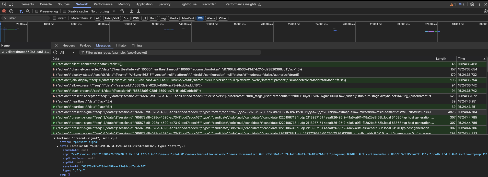
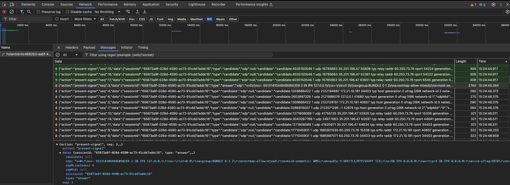

# WebRTC Events
	- ## ICE Candidate Gathering
		- host
		  ```
		  sdpMid: 0, sdpMLineIndex: 0
		  candidate: candidate:1345223362 1 udp 2113937151 4aea1f26-95f2-41a5-a9f1-f18a2be8f58b.local 51366 typ host generation 0 ufrag n4Fy network-cost 999
		  ```
		- srflx
		  ```
		  sdpMid: 2, sdpMLineIndex: 2
		  candidate: candidate:1740573071 1 udp 1677729535 60.250.73.76 59153 typ srflx raddr 0.0.0.0 rport 0 generation 0 ufrag n4Fy network-cost 999
		  url: stun:turn.stage.airsync.net:3478
		  ```
		- relay
		  ```
		  sdpMid: 2, sdpMLineIndex: 2
		  candidate: candidate:3845669066 1 udp 33563135 35.201.196.47 57130 typ relay raddr 60.250.73.76 rport 59153 generation 0 ufrag n4Fy network-cost 999
		  url: turn:turn.stage.airsync.net:3478?transport=udp, relayProtocol: udp
		  ```
		-
- # WebSocket Message
	- ## Upload
	  
		- SDP offer
		  ```
		  v=0
		  o=- 2178718206776319700 2 IN IP4 127.0.0.1
		  s=-
		  t=0 0
		  a=extmap-allow-mixed
		  a=msid-semantic: WMS 705fd8a1-7389-4afb-8a03-c3a1839261ef
		  a=group:BUNDLE 0 1 2
		  m=audio 9 UDP/TLS/RTP/SAVPF 111
		  c=IN IP4 0.0.0.0
		  a=rtpmap:111 opus/48000/2
		  a=fmtp:111 minptime=10;useinbandfec=1
		  a=rtcp:9 IN IP4 0.0.0.0
		  a=rtcp-fb:111 transport-cc
		  a=extmap:1 urn:ietf:params:rtp-hdrext:ssrc-audio-level
		  a=extmap:2 http://www.webrtc.org/experiments/rtp-hdrext/abs-send-time
		  a=extmap:3 http://www.ietf.org/id/draft-holmer-rmcat-transport-wide-cc-extensions-01
		  a=extmap:4 urn:ietf:params:rtp-hdrext:sdes:mid
		  a=setup:actpass
		  a=mid:0
		  a=msid:705fd8a1-7389-4afb-8a03-c3a1839261ef 2590715d-ddbf-42aa-8b77-52a9eeb29ff4
		  a=sendrecv
		  a=ice-ufrag:wzpp
		  a=ice-pwd:xZEDDVo5V5rc3g9GTLBwV2e4
		  a=fingerprint:sha-256 CF:07:32:EE:26:25:CB:47:D0:EA:AA:4D:BC:0B:4D:06:96:51:C0:97:B4:03:E0:C5:7A:2B:33:9D:F8:5B:BB:6C
		  a=ice-options:trickle
		  a=ssrc:3944246763 cname:MFlsMRKYJG+g8Mmv
		  a=ssrc:3944246763 msid:705fd8a1-7389-4afb-8a03-c3a1839261ef 2590715d-ddbf-42aa-8b77-52a9eeb29ff4
		  a=rtcp-mux
		  a=rtcp-rsize
		  m=video 9 UDP/TLS/RTP/SAVPF 102 104 106 108 127 39 112
		  c=IN IP4 0.0.0.0
		  a=rtpmap:102 H264/90000
		  a=rtpmap:104 H264/90000
		  a=rtpmap:106 H264/90000
		  a=rtpmap:108 H264/90000
		  a=rtpmap:127 H264/90000
		  a=rtpmap:39 H264/90000
		  a=rtpmap:112 H264/90000
		  a=fmtp:102 level-asymmetry-allowed=1;packetization-mode=1;profile-level-id=42001f
		  a=fmtp:104 level-asymmetry-allowed=1;packetization-mode=0;profile-level-id=42001f
		  a=fmtp:106 level-asymmetry-allowed=1;packetization-mode=1;profile-level-id=42e01f
		  a=fmtp:108 level-asymmetry-allowed=1;packetization-mode=0;profile-level-id=42e01f
		  a=fmtp:127 level-asymmetry-allowed=1;packetization-mode=1;profile-level-id=4d001f
		  a=fmtp:39 level-asymmetry-allowed=1;packetization-mode=0;profile-level-id=4d001f
		  a=fmtp:112 level-asymmetry-allowed=1;packetization-mode=1;profile-level-id=64001f
		  a=rtcp:9 IN IP4 0.0.0.0
		  a=rtcp-fb:102 goog-remb
		  a=rtcp-fb:102 transport-cc
		  a=rtcp-fb:102 ccm fir
		  a=rtcp-fb:102 nack
		  a=rtcp-fb:102 nack pli
		  a=rtcp-fb:104 goog-remb
		  a=rtcp-fb:104 transport-cc
		  a=rtcp-fb:104 ccm fir
		  a=rtcp-fb:104 nack
		  a=rtcp-fb:104 nack pli
		  a=rtcp-fb:106 goog-remb
		  a=rtcp-fb:106 transport-cc
		  a=rtcp-fb:106 ccm fir
		  a=rtcp-fb:106 nack
		  a=rtcp-fb:106 nack pli
		  a=rtcp-fb:108 goog-remb
		  a=rtcp-fb:108 transport-cc
		  a=rtcp-fb:108 ccm fir
		  a=rtcp-fb:108 nack
		  a=rtcp-fb:108 nack pli
		  a=rtcp-fb:127 goog-remb
		  a=rtcp-fb:127 transport-cc
		  a=rtcp-fb:127 ccm fir
		  a=rtcp-fb:127 nack
		  a=rtcp-fb:127 nack pli
		  a=rtcp-fb:39 goog-remb
		  a=rtcp-fb:39 transport-cc
		  a=rtcp-fb:39 ccm fir
		  a=rtcp-fb:39 nack
		  a=rtcp-fb:39 nack pli
		  a=rtcp-fb:112 goog-remb
		  a=rtcp-fb:112 transport-cc
		  a=rtcp-fb:112 ccm fir
		  a=rtcp-fb:112 nack
		  a=rtcp-fb:112 nack pli
		  a=extmap:14 urn:ietf:params:rtp-hdrext:toffset
		  a=extmap:2 http://www.webrtc.org/experiments/rtp-hdrext/abs-send-time
		  a=extmap:13 urn:3gpp:video-orientation
		  a=extmap:3 http://www.ietf.org/id/draft-holmer-rmcat-transport-wide-cc-extensions-01
		  a=extmap:5 http://www.webrtc.org/experiments/rtp-hdrext/playout-delay
		  a=extmap:6 http://www.webrtc.org/experiments/rtp-hdrext/video-content-type
		  a=extmap:7 http://www.webrtc.org/experiments/rtp-hdrext/video-timing
		  a=extmap:8 http://www.webrtc.org/experiments/rtp-hdrext/color-space
		  a=extmap:4 urn:ietf:params:rtp-hdrext:sdes:mid
		  a=extmap:10 urn:ietf:params:rtp-hdrext:sdes:rtp-stream-id
		  a=extmap:11 urn:ietf:params:rtp-hdrext:sdes:repaired-rtp-stream-id
		  a=setup:actpass
		  a=mid:1
		  a=msid:705fd8a1-7389-4afb-8a03-c3a1839261ef f63909b6-a05d-435b-9bb3-d1709ac4b207
		  a=sendrecv
		  a=ice-ufrag:wzpp
		  a=ice-pwd:xZEDDVo5V5rc3g9GTLBwV2e4
		  a=fingerprint:sha-256 CF:07:32:EE:26:25:CB:47:D0:EA:AA:4D:BC:0B:4D:06:96:51:C0:97:B4:03:E0:C5:7A:2B:33:9D:F8:5B:BB:6C
		  a=ice-options:trickle
		  a=ssrc:3660306254 cname:MFlsMRKYJG+g8Mmv
		  a=ssrc:3660306254 msid:705fd8a1-7389-4afb-8a03-c3a1839261ef f63909b6-a05d-435b-9bb3-d1709ac4b207
		  a=ssrc:1871602834 cname:MFlsMRKYJG+g8Mmv
		  a=ssrc:1871602834 msid:705fd8a1-7389-4afb-8a03-c3a1839261ef f63909b6-a05d-435b-9bb3-d1709ac4b207
		  a=ssrc-group:FID 3660306254 1871602834
		  a=rtcp-mux
		  a=rtcp-rsize
		  m=application 9 UDP/DTLS/SCTP webrtc-datachannel
		  c=IN IP4 0.0.0.0
		  a=setup:actpass
		  a=mid:2
		  a=ice-ufrag:wzpp
		  a=ice-pwd:xZEDDVo5V5rc3g9GTLBwV2e4
		  a=fingerprint:sha-256 CF:07:32:EE:26:25:CB:47:D0:EA:AA:4D:BC:0B:4D:06:96:51:C0:97:B4:03:E0:C5:7A:2B:33:9D:F8:5B:BB:6C
		  a=ice-options:trickle
		  a=sctp-port:5000
		  a=max-message-size:262144
		  ```
		- Candidate
		  ```json
		  {
		    "sessionId": "65873a9f-028d-4590-ac73-91cdd7addc16",
		    "type": "candidate",
		    "sdp": null,
		    "candidate": "candidate:32629788 1 udp 1677729535 60.250.73.76 4109 typ srflx raddr 0.0.0.0 rport 0 generation 0 ufrag wzpp network-cost 999",
		    "sdpMid": "2",
		    "sdpMLineIndex": 2
		  }
		  ```
	- ## Download
	  
		- SDP answer
		  ```
		  v=0
		  o=- 5513141044946050259 2 IN IP4 127.0.0.1
		  s=-
		  t=0 0
		  a=group:BUNDLE 0 1 2
		  a=extmap-allow-mixed
		  a=msid-semantic: WMS
		  m=audio 9 UDP/TLS/RTP/SAVPF 111
		  c=IN IP4 0.0.0.0
		  a=rtcp:9 IN IP4 0.0.0.0
		  a=ice-ufrag:D9lK
		  a=ice-pwd:Gq8blCpAHeOk23GNchayvj4o
		  a=ice-options:trickle renomination
		  a=fingerprint:sha-256 9E:65:BD:07:A7:F6:DD:05:A9:0F:23:88:8C:8F:AF:6A:64:30:C7:A3:6D:AC:2E:E5:16:D9:08:0B:55:A0:31:3F
		  a=setup:active
		  a=mid:0
		  a=extmap:1 urn:ietf:params:rtp-hdrext:ssrc-audio-level
		  a=extmap:2 http://www.webrtc.org/experiments/rtp-hdrext/abs-send-time
		  a=extmap:3 http://www.ietf.org/id/draft-holmer-rmcat-transport-wide-cc-extensions-01
		  a=extmap:4 urn:ietf:params:rtp-hdrext:sdes:mid
		  a=recvonly
		  a=rtcp-mux
		  a=rtpmap:111 opus/48000/2
		  a=rtcp-fb:111 transport-cc
		  a=fmtp:111 minptime=10;useinbandfec=1
		  m=video 9 UDP/TLS/RTP/SAVPF 106
		  c=IN IP4 0.0.0.0
		  a=rtcp:9 IN IP4 0.0.0.0
		  a=ice-ufrag:D9lK
		  a=ice-pwd:Gq8blCpAHeOk23GNchayvj4o
		  a=ice-options:trickle renomination
		  a=fingerprint:sha-256 9E:65:BD:07:A7:F6:DD:05:A9:0F:23:88:8C:8F:AF:6A:64:30:C7:A3:6D:AC:2E:E5:16:D9:08:0B:55:A0:31:3F
		  a=setup:active
		  a=mid:1
		  a=extmap:14 urn:ietf:params:rtp-hdrext:toffset
		  a=extmap:2 http://www.webrtc.org/experiments/rtp-hdrext/abs-send-time
		  a=extmap:13 urn:3gpp:video-orientation
		  a=extmap:3 http://www.ietf.org/id/draft-holmer-rmcat-transport-wide-cc-extensions-01
		  a=extmap:5 http://www.webrtc.org/experiments/rtp-hdrext/playout-delay
		  a=extmap:6 http://www.webrtc.org/experiments/rtp-hdrext/video-content-type
		  a=extmap:7 http://www.webrtc.org/experiments/rtp-hdrext/video-timing
		  a=extmap:8 http://www.webrtc.org/experiments/rtp-hdrext/color-space
		  a=extmap:4 urn:ietf:params:rtp-hdrext:sdes:mid
		  a=extmap:10 urn:ietf:params:rtp-hdrext:sdes:rtp-stream-id
		  a=extmap:11 urn:ietf:params:rtp-hdrext:sdes:repaired-rtp-stream-id
		  a=recvonly
		  a=rtcp-mux
		  a=rtcp-rsize
		  a=rtpmap:106 H264/90000
		  a=rtcp-fb:106 goog-remb
		  a=rtcp-fb:106 transport-cc
		  a=rtcp-fb:106 ccm fir
		  a=rtcp-fb:106 nack
		  a=rtcp-fb:106 nack pli
		  a=fmtp:106 level-asymmetry-allowed=1;packetization-mode=1;profile-level-id=42e01f
		  m=application 9 UDP/DTLS/SCTP webrtc-datachannel
		  c=IN IP4 0.0.0.0
		  a=ice-ufrag:D9lK
		  a=ice-pwd:Gq8blCpAHeOk23GNchayvj4o
		  a=ice-options:trickle renomination
		  a=fingerprint:sha-256 9E:65:BD:07:A7:F6:DD:05:A9:0F:23:88:8C:8F:AF:6A:64:30:C7:A3:6D:AC:2E:E5:16:D9:08:0B:55:A0:31:3F
		  a=setup:active
		  a=mid:2
		  a=sctp-port:5000
		  a=max-message-size:262144
		  ```
		- Candidate
		  ```json
		  {
		    "sessionId": "65873a9f-028d-4590-ac73-91cdd7addc16",
		    "type": "candidate",
		    "sdp": null,
		    "candidate": "candidate:1027641139 1 tcp 1518091519 ::1 36147 typ host tcptype passive generation 0 ufrag D9lK network-id 2",
		    "sdpMid": "0",
		    "sdpMLineIndex": 0
		  }
		  ```
-