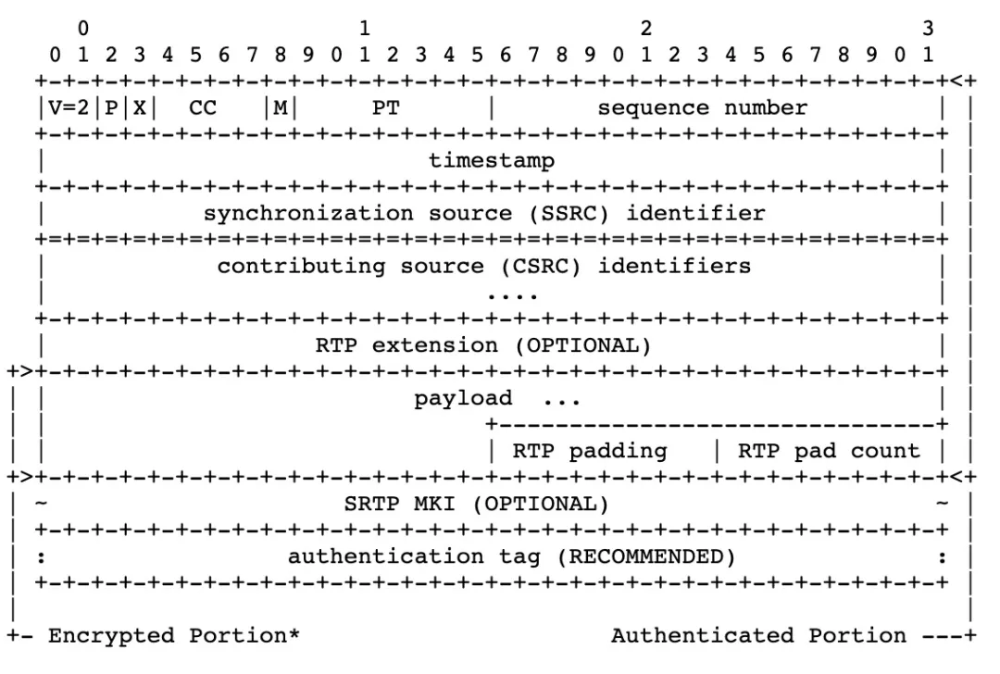
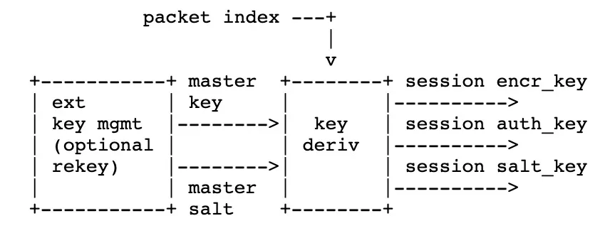

# 要解決的問題
- 對 RTP / RTCP 的 payload 加密
- 保證 RTP / RTCP 的完整性，同時防止重放攻擊
- # 結構
- 
	- Encrypted Portion 由 payload, RTP padding, RTP pad count 組成
	- 需要驗證部份 Authenticated Portion 由 Encrypted Portionm, RTP header, RTP header extension 組成
	- 通常只對 payload 加密
- # Key 管理
	- Session: <SRTP 目的 IP, SRTP 目的 port>
	- Stream: <SSRC, RTP/RTCP 目的IP, RTP 目的 port>，一個 SRTP / SRTCP Session 由多個 stream 組成。對每個 stream 的加解密相關參數描述為 Cryptographic Context。
	- 每個 stream 的 Cryptographic Context 中包含以下參數
		- SSRC
		- Cipher Parameter: 加解密使用的 key, salt，算法類型，參數
		- Authentication Parameter: 完整性使用的 key, salt，算法類型，參數
		- Anti-Replay Data: 防止重放攻擊緩存的數據信息
	- 在 Session 中每個 Stream 都會用到屬於自己的加解密 key, Authentication key。這些 Session key 是通過對 Master key 使用 KDF (Key Derivation Function) 導出
	- 
	- master key: DTLS 完成後協商得到的 key
	- master salt: DTLS 完成後協商得到的 key
- # 序列號
	- 在 SRTP 中，序列號（sequence number, SN）是非常關鍵的一部分，主要用來：
		- 保護封包順序（防止重播攻擊）
		- 加密與認證密鑰的生成（序列號通常參與 IV 的組合）
		- 封包完整性驗證
	- SRTP 的序列號管理與標準 RTP（Real-time Transport Protocol）一樣是基於 16-bit 的遞增數字（0～65535之間循環），但是加了安全性增強的設計。
	- ## RTP 封包內的序列號
		- 每發送一個 RTP 封包，序列號加 1。
		- 當序列號達到 65535 時，回繞（wrap around）回到 0。
		- 這個序列號放在 RTP 封包頭中，占 16 bits。
	- ## SRTP 封包保護（加密/認證）
		- 加密和認證時，序列號會被用來產生 IV (Initialization Vector)。
		- IV 通常是基於：
			- SSRC（Synchronization Source）
			- 序列號
			- 其他密鑰派生參數
		- 這樣設計可以確保即使資料內容重複，因為序列號不同，最終加密結果也不同，增加安全性。
	- ## 防止重播攻擊（Replay Protection）
		- 重播緩衝區（Replay Protection Window）：通常是 64 或 128 個封包大小。
		- SRTP 使用序列號來判斷接收到的封包是否是：
			- 新封包（正常）
			- 重複封包（攻擊或網路重播）
			- 過期封包（已被處理過，應拒絕）
		- 如果序列號在當前窗口之前（太舊），SRTP 可以直接丟棄它。
		- 使用位元掩碼（bitmask）快速記錄哪些封包已經收到過。
	- ## Roll-over Counter (ROC)
		- 因為序列號只有 16 bits，當它回繞時需要靠另一個值來判斷封包真正的順序。
		- ROC（Roll-over Counter） 是一個 32 bits 的計數器，記錄回繞（wrap）次數。
		- 每當序列號從 65535 回到 0，ROC +1。
		- Extended Sequence Number (ESN) = ROC * 2¹⁶ + SN
		- Extended Sequence Number 用來：
			- 正確產生 IV
			- 檢查封包順序
- #  Initialization Vector (IV) 的使用方式
	- ## IV 的目的
		- IV 是為了防止加密時出現相同明文導致的加密模式弱點。
		- 在 SRTP 裡，每一個 RTP 封包都有一個唯一的 IV。
		- IV 會參與生成加密密鑰流（尤其是在 AES-CTR、AES-GCM 模式下）。
	- ## IV 構造步驟簡化版
		- 從 SRTP 主密鑰衍生出 salt_key。
		- 組合封包的識別資訊（SSRC、ROC、SN），並適當填充到 128 bits。
		- 用 salt_key 做 XOR 運算。
		- 將這個結果當作 IV，提供給加密或認證演算法使用。
	- 最後的 IV 就是專門針對這個封包唯一計算出來的，用來**保證加密的隨機性**。
- **Local Master Key**: 加密「自己送出去」的封包
- **Remote Master Key**: 解密「別人送過來」的封包
- # GStreamer
	- ```
	  udpsrc uri=udp://224.5.5.5:4002 multicast-iface=wlan0 
	  caps="application/x-srtp, media=video, payload=96, clock-rate=90000, 
	  	encoding-name=H264,ssrc=(uint)1234564002,
	      srtp-key=(buffer)E1F97A0D3E018BE0D64FA32C06DE41390EC675AD498AFEEBB6960B3AABE6, 
	      srtp-cipher=aes-128-icm, srtp-auth=hmac-sha1-80, 
	      srtcp-cipher=aes-128-icm, srtcp-auth=hmac-sha1-80, 
	      roc=(uint)0" 
	  ! srtpdec 
	  ! rtpbin 
	  ! queue 
	  ! rtph264depay 
	  ! video/x-h264, stream-format=byte-stream , alignment=au 
	  ! appsink name=appsink sync=false
	  ```
		- srtp-cipher: **加密算法**，用 AES-128 in ICM (counter) 模式，確保 RTP payload 被加密。
		-