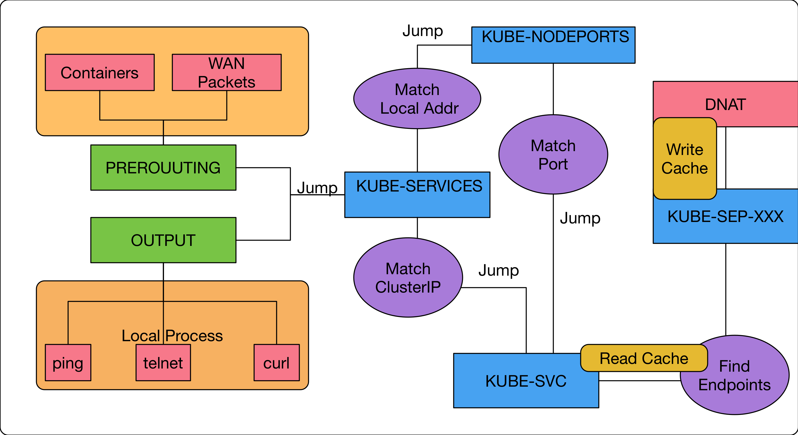

public:: true
tags:: Kubernetes, Kubernetes Service, iptables

- ## 用途
  讓同一個 Client 來的連接都分配到同一個 Pod
- ## Configuration
  1. None: 不作用
  2. ClientIP: 當 Client IP 相同時導到同一個 EndPoints
  如果使用 [[NodePort]] 或 [[Ingress]] 可能會拿到都是 load-balancer 或 [[Ingress]] controller 的 IP
- ## How It Works
	- ```
	  $sudo iptables-save | grep k8s-nginx-affinity
	  
	  -A KUBE-SEP-HDMJEKA4BFKBU6OK -p tcp -m comment --comment "default/k8s-nginx-affinity:" -m recent --set --name KUBE-SEP-HDMJEKA4BFKBU6OK --mask 255.255.255.255 --rsource -m tcp -j DNAT --to-destination 10.244.0.145:80
	  
	  -A KUBE-SVC-UBXGHWUUHMMRNNE6 -m comment --comment "default/k8s-nginx-affinity:" -m recent --rcheck --seconds 10800 --reap --name KUBE-SEP-HDMJEKA4BFKBU6OK --mask 255.255.255.255 --rsource -j KUBE-SEP-HDMJEKA4BFKBU6OK
	  ```
	  
		- 1. `KUBE-SEP`為執行`DNAT`的 custom chain，當選出要使用的 Endpoints 時，將結果記錄到 Cache 中。
		  **[來源IP地址] => KUBE-SEP-HDMJEKA4BFKBU6OK**
		  -m recent: 使用擴充模組 recent
		  --set: 這次的行為想要進行儲存的動作，將某些 key/value 寫進到 recent cache 內
		  --name KUBE-SEP-XXXXXXXX: 這邊對應的就是存到 cache 內的 Value.
		  --mask 255.255.255.255: 這個搭配下一個參數使用
		  --rsource: 這邊代表是的我要用什麼當做 key, 這邊使用的是 source 就是所謂的封包來源IP地址,既然有IP地址，就可以搭配前面的mask來調整IP位址的範圍，這個範例中就是/32的設定，意味IP要完全一樣才行。
		- 2. 針對每一條 `KUBE-SVC-XXX` 裡面的規則，依序每個 Endpoints 查詢 Cache 中有沒有[來源IP]=>當前 Endpoints 的記錄，有就跳到對應的 custom chain 執行 `DNAT`
		  -m recent: 使用擴充模組 recent
		  --rcheck: 這邊我們執行 READ 的指令，要檢查 cache 內是否有對應的 key/value
		  --name: value, 就是 Endpoints 對應到的 custom-chain name
		  --rsouce/--mask: key, 封包的來源 IP
		  --seconds: 每個 cache 內的記錄都會有一個過期的時間，這個時間的意思是只有上次設定該 ket/value 的時間距離現在N秒內的才算數，已這個範例來說就是 10800秒 內的 cache 記錄才算數，如果是超過 10800秒 前記錄的，就當失效。
		  --reap: 這個是指每次查詢的時候，會將已經超過有效時間 的規則一併清除。