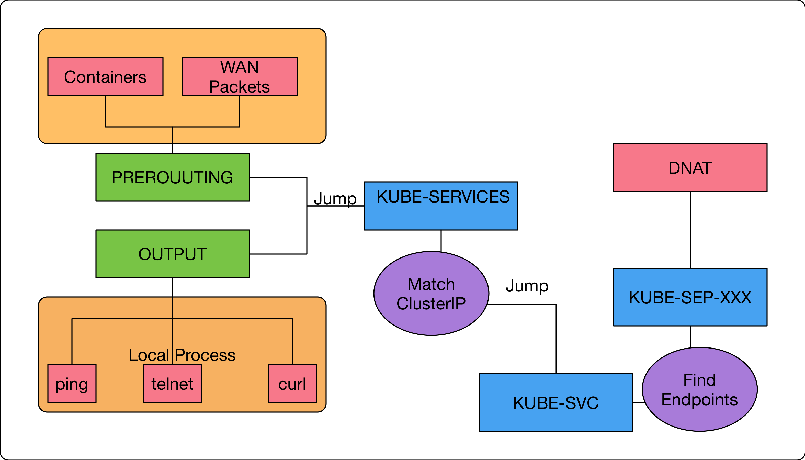

public:: true
tags:: Kubernetes, Kubernetes Service, iptables

- ## 用途
  讓同一個 Client 來的連接都分配到同一個 Pod
- ## Configuration
  1. None: 不作用
  2. ClientIP: 當 Client IP 相同時導到同一個 EndPoints
  如果使用 [[NodePort]] 或 [[Ingress]] 可能會拿到都是 load-balancer 或 [[Ingress]] controller 的 IP
- ## How It Works
	- ```
	  $sudo iptables-save | grep k8s-nginx-affinity
	  
	  -A KUBE-SEP-HDMJEKA4BFKBU6OK -p tcp -m comment --comment "default/k8s-nginx-affinity:" -m recent --set --name KUBE-SEP-HDMJEKA4BFKBU6OK --mask 255.255.255.255 --rsource -m tcp -j DNAT --to-destination 10.244.0.145:80
	  -A KUBE-SVC-UBXGHWUUHMMRNNE6 -m comment --comment "default/k8s-nginx-affinity:" -m recent --rcheck --seconds 10800 --reap --name KUBE-SEP-HDMJEKA4BFKBU6OK --mask 255.255.255.255 --rsource -j KUBE-SEP-HDMJEKA4BFKBU6OK
	  ```
	  
	  1. `KUBE-SEP`為執行`DNAT`的 custom chain，當選出要使用的 Endpoints 時，將結果記錄到 Cache中
-