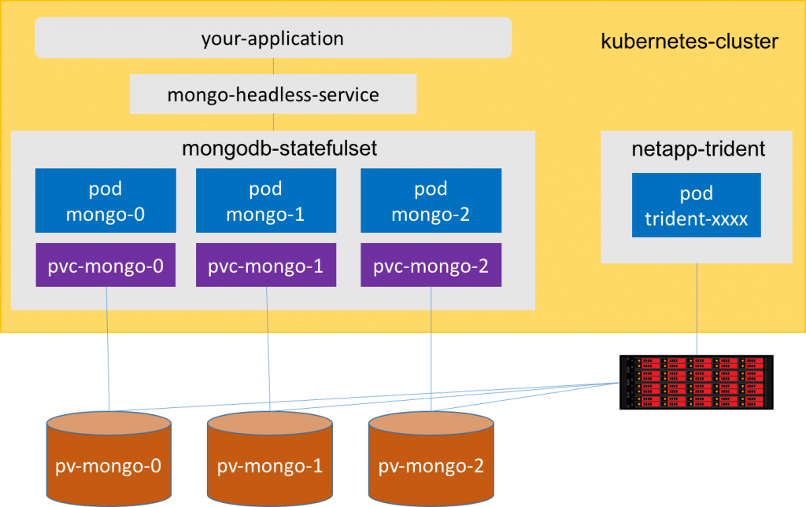

public:: true
tags:: Kubernetes, Kubernetes Node, Kubernetes Pod

- # What is StatefulSet?
	- 基本上 StatefulSet 中在 pod 的管理上都是與 Deployment 相同，基於相同的 container spec 來進行；而其中的差別在於 **StatefulSet controller 會為每一個 pod 產生一個固定的識別資訊，不會因為 pod reschedule 後有變動**。
	- ## When to use?
		- 需要穩定的 persistent storage (pod reschedule 後還是能存取到相同的資料，基本上用 PVC 就可以解決)
		- 需要穩定 & 唯一的網路識別 (pod reschedule 後的 pod name & hostname 都不會變動)
		- 佈署 & scale out 的時後，每個 pod 的產生都是有其順序且逐一慢慢完成的
	- ## 限制
		- storage 的部份一定要綁定 PVC，並綁定到特定的 StorageClass or 預先配置好的 PersistentVolume，確保 pod 被刪除後資料依然存在
		- 需要額外定義一個 [[Headless Service]] 與 StatefulSet 搭配，確保 pod 有固定的 network identity
	- ## Example
	  
	  
	  ```yaml
	  ---
	  # v1.9 版本之前必須使用 "apps/v1beta2"
	  apiVersion: apps/v1
	  kind: StatefulSet
	  metadata:
	    name: web
	  spec:
	    selector:
	      # 必須與 ".spec.template.metadata.labels" 相同
	      matchLabels:
	        app: nginx
	    serviceName: "nginx"
	    replicas: 3
	    template:
	      metadata:
	        # 必須與 ".spec.selector.matchLabels" 相同
	        labels:
	          app: nginx
	      spec:
	        # 每個pod依順序性刪除時間隔時間
	        terminationGracePeriodSeconds: 10
	        containers:
	        - name: nginx
	          image: k8s.gcr.io/nginx-slim:0.8
	          ports:
	          - containerPort: 80
	            name: web
	          # 指定將 pvc 掛載到特定的目錄上
	          volumeMounts:
	          - name: www
	            mountPath: /usr/share/nginx/html
	    # 使用 persistent volume 來確保資料不會因為 pod reschedule 而消失
	    # 以下是使用 volumeClaimTemplates + StorageClass 來完成
	    volumeClaimTemplates:
	    - metadata:
	        name: www
	      spec:
	        accessModes: [ "ReadWriteOnce" ]
	        # 透過動態方式自動產生PVC，這裡需要指定一個已經存在並且合法的storageClass
	        storageClassName: "my-gfs-storageclass"
	        resources:
	          requests:
	            storage: 1Gi
	  ```
- # 如何識別 StatefulSet 產生的 Pod?
	- ## Ordinal Index
	- ## Stable Network ID
	- ## Stable Storage
	- ## Pod Name Label
- # Deployment & Scaling 流程說明
	- ## 佈署 & Scale out
	- ## 刪除 & Scale in
	- ## Pod Management Policy
- # 更新(update)要如何進行?
	- ## On Delete
	- ## Rolling Update
		- ### Partition