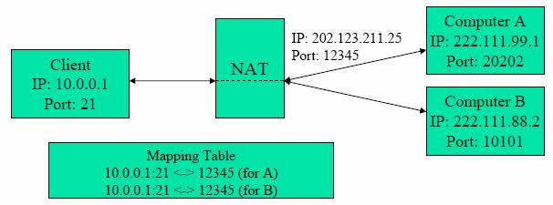
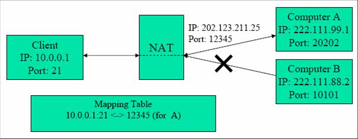
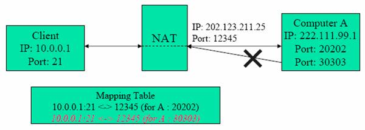
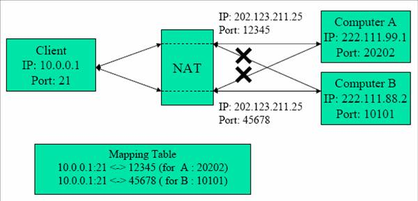
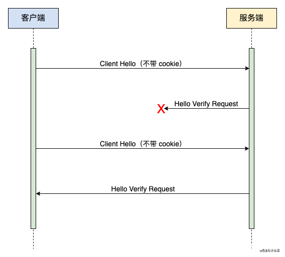
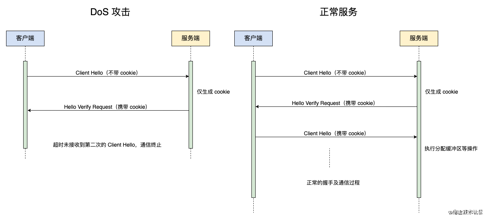

public:: true

- # RTP
  collapsed:: true
	- ## Offer
		- Generally low latency.
		- 資料包按順序編號並帶有時間戳，以便在資料包無序到達時進行重組。這使得使用 RTP 發送的資料可以在不保證排序甚至根本不保證傳送的傳輸上傳送。
		- RTP 不僅限於在視聽通訊中使用。它可用於任何形式的連續或主動資料傳輸，包括資料流、主動徽章或狀態顯示更新，或控制和測量資訊傳輸。
	- ## Doesn't offer
		- RTP does **not** guarantee QoS.
		  它僅提供允許在堆疊中的其他位置實現 QoS 所需的資訊。
		- 不處理可能需要的資源的分配或保留。
	- ## [[RTCPeerConnection]]
	- ## [[RTP 實作 hold 功能]]
- # Connectivity
  id:: 67441318-7be3-4c5f-b921-e393ac007fb0
  collapsed:: true
	- ## Signaling
		- ### Session descriptions
		  The configuration of an endpoint on a WebRTC connection.
		  透過 [[SDP]] 交換資訊
			- Example code Caller:
			  
			  ```javascript
			  const pc = new RTCPeerConnection();
			  
			  // Add local media tracks
			  const stream = await navigator.mediaDevices.getUserMedia({ audio: true, video: true });
			  stream.getTracks().forEach(track => pc.addTrack(track, stream));
			  
			  // Create an offer
			  const offer = await pc.createOffer();
			  
			  // Set the local description
			  await pc.setLocalDescription(offer);
			  
			  // Send the local description (SDP) to the remote peer via signaling
			  sendToSignalingServer(pc.localDescription);
			  
			  // Event: Handle incoming ICE candidates from the signaling server
			  signalingServer.on("iceCandidate", candidate => {
			      pc.addIceCandidate(candidate).catch(e => console.error("Error adding ICE candidate:", e));
			  });
			  
			  // Step: Receive the answer from the remote peer
			  signalingServer.on("answer", async answer => {
			      try {
			          // Set the received answer as the remote description
			          await pc.setRemoteDescription(new RTCSessionDescription(answer));
			          console.log("Remote description set successfully.");
			      } catch (e) {
			          console.error("Error setting remote description:", e);
			      }
			  });
			  ```
		- ### Pending and current descriptions
			- The **current description** (which is returned by the `RTCPeerConnection.currentLocalDescription` and `RTCPeerConnection.currentRemoteDescription` properties) represents the description currently in actual use by the connection. This is the most recent connection that both sides have fully agreed to use.
			- The **pending description** (returned by `RTCPeerConnection.pendingLocalDescription` and `RTCPeerConnection.pendingRemoteDescription`) indicates a description which is currently under consideration following a call to `setLocalDescription()` or `setRemoteDescription()`, respectively.
	- ## ICE
		- ### Trickle ICE
		  Trickle ICE is a feature in WebRTC that allows ICE candidates (potential network paths) to be sent incrementally to the remote peer as they are discovered, rather than waiting for the entire list of candidates to be gathered. This helps establish the connection faster and makes the process more efficient.
		- ### Candidate Pair
		  id:: 674449f6-4fb3-4a89-a5c9-507b51322e81
		  兩個 Peer 各自的 Candidate 組合
		- ### ICE rollbacks
		  A rollback restores the SDP offer (and the connection configuration by extension) to the configuration it had the last time the connection's `signalingState` was `stable`.
	- ## [[Perfect negotiation pattern]]
	-
- # Data channel
  collapsed:: true
	- ## Create a data channel
		- ### Automatic negotiation
		  ```javascript
		  let dataChannel = pc.createDataChannel("MyApp Channel");
		  
		  dataChannel.addEventListener("open", (event) => {
		    beginTransmission(dataChannel);
		  });
		  ```
		  Call `createDataChannel()`without specifying a value for the `negotiated` property, or specifying the property with a value of `false`. This will automatically trigger the `RTCPeerConnection` to handle the negotiations for you, causing the remote peer to create a data channel and linking the two together across the network.
		- ### Manual negotiation
		  ```javascript
		  let dataChannel = pc.createDataChannel("MyApp Channel", {
		  negotiated: true,
		  });
		  - dataChannel.addEventListener("open", (event) => {
		  beginTransmission(dataChannel);
		  });
		  - requestRemoteChannel(dataChannel.id);
		  ```
		  Specifying in the options a `negotiated` property set to `true`. This signals to the peer connection to not attempt to negotiate the channel on your behalf.
	- ## Security
		- All data transferred using WebRTC is encrypted. In the case of `RTCDataChannel`, the encryption used is Datagram Transport Layer Security (DTLS)
- # [[Observe WebRTC Signaling Using Chrome Tools]]
- # Media Flow
  collapsed:: true
	- ## Media capture and constraints
	  Media capture in WebRTC is facilitated by the `getUserMedia()` method, which prompts the user for permission to access their camera and microphone. Upon consent, it returns a `MediaStream` object containing `MediaStreamTrack` objects for each media type (audio and video)
	  ```javascript
	  const openMediaDevices = async (constraints) => {
	      return await navigator.mediaDevices.getUserMedia(constraints);
	  }
	  
	  try {
	      const stream = openMediaDevices({'video':true,'audio':true});
	      console.log('Got MediaStream:', stream);
	  } catch(error) {
	      console.error('Error accessing media devices.', error);
	  }
	  ```
		- ### MediaStream
		  Represents a stream of media content, which may include multiple tracks such as audio and video.
		- ### MediaStreamTrack
		  Represents a single media track within a `MediaStream`, such as an individual audio or video track.
		  Each `MediaStreamTrack` may have one or more channels.
		  The channel represents the smallest unit of a media stream, such as an audio signal associated with a given speaker, like left or right in a stereo audio track.
		- ### Constraints
		  Constraints are used to specify desired properties for media capture, such as resolution for video or sample rate for audio.
		  [Example constraint exerciser](https://developer.mozilla.org/en-US/docs/Web/API/Media_Capture_and_Streams_API/Constraints#example_constraint_exerciser)
	- ## Encoding
	  Once captured, media streams are encoded using codecs before transmission. WebRTC supports various codecs, including VP8 and VP9 for video, and Opus for audio. The choice of codec can affect the quality and bandwidth requirements of the media stream.
	  https://developer.mozilla.org/en-US/docs/Web/Media/Formats/WebRTC_codecs
	  **Bitrate Control**
	  WebRTC dynamically adjusts the encoding bitrate based on:
		- **Network Conditions:** Packet loss or bandwidth changes.
		- **Resolution and Frame Rate:** Encoding can be scaled to fit device capabilities.
	- ## Transmission
		- ### Signaling
		- ### Connection Setup
		- ### **Data Transmission**
			- WebRTC streams media data over:
				- **SRTP (Secure Real-time Transport Protocol):** Ensures secure transmission of audio and video.
				- **RTP (Real-time Transport Protocol):** For payload delivery with minimal latency.
				- **RTCP (RTP Control Protocol):** Provides feedback on quality, such as packet loss and jitter.
		- ### **Packet Prioritization**
			- Video and audio packets are prioritized differently to ensure audio continuity (e.g., in poor network conditions).
			- **Forward Error Correction (FEC):** Used to reconstruct lost packets.
	- ## Rendering
		- ### **Rendering Audio**
			- Decoded audio streams are passed to the system's audio output (e.g., speakers or headphones).
			- **Audio Rendering Components:**
				- Volume control
				- Noise suppression
				- Echo cancellation
		- ### **Rendering Video**
			- Decoded video frames are displayed in an HTML `<video>` element.
			- **Steps:**
				- The video decoder reconstructs the compressed frames.
				- Frames are queued for rendering in the browser or native application.
				- Display timing ensures synchronization with the audio stream.
- # Network Traversal
  collapsed:: true
	- ## NAT
	  NAT 是一種將內部IP 與外部IP互相轉換之技術。負責將進出封包的表頭進行轉換使得內部電腦可以 透通的與外部網路連線溝通。
		- ### Full Cone NAT
		  單純的做位址轉換，並未對進出的封包設限
		  
		- ### Restricted Cone NAT (Address Restricted Cone)
		  從內部送出之封包的目的地 IP 位址會被記住。只有這些曾經收過這些封包的位址可以送封包進入 NAT。由其他位址送進來的封包，都會被檔下。
		  {:height 243, :width 604}
		- ### Port Restricted Cone NAT
		  由外部送進來的封包，除了由那些接收過內部所送出 的封包的IP 位址及 Port Number 所送來的封包之外，都會被檔下。
		  
		- ### Symmetric NAT
		  前三種NAT在做位址轉換時，無論封包是送往何處， NAT內部同一內部位址 都對應到同一個外部位址，但在Symmetric NAT內則每一內部位址對不同的目的地， 都對應到不同的外部位址。
		  Symmetric NAT只允許先由私有網域內的使用者發送封包到網際網路中的使用者 可以回傳封包。
		  
	- ## Challenges in P2P connections
	  兩個皆位於 Private IP 區域內的設備，欲建立連線時，會因為不知道對方的 Public IP Address，而無法正確的建立連線。
	- ## WebRTC tools for NAT/Firewall Traversal
		- **ICE (Interactive Connectivity Establishment):** A framework that combines STUN and TURN to discover the best path to connect peers. ICE gathers multiple connection candidates (e.g., direct, STUN-derived, TURN-relayed) and tests them to determine the most efficient route.
		- **STUN (Session Traversal Utilities for NAT):** Allows a device to discover its public IP address and the type of NAT it is behind by sending requests to a STUN server, which responds with the device's public address and port. This information helps establish direct connections when possible.
		- **TURN (Traversal Using Relays around NAT):** Used when direct connections fail, TURN servers relay data between peers. This approach is more resource-intensive but ensures connectivity in restrictive NAT scenarios, such as with symmetric NATs.
- # Security in WebRTC
	- ## DTLS
	  In WebRTC, DTLS is employed to secure both media and data channels.
	  For media channels, DTLS is used in conjunction with SRTP to encrypt audio and video streams.
	  For data channels, DTLS operates over the Stream Control Transmission Protocol (SCTP) to secure arbitrary data transmission.
		- SSL/TLS 基於 TCP，因此不需要操心重放、亂序、丟包的問題，可靠傳輸由 TCP 做了保證；而 DTLS 基於 UDP，UDP 是一種盡力而爲的協議，因此 DTLS 需要自己處理重放、亂序、丟包的問題。
		- ### 握手防護機制
			- **重傳**
				- TCP 天然的重傳機制保證了消息不會丟失，而 UDP 對此沒有任何保證。因此 DTLS 額外增加了超時重傳機制來確定握手消息到達
				  
			- **序列號**
				- 爲了保證握手消息的有序性，DTLS 在握手報文中增加了 message_seq 字段便於接收方處理亂序消息。接收方直接處理屬於當前步驟的消息，提供一個緩存隊列來緩存提前到達的消息。
			- **消息重放檢測**
				- 消息重放也是 DoS 攻擊的一種，攻擊者可以截取發送者發送的數據，並直接原封不動地發給接收方，來達到欺騙接收方的目的。 DTLS 增加了類似 IPsec AH/ESP 的消息重放檢測，使用一個 bitmap 滑動窗口來接收消息，結合消息本身的序號，bitmap 可以判斷該消息是否是太老的消息，是的話則直接拋棄。這個功能在 DTLS 中是可選的，因爲某些 UDP 報文的重複只是單純因爲網絡錯誤。
			- **報文大小限制**
				- TCP 面向字節流，而 UDP 面向報文。因此 TCP 會自動將報文進行拆分和組裝，無需上層操心；而 UDP 報文如果超過了 MTU（鏈路層的最大傳輸單元） 限制，會在 IP 層被強制分片，使得每一片大小都小於 MTU，接收方 IP 層需要進行數據報的重組，這樣就會多做許多工作，更麻煩的地方在於只要其中一片丟失就會造成重組失敗，造成整個 UDP 報文丟失。 因此 DTLS 直接在 UDP 之上就對握手消息做了分段，握手報文中的 fragment_offset 和 fragment_length 就是爲了這個目的，分別代表這段報文相對消息起始的偏移量以及這段報文的長度。
			- **Cookie**
				- 相對 TCP 來說，UDP 連接對 DoS 攻擊更加敏感，因爲 TCP 可以使用 SYN Cookie 的機制來防範 DoS 攻擊。 如果在 UDP 上直接使用 TLS 的握手方式，就可能發生以下兩種情況：
					- 攻擊者可以通過發送一系列握手啓動請求來消耗服務器上的資源，例如服務端可能會爲此分配緩衝區，並且加密過程也是一個非常消耗 CPU 資源的操作；
					- 攻擊者可以僞造受害客戶端的 IP 地址向服務端發起 DTLS 握手，迫使服務端發送 Certificate 消息給受害客戶端，上文提到過 Certificate 攜帶了很多信息，包括數字證書等，所以這個消息會非常大，使得受害客戶端不得不接受大量無用消息。
				- 因此 DTLS 在 1.0 版本就加入了 HelloVerifyRequest 和 Cookie，用於服務端對客戶端的二次校驗，避免 DoS 攻擊。具體實現方式如下：
					- 當客戶端首次給服務端發送 Client Hello 時，服務端只會生成一個 Cookie 並通過 HelloVerifyRequest 發送給客戶端，不會執行分配緩衝區等操作，直到收到帶上相同 Cookie 的 Client Hello 纔會繼續握手，可以使得僞造 IP 的攻擊難以實現（使用真實 IP 的 DoS 攻擊無能爲力）；
					- HelloVerifyRequest 足夠小，即使服務端被攻擊者當槍使來攻擊其他機器，也不會造成大量數據發送。
				- 
	- ## SRTP
	  SRTP is an extension of the Real-time Transport Protocol (RTP) and provides encryption, message authentication, and integrity for media streams.
	  The encryption keys used by SRTP in WebRTC are derived from the DTLS handshake process, a method known as DTLS-SRTP. This approach ensures that key exchange is secure and that media streams are protected from interception and tampering.
		- **Confidentiality:** By encrypting the media payload, SRTP ensures that audio and video content remain confidential during transmission.
		- **Authentication:** It verifies that the media packets originate from a legitimate source, preventing impersonation attacks.
		- **Integrity:** SRTP ensures that media packets have not been modified in transit, protecting against tampering.
- # [[Emulate Network Conditions to Test WebRTC Adaptability]]
-
- # Reference
	- "Introduction to WebRTC protocols," *mdn web docs*, Available: [link_to_page](https://developer.mozilla.org/en-US/docs/Web/API/WebRTC_API/Protocols).
	- "Getting started with WebRTC," *WebRTC.org*, Available: [link_to_page](https://webrtc.org/getting-started/overview).
	- "SCTP introduction,"  Available: [link_to_page](https://sites.google.com/site/applezulab/network/sctp_introduction).
	- "一文讀懂 DTLS 協議," Available: [link_to_page](https://www.readfog.com/a/1641737692694810624).
	- "An In-Depth Look at SRTP Protocol: Securing Real-Time Communication," *digitalsamba*, Available: [link_to_page](https://www.digitalsamba.com/blog/srtp-protocol).
-