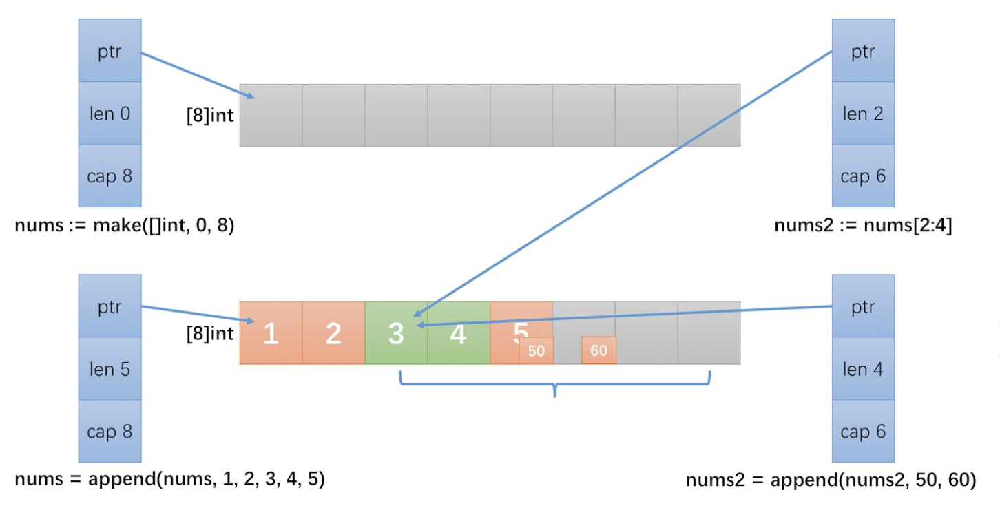
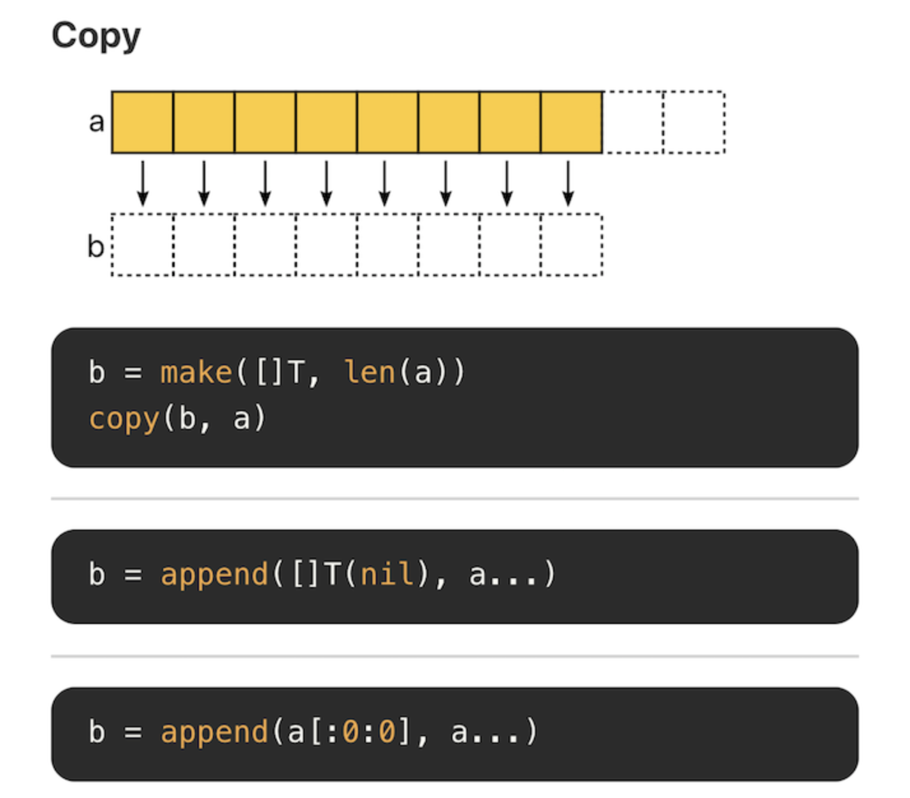
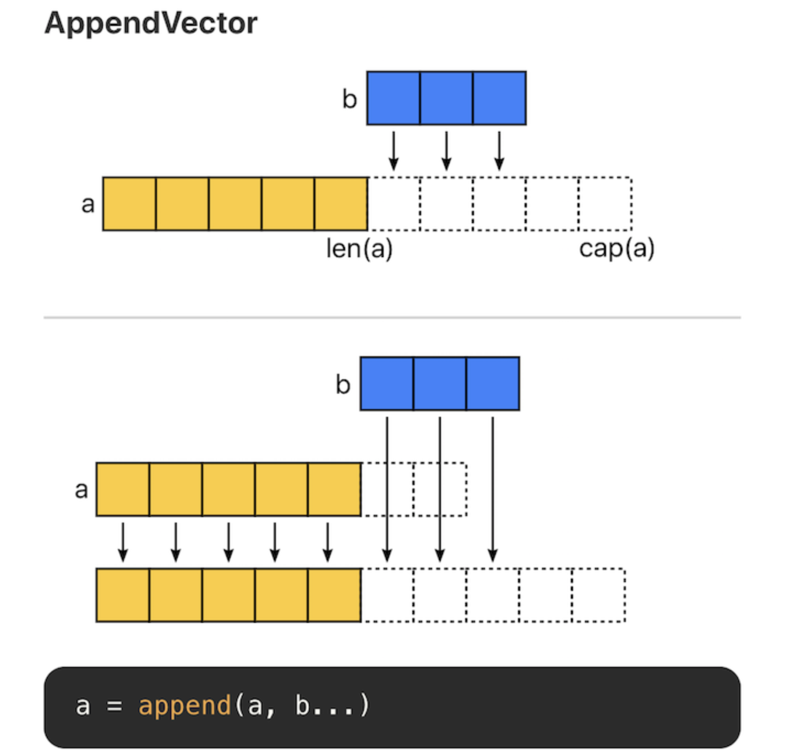
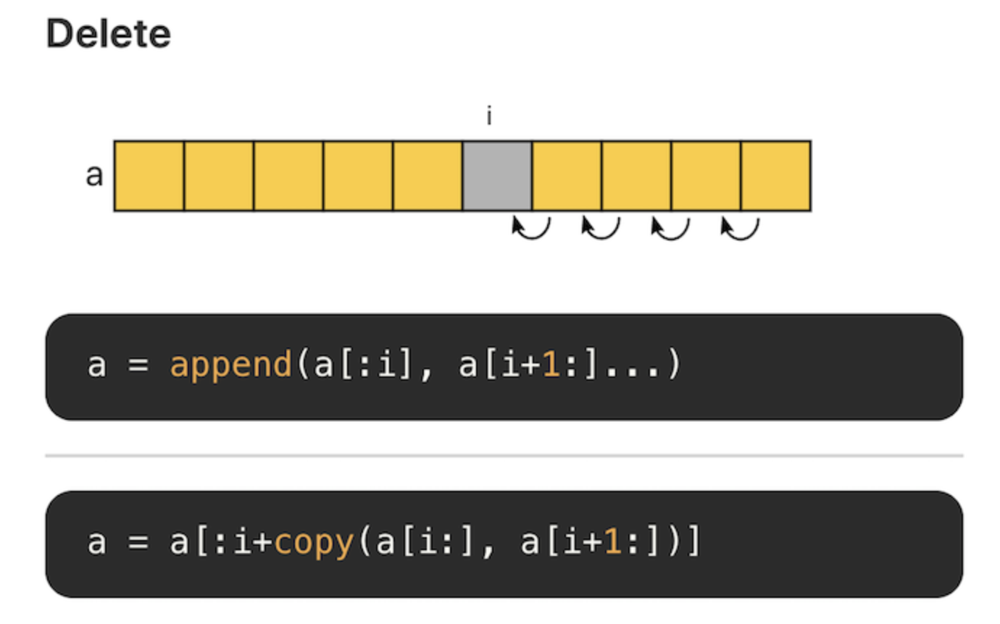
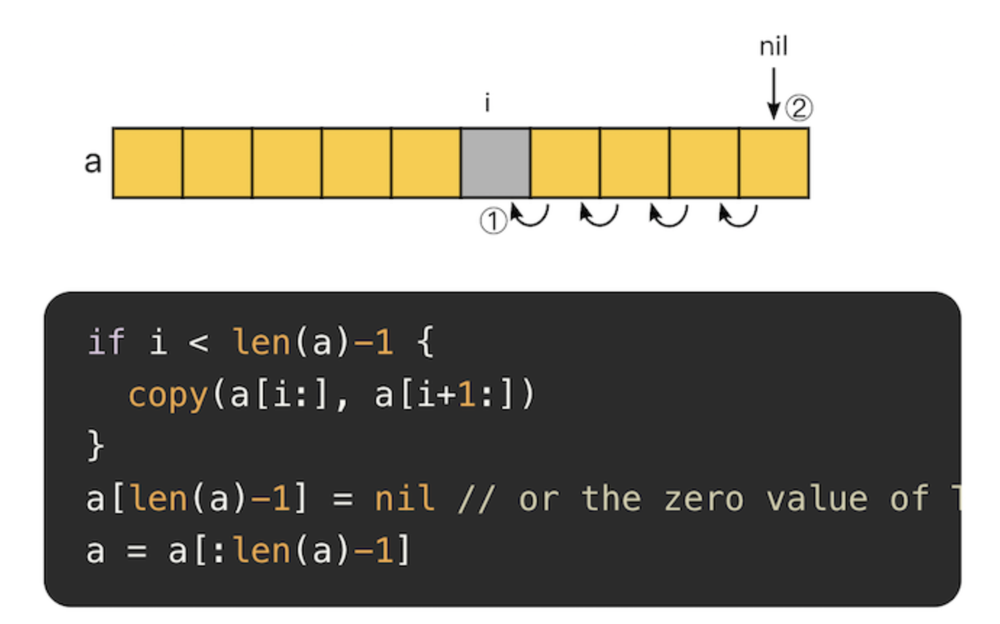
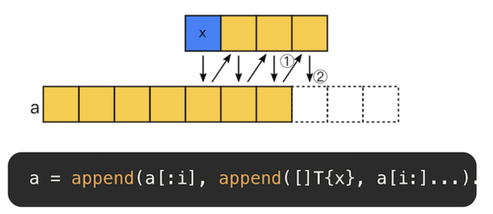
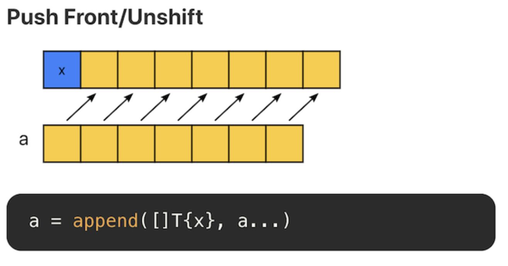
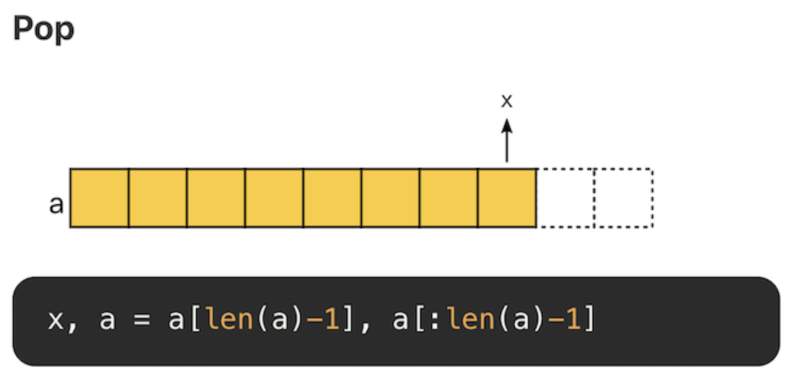
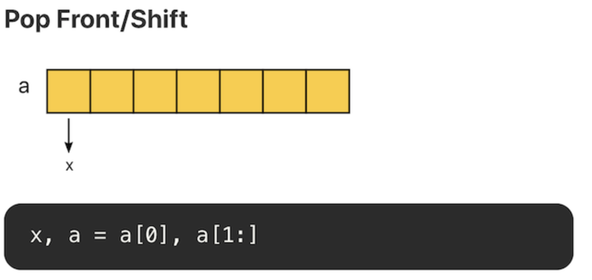

public:: true

- ## goroutine GMP
	- **基本概念要能說出來：**
		- **G (Goroutine)**：用戶態的輕量級執行緒
		- **M (Machine)**：OS 執行緒
		- **P (Processor)**：邏輯處理器，持有 G 的佇列
	- **核心優勢**：M:N 調度模型，一個 M 可以執行多個 G
- ## Goroutine Leak 怎麼避免？
	- channel 沒關閉
	- context 沒取消
	- 死鎖情況
- ## Channel 的使用與原理
  id:: 8ca97253-f228-4ce0-8605-ca9e51f24c3d
	- buffered vs unbuffered
	- close 的時機
	- select 的使用
- ## sync 包的使用
	- WaitGroup、Mutex、RWMutex
	- Once、Pool
	- 什麼時候用 channel，什麼時候用 mutex？
- ## Context 的傳遞與取消
	- 超時控制
		- time.After
		  ```go
		  func doBadthing(done chan bool) {
		  	time.Sleep(time.Second)
		  	done <- true
		  }
		  
		  func timeout(f func(chan bool)) error {
		  	done := make(chan bool)
		  	go f(done)
		  	select {
		  	case <-done:
		  		fmt.Println("done")
		  		return nil
		  	case <-time.After(time.Millisecond):
		  		return fmt.Errorf("timeout")
		  	}
		  }
		  
		  // timeout(doBadthing)
		  ```
		-
		-
	- 優雅關閉
- ## 常見並發問題
	- Race condition 怎麼 debug？
	- 如何控制 goroutine 數量？（worker pool）
- ## panic
	- `recover()` **必須**在 `defer` 函數中呼叫
	  ```go
	  func wrong2() {
	      defer recover() // ❌ 無效！recover 必須在「函數呼叫」中
	      panic("test")
	  }
	  
	  // 正確寫法
	  func correct() {
	      defer func() {
	          recover() // ✅ 在匿名函數中呼叫
	      }()
	      panic("test")
	  }
	  ```
	- panic 發生後，當前函數會立即停止，開始執行 defer 棧
	- recover 要跟 panic 在同一個 goroutine 才會被觸發
	- 如果沒有 recover，panic 會向上傳播直到程式崩潰
	- defer 是 **LIFO（後進先出）** 棧
	- 適合用 panic 的場景：
		- **初始化階段的致命錯誤**（如設定檔載入失敗）
		- **程式設計錯誤**（如除以零、陣列越界）
		- **不可恢復的錯誤**（如記憶體分配失敗）
	- 不應該用 panic 的場景：
		- **正常的錯誤處理**（應該用 `error` 回傳）
		- **可預期的失敗**（如網路請求失敗、檔案不存在）
		- **業務邏輯錯誤**
	- **面試標準答案：**
		- "Go 提倡用 error 處理錯誤，panic 應該只用在真正無法恢復的異常情況。在函式庫開發中，幾乎不應該讓 panic 傳播給呼叫者，應該 recover 後轉成 error 回傳。"
- ## channel
	- Unbuffered Channel
		- 在每次要傳送或接收前都必需進行等待
		  對於一個沒有 buffer 的 channel ，channel 上一次只能有一個值，前一個傳完，才能傳下一個，不能允許一次上傳超過一個
	- buffered Channel
		- 如果是有 buffer 的 channel 那麼就 **不必在意對方是否接收到** ，只要在以是否仍有足夠的緩充空間，如果沒有空間了才會進行等待。
	- 接收不確定個數的 channel
		- 因此可以利用 `for + range` 來接收 channel 上的值，但是要注意一點，傳送最後一個值後必需利用 `close()` 將 channel 關閉，golang 才知道這是最後一個值
- ## array
	- array 的長度是固定的，兩個長度不同的 array 不能互相賦值
	- C 語言的 array 是指向第一個元素的指針， Go 不是。**Go 的 array 被傳遞時是複製一個。**
	  ```go
	  a := [...]int{1, 2, 3}
	  b := a
	  a[0] = 100
	  fmt.Println(a, b) // [100 2 3] [1 2 3]
	  ```
- ## slice
	- ### struct
	  ```go
	  struct {
	      ptr *[]T
	      len int
	      cap int
	  }
	  ```
	- 新增元素到 slice 時, 如果超過了 cap 的大小, 會分配內存來增大。當小於 2048 時是以 2 的倍數新增。
	- ### slice 操作不複製元素
	  
	  ```go
	  nums := make([]int, 0, 8)
	  nums = append(nums, 1, 2, 3, 4, 5)
	  nums2 := nums[2:4]
	  printLenCap(nums)  // len: 5, cap: 8 [1 2 3 4 5]
	  printLenCap(nums2) // len: 2, cap: 6 [3 4]
	  
	  nums2 = append(nums2, 50, 60)
	  printLenCap(nums)  // len: 5, cap: 8 [1 2 3 4 50]
	  printLenCap(nums2) // len: 4, cap: 6 [3 4 50 60]
	  ```
		- nums2 把 nums 拿來切片，底層指的是同一個 array
		- nums2 新增 50, 60 將底層 [4] 的位置改成 50，[5] 改成 60
		- 因為 nums 和 nums2 是指向同一個 array 所以也被改了值
	- ### slice 操作
		- **Copy**
		  
		- **append**
		  
		  切片有三个属性，指针(ptr)、长度(len) 和容量(cap)。append 时有两种场景：
			- 当 append 之后的长度小于等于 cap，将会直接利用原底层数组剩余的空间。
			- 当 append 后的长度大于 cap 时，则会分配一块更大的区域来容纳新的底层数组。
			  因此，为了避免内存发生拷贝，如果能够知道最终的切片的大小，预先设置 cap 的值能够获得最好的性能。
		- **Delete**
		  
		  切片的底层是数组，因此删除意味着后面的元素需要逐个向前移位。每次删除的复杂度为 O(N)，因此切片不合适大量随机删除的场景，这种场景下适合使用链表。
		- **Delete(GC)**
		  
		  删除后，将空余的位置置空，有助于垃圾回收。
		- **Insert**
		  
		  insert 和 append 类似。即在某个位置添加一个元素后，将该位置后面的元素再 append 回去。复杂度为 O(N)。因此，不适合大量随机插入的场景。
		- **Filter**
		  ```go
		  n := 0
		  for _, x := range a {
		      if keep(x) {
		          a[n] = x  // 把保留的元素移到前面
		          n++       // n 記錄保留了幾個元素
		      }
		  }
		  a = a[:n]  // 重新切片，只保留前 n 個元素
		  
		  
		  // 假設原始 slice：a = [1, 2, 3, 4, 5]，我們要保留偶數。
		  // 循環後：
		  // a = [2, 4, 3, 4, 5]  ← 注意！長度還是 5
		  // n = 2                ← 只有 2 個元素符合條件
		  //      ↑  ↑  ←── 這些是舊數據
		  
		  // 執行 a = a[:n]
		  a = [2, 4]  // len: 2, 舊的 [3, 4, 5] 被切掉了
		  ```
		  当原切片不会再被使用时，就地 filter 方式是比较推荐的，可以节省内存空间。
			- `a = a[:n]` 的作用：
				- **截斷 slice**，讓長度變成實際保留的元素數量
				- **丟棄後面的舊元素**，讓 slice 只包含過濾後的數據
				- 這是一種**零分配（zero allocation）** 的高效過濾方式，不需要創建新 slice。
		- **Push**
		  ```go
		  a = append(a, x)
		  ```
		  在末尾追加元素，不考虑内存拷贝的情况，复杂度为 O(1)。
		  
		  在头部追加元素，时间和空间复杂度均为 O(N)，不推荐。
		- **Pop**
		  
		  尾部删除元素，复杂度 O(1)
		  
		  头部删除元素，如果使用切片方式，复杂度为 O(1)。但是需要注意的是，底层数组没有发生改变，第 0 个位置的内存仍旧没有释放。如果有大量这样的操作，头部的内存会一直被占用。
	- ### 性能陷阱 大量内存得不到释放
		- 在已有切片的基础上进行切片，不会创建新的底层数组。因为原来的底层数组没有发生变化，内存会一直占用，直到没有变量引用该数组。因此很可能出现这么一种情况，原切片由大量的元素构成，但是我们在原切片的基础上切片，虽然只使用了很小一段，但底层数组在内存中仍然占据了大量空间，得不到释放。比较推荐的做法，使用 `copy` 替代 `re-slice`。
		- ```go
		  func lastNumsBySlice(origin []int) []int {
		  	return origin[len(origin)-2:]
		  }
		  
		  func lastNumsByCopy(origin []int) []int {
		  	result := make([]int, 2)
		  	copy(result, origin[len(origin)-2:])
		  	return result
		  }
		  ```
		  `lastNumsBySlice` 耗费了 100.14 MB 内存，也就是说，申请的 100 个 1 MB 大小的内存没有被回收。因为切片虽然只使用了最后 2 个元素，但是因为与原来 1M 的切片引用了相同的底层数组，底层数组得不到释放，因此，最终 100 MB 的内存始终得不到释放。而 `lastNumsByCopy` 仅消耗了 3.14 MB 的内存。这是因为，通过 `copy`，指向了一个新的底层数组，当 origin 不再被引用后，内存会被垃圾回收(garbage collector, GC)。
- ## TODO:
	- https://geektutu.com/post/hpg-sync-cond.html
	- ## 我的建議：針對面試準備
	- ### ✅  **必看** （直接影響面試表現）
	  
	  **第三章：並發編程**
	- ✅ sync.Pool（**必看**，面試常考，Redis 連線池等場景）
	- ✅ sync.Once（**必看**，單例模式，初始化場景）
	- ⚠️ sync.Cond（**選看**，面試較少考，但看一次搞懂概念就好）
	- ✅ 並發控制（**必看**，WaitGroup、Context、ErrGroup）
	  
	  **第二章：常用資料結構**
	- ⚠️ string/[]byte 轉換（**選看**，知道零拷貝的概念即可）
	- ⚠️ for-range（**選看**，知道閉包陷阱即可）