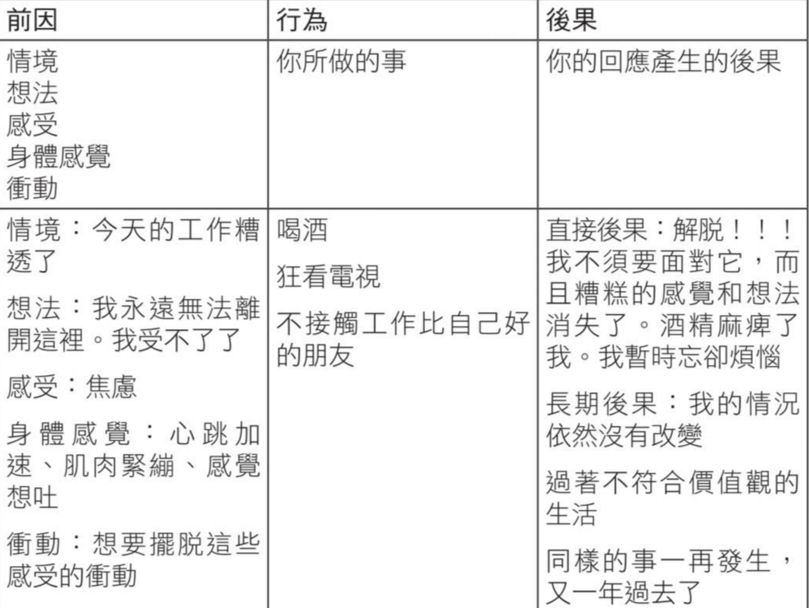

public:: true
book:: 抗壓韌性：學會覺察與疼惜自我，活出想要的人生
tags:: psychology, values
chapter:: 7

- 在採取行動前，如何更懂得思考、更懂得感受、採納觀點、活在此時此刻。
  每個行為都有目的或意圖，要發現行為模式需要先了解前因、行為和後果。
	- 前因：觸發因素或刺激，情境、想法、感受或身體感覺
	  background-color:: blue
	- 行為：無論可否被觀察的，包含內在的反芻、自我對話、擔憂
	  background-color:: blue
	- 後果：行為後發生的事件，導致行為持續或增加
	  background-color:: blue
	- 
- 當處於自動導航狀態，只關心讓感覺變好、擺脫不想要的想法和感受，而不專注於行為帶來的長期無意識後果（不符合個人價值觀、缺乏目的和意義的生活)
  background-color:: red
- ## 改變
  對前因採取不同的回應方式，價值觀驅動行為。
  符合價值觀的行為會獲得本質上的獎勵。
   
  
  選擇一個生活面向進行改變，不要一次超過一個，否則很容易透支自己。
- ## SMART
	- Specific 具體的：清楚何時何地要採取什麼行動。例如：星期一、三、五走樓梯到辦公室
	- Meaningful 有意義的：目標應受到價值觀的指引並具有意義。
	- Achievable 可達成的：目前是否有資源和能力達成？若沒有，需要做些什麼才有可能達成？
	- Realistic 實際的：生活中的需求會彼此競爭，這個目標是否實際？
	- Time-framed 有時間範圍的：決定想達成這個目標的時間和日期。
	- 如果設定目標只為了達成，最後會失去渴望的目標和意義感，專注於過程以及想展現出的價值觀。
	  background-color:: red
	- 讓周圍的環境和系統對你有所助益，為想培養的習慣減少障礙，為想戒掉的習慣增加障礙。
	  background-color:: red
- ## 動機的迷思
  依賴內在狀態來決定是否採取有意義的行動，就像在說只有天空出現鳯梨形狀的雲才要做某件事。
  無論腦袋告訴你什麼，你總是能掌控自己的行為。不要受制於想做或不想做的感覺。
- ## 追蹤帶來改變
  持續追蹤並監測你的進步來了解自己是否正在做出改變。
  韌性不是可擁有的東西，而是個站起來的過程。韌性不是感覺不到悲傷、恐懼或焦慮，而是帶著這些感覺繼續向前。
  
-