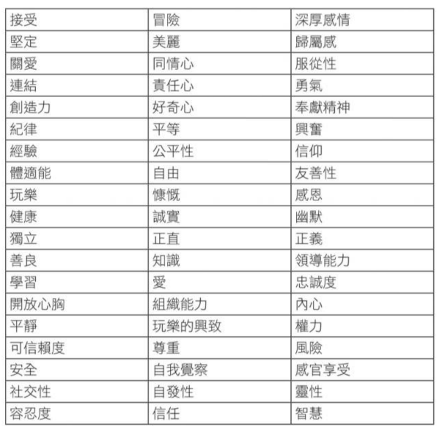

public:: true
book:: 抗壓韌性：學會覺察與疼惜自我，活出想要的人生
tags:: psychology, values
chapter:: 6

- ## 價值觀的重要
  讓自己感覺好一點長期來看可能會導致人生缺乏目的和意義感。
  如果有價值觀，在追求有意義和活力的人生時，就有接受不舒服感覺的理由。
  存活下來的不是最強壯的人，而是那些有「原因」的人。
  你想成為什麼樣的人？想去哪？想怎麼去？價值觀能提供這些問題的方向，不是展示「人生的意義」，而是展示「人生中的意義」。
- ## 價值觀是什麼
- 價值觀不同於目標，不是抵達終點在清單上打個勾就好。
  background-color:: blue
  ```
  拿一張紙，在其中一面寫下對你來說很重要的事（人、寵物、工作、興趣），另一面寫下害怕的事。
  ```
  在情緒痛苦時可以選擇價值觀，當失去這些很重要的事時，要如何對待自己？接納情緒並選擇價值觀，就能為生命帶來意義。
  別讓「應該」或「必須」綁架你的價值觀。
  價值觀也可能互相衝突，有時需要排列優先順序。(e.g. 好朋友 or 盡責的員工)
- ## 找出你的價值觀
  id:: 668bd610-15aa-4972-af77-5fba95989640
  選出重要的價值觀，如果使用這些價值觀作為羅盤，你會做出哪些行為。
  {:height 714, :width 722}
- #### 自己想在生活的哪些部分展現這些價值觀。
  
- ### 活出價值觀的練習
- 回顧截至今日的人生
  ```
  我花了太多時間擔心...
  我花太少時間（做什麼樣的事)...
  如果我能回到過去，那麼從今以後，我想要改變的事情是...
  我會花更多時間...
  我會告訴自己...
  ```
- 顯示出你真正想成為什麼樣的人
  ```
  想像自己的葬禮，三個代表生命中不同層面的人怎麼談論你這個人
  你的一生代表了什麼
  你做的事如何反映你本人和價值觀
  ```
- 寫下一個真正在乎的價值觀
  
- 不要告訴任何人，可以找出什麼對你來說是重要的，而不會管別人怎麼想。