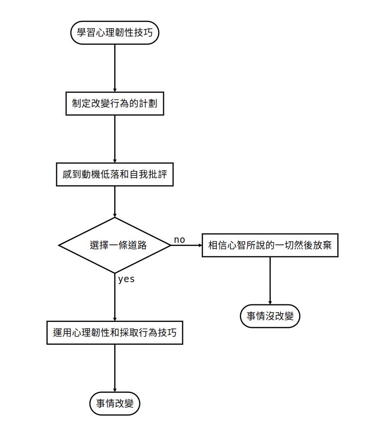

public:: true
author:: Sam Akbar
tags:: book, psychology, stress, mind, feel, emotion, self-observation, mindfulness, values, self-kindness
status:: DONE

- {{query (and (property chapter) (and <% current page %>))}}
  query-table:: true
  query-properties:: [:block :chapter]
  query-sort-by:: chapter
  query-sort-desc:: false
- ## 如何更懂得思考
  chapter:: 2
	- ### 一般人處理想法的方式
	  id:: 6686dc68-d802-455b-aa21-99c39ce0a380
		- 要求擅於解決問題的心智處理內在的漩渦，試圖告訴自己這沒什麼、苛責自己怎麼會有這想法。
		  努力擺脫某個念頭沒有用，愈是刻意壓抑某個念頭，反彈的力道就愈大。
			- Change 改變
			- Avoid 避免
			- Get rid 拋棄
			- Eliminate 消除
	- ### 認知糾結 Cognitive Fusion
		- 當想法關於評價、論斷、意見、原因和批評，需要放下它們是否真實的念頭
		  background-color:: green
		- 糾結在自我批評和論斷中，很快就會導致一連串自動導航的聯想把你推向絕望。
	- ### 有效的方法
	  id:: 6686e0a3-971e-4780-88ad-438f923ebb8c
		- 管理想法並改變你與想法之間的關係。可以有想法，但不用相信它。
		- 能包容一種觀點而不接受它，是受過教育的象徵。
		  background-color:: yellow
		- 拆解想法讓想法失去力量，或是不再糾結於那些想法。重點不是要判斷這些想法是否真實。
		  `我注意到我現在有...的想法`
		  在觀察自己的立場，讓自己與想法之間產生距離。
		- 當某些想法不再有幫助，而且無法幫助你成為想成為的那種人，就可以考慮從這些想法中解離。
- ## 如何更懂得感受
  chapter:: 3
	- ### 接受情緒
		- 接受情緒代表願意感受、敞開心胸、適應、騰出空間、感到好奇，無論出現什麼情緒都能夠包容它。
		  即使有感到不舒服的情緒依然可以去做自己認為重要的事。
		- 生而為人本來就會擁有自然的負面情緒，像是失去工作、結束戀情、父母得了不治之症
		  試圖用沒效的方式就會創造新的痛苦 ((6686dc68-d802-455b-aa21-99c39ce0a380))
		- ### 經驗性迴避 [Experiential avoidance](((b374557b-7378-496d-8c3a-2c87a272e7f8)))
			- 個人會有不願意保留的個人厭惡經驗，這個經驗可以包括身體的感覺、情緒、思考、記憶、甚至是行為傾向。
			  個人會為了避免厭惡經驗或事件而採取不良的措施，來改變事件的頻率、形態以及發生的背景。
			- 長期使用這種方式會帶來許多折磨並侵蝕生活品質。
	- ### 關於情緒教養
		- 在人生中（尤其是孩童時期）學到關於情緒的哪些事，思考以下問題
			- 你有哪些情緒是受到禁止的？
			- 你曾公開表達過哪些情緒？
			- 當你心情不好，身邊的大人會做些或說些什麼？
			- 當面對困難的情緒，你身邊的人會採取什麼應對策略？
			- 面對困難情緒時，你是否仍在使用多年前的應對策略？
- ## 如何採納觀點
  chapter:: 4
	- ### 思考自我
	  由體驗到的關於自己、他人和周圍世界的想法、影像、回憶感受和身體感覺組成
	  大部份時候可能都以思考自我的觀點和世界互動，並糾結在它告訴你的事情。
	- ### 觀察自我
	  有一個分離的自我在觀察**注意**自己一切的心智活動。
		- 雖然內在世界一直在改變，但注意的部份從來不會改變，就只是注意到X，而且自己不可能成為X。
		- 書中的練習主要在以觀察自己回想痛苦經歷時有什麼感受、出現哪些情緒，意識到自己並不是這些情緒本身，並站在觀察者的角度，會對正在遭遇苦難的自己說些什麼。
		- 透過深層觀察自己而了解的自己會多於為自己貼上的標籤（我是什麼身份或角色），這個觀察的角色很穩定且會一直陪伴自己。
- ## 如何活在當下
  chapter:: 5
	- ### 不喜歡活在當下
	  人們會一直思考不是現在正在發生的事情，像是反芻過去、擔心未來
	  一直讓心智以自動導航模式運作，不會讓你過上更滿意的人生。
	- ### 正念
	  專注在此時此刻，不加批判的覺察
		- 書中提到的幾種練習
			- 正念呼吸
				- 觀察空氣，吸氣和吐氣的感受
				- 當分心時只要將注意力放回觀察呼吸這件事
			- 放下船錨
				- 注意身體的感受、有哪些部份是可以控制的
				- 環顧房間注意看到的東西、聽到的聲音
				- 注意到有件令自己痛苦的事，而你正在掙札
				- 注意到有這些感受的自己
			- 正念傾聽
				- 真心對對方要講什麼感到好奇
				- 心智可能產生很多想法，只要注意到有這些想法並當作是背景音樂
				- 重複對方的話
				- 請對方進一步闡述，確認自己的理解是否正確
				- 提問但不打斷對方，為了深入了解對方的經驗
				-
- ## 如何更懂得生活
  chapter:: 6
	- ### 價值觀的重要
	  讓自己感覺好一點長期來看可能會導致人生缺乏目的和意義感。
	  如果有價值觀，在追求有意義和活力的人生時，就有接受不舒服感覺的理由。
	  存活下來的不是最強壯的人，而是那些有「原因」的人。
	  你想成為什麼樣的人？想去哪？想怎麼去？價值觀能提供這些問題的方向，不是展示「人生的意義」，而是展示「人生中的意義」。
	- ### 價值觀是什麼
	  collapsed:: true
		- 價值觀不同於目標，不是抵達終點在清單上打個勾就好。
		  background-color:: blue
		  ```
		  拿一張紙，在其中一面寫下對你來說很重要的事（人、寵物、工作、興趣），另一面寫下害怕的事。
		  ```
		  在情緒痛苦時可以選擇價值觀，當失去這些很重要的事時，要如何對待自己？接納情緒並選擇價值觀，就能為生命帶來意義。
		  別讓「應該」或「必須」綁架你的價值觀。
		  價值觀也可能互相衝突，有時需要排列優先順序。(e.g. 好朋友 or 盡責的員工)
	- ### 找出你的價值觀
	  選出重要的價值觀，如果使用這些價值觀作為羅盤，你會做出哪些行為。
	  {:height 714, :width 722}
		- #### 自己想在生活的哪些部分展現這些價值觀。
		  
	- ### 活出價值觀的練習
		- 回顧截至今日的人生
		  ```
		  我花了太多時間擔心...
		  我花太少時間（做什麼樣的事)...
		  如果我能回到過去，那麼從今以後，我想要改變的事情是...
		  我會花更多時間...
		  我會告訴自己...
		  ```
		- 顯示出你真正想成為什麼樣的人
		  ```
		  想像自己的葬禮，三個代表生命中不同層面的人怎麼談論你這個人
		  你的一生代表了什麼
		  你做的事如何反映你本人和價值觀
		  ```
		- 寫下一個真正在乎的價值觀
		  
		  不要告訴任何人，可以找出什麼對你來說是重要的，而不會管別人怎麼想。
- ## 如何採取行動
  chapter:: 7
	- 在採取行動前，如何更懂得思考、更懂得感受、採納觀點、活在此時此刻。
	  每個行為都有目的或意圖，要發現行為模式需要先了解前因、行為和後果。
		- 前因：觸發因素或刺激，情境、想法、感受或身體感覺
		  background-color:: blue
		- 行為：無論可否被觀察的，包含內在的反芻、自我對話、擔憂
		  background-color:: blue
		- 後果：行為後發生的事件，導致行為持續或增加
		  background-color:: blue
		- 
		- 當處於自動導航狀態，只關心讓感覺變好、擺脫不想要的想法和感受，而不專注於行為帶來的長期無意識後果（不符合個人價值觀、缺乏目的和意義的生活)
		  background-color:: red
	- ### 改變
	  對前因採取不同的回應方式，價值觀驅動行為。
	  符合價值觀的行為會獲得本質上的獎勵。
	   
	  
	  選擇一個生活面向進行改變，不要一次超過一個，否則很容易透支自己。
	- ### SMART
		- Specific 具體的：清楚何時何地要採取什麼行動。例如：星期一、三、五走樓梯到辦公室
		- Meaningful 有意義的：目標應受到價值觀的指引並具有意義。
		- Achievable 可達成的：目前是否有資源和能力達成？若沒有，需要做些什麼才有可能達成？
		- Realistic 實際的：生活中的需求會彼此競爭，這個目標是否實際？
		- Time-framed 有時間範圍的：決定想達成這個目標的時間和日期。
		- 如果設定目標只為了達成，最後會失去渴望的目標和意義感，專注於過程以及想展現出的價值觀。
		  background-color:: red
		- 讓周圍的環境和系統對你有所助益，為想培養的習慣減少障礙，為想戒掉的習慣增加障礙。
		  background-color:: red
	- ### 動機的迷思
	  依賴內在狀態來決定是否採取有意義的行動，就像在說只有天空出現鳯梨形狀的雲才要做某件事。
	  無論腦袋告訴你什麼，你總是能掌控自己的行為。不要受制於想做或不想做的感覺。
	- ### 追蹤帶來改變
	  持續追蹤並監測你的進步來了解自己是否正在做出改變。
	  韌性不是可擁有的東西，而是個站起來的過程。韌性不是感覺不到悲傷、恐懼或焦慮，而是帶著這些感覺繼續向前。
	  
- ## 如何對自己更具慈悲心
  chapter:: 8
	- ### 了解大腦的情緒調節系統
		- #### 威脅系統
		  偵測威脅生命的危險並提出警告，啟動時會感受到焦慮、憤怒和厭惡等情緒。
		  對自我概念的威脅也會觸發，像是他人的批評或自我批評。
		- #### 驅動系統
		  欲望、奮鬥及取得成就，獲得愉悅、有趣或興奮的感覺。
		  把這當作面對威脅系統的唯一反應會造成
		  1. 長期來說會渴望更有意義的東西
		  2. 如果沒達成目標會加倍批評自己，使威脅系統變得更強大
		  不斷想獲得更多卻無法擁有平靜、滿足及自我接受
		- #### 撫慰系統
		  無所求，接受目前的狀態。
		  讓你有時間和空間來休息和消化
		- 
	- ### 什麼是自我慈悲
		- 自我仁慈
		  用理解與關心對待自己，而不是批評或論斷自己
		- 普遍人性
		  認知到每個人都會失敗、犯錯，而且我們在承受痛苦時並不是孤單一人
		- 正念
		  察覺當下的時刻，不批判自己和人生
	- ### 自我慈悲不是自我放縱
		- 人們不喜歡自我慈悲的一個主因是擔心自己變得放縱，失去一切動機。
		  很少人會因為被批評而做得更好。
		  自我慈悲的人設定的目標和其他人一樣高，在面臨挫折時更能保持彈性。
	- ### 自我慈悲不是自憐
		- 感到自憐是因為超載和沉浸在自己的問題裡(over-identification)
		  自我慈悲的人懂得用平靜的心面對苦難，選擇更多符合價值觀生活的行為，像是善待自己、正念、與他人連結
	- ### 自我慈悲的方法
		- 意識到情緒調節系統的運作，了解是什麼在影響行為
		- 處於威脅模式時呼吸會變得快速且短促，**舒緩節奏呼吸**能停止壓力反應，使撫慰系統開始工作。
-
- ## Reference
	- S C Hayes, K G Wilson, E V Gifford, V M Follette, K Strosahl. “Experiential avoidance and behavioral disorders: a functional dimensional approach to diagnosis and treatment,” in *Journal of Consulting and Clinical Psychology*, 1996, 64(6):1152-68. doi: 10.1037//0022-006x.64.6.1152.
	  id:: b374557b-7378-496d-8c3a-2c87a272e7f8