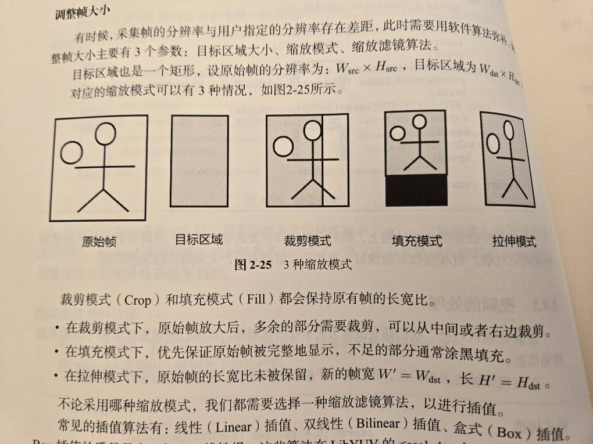

# 時間戳與計時
	- 固定時鐘 steady clock: 系統啟動後的 ns，不能修改
	- 系統時鐘 system clock: 可修改、網路對時
	- RTCP 會定期發送 Sender Report，有每個音視頻的 timestamp 和 Network Time Protocol 時間戳，用來對齊音視頻
- # 旋轉角與朝向
	- 在圖像調整成自然方向前**需要**順時針旋轉的角度
	- 鏡像：
		- 自己看應該是照鏡子
		- 對方看應該像面對面
	- 後鏡頭的旋轉角為 90 度
	- 前鏡頭在預覽畫面時系統已經做了一次鏡像，對於旋轉角為 90 度的圖做鏡像後需要再轉 270 度才會是自然視角，所以前鏡頭的旋轉角為 270 度
	- 當順時針旋轉手機 X 度時，後鏡頭的圖像會逆時針旋轉 X 度
- # 前處理
	- ## 調整幀大小
		- 目標區域大小、縮放模式、縮放濾鏡算法
		- 
		- 插值算法
	- ## 特效
		- 使
	-
-